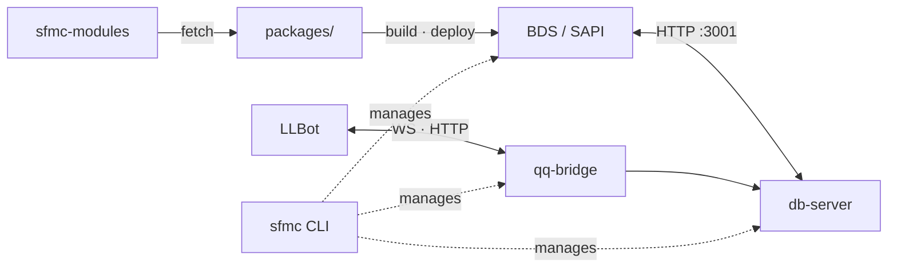
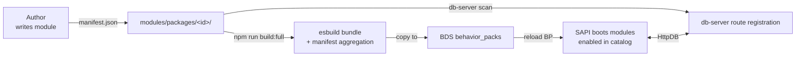

# ScriptsForMinecraftServer

> A monorepo for a Minecraft Bedrock Script API (SAPI) behavior pack plus a set of Node.js sidecar services. 22+ business modules collaborate as BP code + Node services; a single SEA executable ships the whole supervisor.
> Bilingual:

[中文版本 →](./README.md)

[](https://github.com/DogeLakeDev/ScriptsForMinecraftServer/tags)
[](./LICENSE)
[](https://nodejs.org)
[](https://www.typescriptlang.org)
[](https://nodejs.org/api/single-executable-applications.html)
[](./modules/catalog.json)
[](https://www.minecraft.net/en-us/download/server/bedrock)
[](./qq-bridge)

---

## Project overview

ScriptsForMinecraftServer turns Bedrock Dedicated Server's scripting surface into a complete server-side system:

- **Module-by-package model** — every entry under `modules/packages/<id>/` is a first-class module; modules are registered through `modules/catalog.json` and loaded by `ModuleRegistry`. `type` in the catalog distinguishes `core` (infrastructure) from `feature` (add-on functionality).
- **4 top-level services** — `db-server` (SQLite REST API) / `qq-bridge` (QQ ⇄ MC bridge) / `bds-tools` (BDS process manager) / `sfmc` (SEA CLI).
- **Single SEA executable** — `dist/sea/sfmc.exe` runs every dispatch mode from one binary.
- **SDK toolkit** `@sfmc-bds/sdk` — lives at `modules/sdk/@sfmc-sdk/` and shares low-level contracts across the SAPI / Node split. **It is a toolkit, not a module.**
- **Build-time module fetch** — one-shot CLI `tools/fetch-module.mjs` populates modules from GitHub Releases (or `cp -r` from a local checkout). The SEA itself never connects to the network.

## Architecture diagram



**At a glance**

- **Modules:** registry → `modules/packages/` → esbuild → BDS behavior pack  
- **In-game:** SAPI talks to db-server over HTTP (config / data / module toggles)  
- **QQ:** LLBot → qq-bridge → db-server; MC→QQ goes db-server → LLBot directly  

See the [documentation](./docs/README.md) for details.

## Module lifecycle



## Quick start

SFMC ships two equivalent on-ramps. Pick whichever feels right.

### ⚡ SEA single-exe (recommended — skip Node entirely)

```bash
# 1. Grab sfmc.exe for your platform from GitHub Releases, drop it in an empty dir
# 2. Self-check
node tools/check-ootb.mjs            # or just run ./sfmc.exe (auto-init) / ./sfmc.exe init

# 3. First launch runs the wizard: pick BDS path / LLBot path / backup dir,
#    then pick 1+ modules — it auto-installs → builds → deploys to BDS.
./sfmc.exe                          # alias for sfmc

# 4. Once REPL is up, install more modules without restarting BDS:
sfmc> module install <id>
sfmc> behavior-pack build && behavior-pack deploy

# 5. Bring up everything
sfmc> start -all
```

### ⚙️ npm monorepo (developers — edit BP scripts / write custom modules)

```bash
# 1. clone + install
git clone https://github.com/DogeLakeDev/ScriptsForMinecraftServer
cd ScriptsForMinecraftServer
npm install

# 2. Self-check + wizard (fill in BDS / LLBot / backup paths)
node tools/check-ootb.js
node sfmc/dist/main.js              # same as sfmc

# 3. Install modules (default: first-party sfmc-modules registry)
node tools/fetch-module.mjs search                     # see what's available
node tools/fetch-module.mjs install afk
node tools/fetch-module.mjs install land economy
# install syncs modules/catalog.json + module-lock.json

# 4. After editing BP / writing a custom module:
npm run build --workspaces         # rebuild SDK + assembly tooling
sfmc> behavior-pack build && behavior-pack deploy

# 5. Start
sfmc> start -all
```

Both paths share the same:

- First-party module registry `Tanya7z/sfmc-modules` (GitHub Releases).
- `tools/fetch-module.mjs` to pull modules.
- `sfmc behavior-pack build/deploy` driven by `bds-tools/pack-manager`.
- `modules/module-lock.json` for enable/disable state.

The SEA does **not** ship a fixed behavior pack — the BP is assembled live from your enabled modules. Modules not in the first-party registry trigger a yellow "unknown source" warning at boot; verify before trusting.

## Directory layout

```
ScriptsForMinecraftServer/
├── bds-tools/             BDS auto-update + process manager
├── db-server/             SQLite HTTP REST API (port 3001)
├── qq-bridge/             QQ bridge (LLBot OneBot 11)
├── sfmc/                  REPL management CLI (runs through the SEA)
├── remote-controller/     Remote agent
├── modules/
│   ├── catalog.json       22 business module rows
│   ├── module-lock.json   enable/disable state
│   ├── sdk/@sfmc-sdk/     single umbrella
│   └── packages/          25 business modules
├── tools/                 self-check + build + fetch-module.mjs
├── configs-default/       default config JSON
├── build-sea.mjs          SEA build entry
└── docs/                  bilingual docs
    ├── user-guide.en.md
    ├── marketplace.en.md
    └── dev/{module-author,sdk-reference,manifest-contract}.en.md
```

## Documentation

Full docs: [docs/](./docs/README.md) (Chinese). Structure:

| Section | Entry |
|---------|--------|
| User guide | [docs/guide/](./docs/guide/README.md) |
| Developer guide | [docs/dev/](./docs/dev/README.md) |
| API reference | [docs/api/](./docs/api/README.md) |
| [CLAUDE.md](./CLAUDE.md) | same | Project notes for Claude Code |

## Requirements

| Component | Required |
|-----------|----------|
| Node.js | 22.13+ (db-server uses native `node:sqlite`, needs `--experimental-sqlite` before 22.13) + 18+ (SAPI bundle) |
| OS | Windows 10/11 (primary), Linux/macOS supported |
| BDS | Bedrock Dedicated Server 1.26.x |
| Disk | ~500 MB (BP + services + node_modules) |

Windows: BDS needs Loopback Exemption (now bundled into the wizard):

```powershell
CheckNetIsolation LoopbackExempt -is -n=Microsoft.MinecraftUWP_8wekyb3d8bbwe
```

## Ports

| Port | Purpose |
|------|---------|
| `3001` | db-server REST API (BP / sfmc / qq-bridge all hit this) |
| `3002` | qq-bridge inbound reverse WebSocket from LLBot OneBot 11 |
| `3004` | db-server → LLBot (MC→QQ direct; **3003 is unused**) |

## Roadmap

- ✅ **Stage I**: per-module manifest + emit-manifest + db-server reader
- ✅ **Stage J**: `shared/*` migrated into `@sfmc-bds/sdk`; 22 modules migrated out
- ✅ **Stage K**: SEA slim — modules stripped from the SEA, populated by `tools/fetch-module.mjs`
- 🚧 **Stage L**: auto-extract remote zips; `sfmc module install --enable-and-deploy` one-shot
- 🚧 **Stage M**: module signing / public-key verification (replace plain SHA-256)
- 🚧 **Stage N+**: service mesh (multi-BDS / cross-node)

## License

[AGPL-3.0](./LICENSE)

* **Freedom**: You may run, copy, distribute, and modify the program, provided those freedoms are preserved.
* **Copyleft**: If you distribute a modified version, you must provide the complete Corresponding Source under the same license (AGPL v3).
* **Source**: Corresponding Source must include all scripts, interface definitions, shared libraries, etc. needed for others to rebuild and modify.
* **Additional terms**: You may add further permissions, but not further restrictions (section 7).

---
> ⚠️ AI Assistance Disclaimer
> Portions of this project were produced with assistance from artificial intelligence (AI) tools for research, drafting, formatting, optimization, and development workflows.
>
> All AI-assisted content is human-reviewed, edited, and verified before publication.
> AI is used to improve productivity, accessibility, and workflow efficiency — not to replace human oversight, expertise, or judgment.

[中文版本 →](./README.md)
