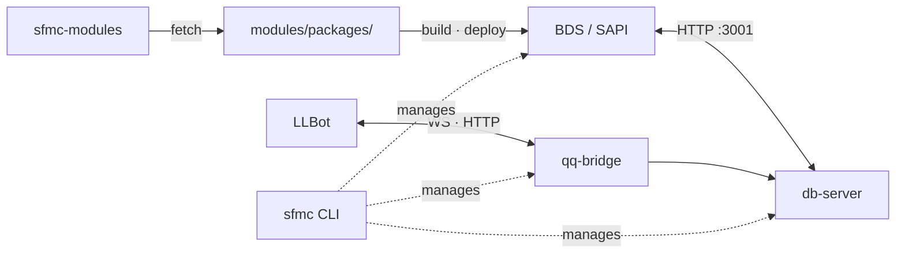
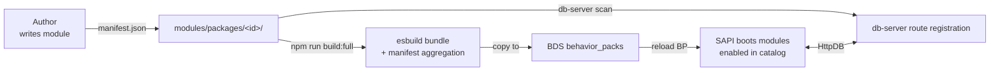

# ScriptsForMinecraftServer

> A monorepo for a Minecraft Bedrock Script API (SAPI) behavior pack plus a set of Node.js sidecar services. 22+ business modules collaborate as BP code + Node services; the `@sfmc-bds/sfmc` meta package installs the whole supervisor in one command.
> Bilingual:

[中文版本 →](./README.md)

[](https://github.com/DogeLakeDev/ScriptsForMinecraftServer/tags)
[](./LICENSE)
[](https://nodejs.org)
[](https://www.typescriptlang.org)
[](https://www.npmjs.com/package/@sfmc-bds/sfmc)
[](./modules/catalog.json)
[](https://www.minecraft.net/en-us/download/server/bedrock)
[](./packages/qq-bridge)

---

## Project overview

ScriptsForMinecraftServer turns Bedrock Dedicated Server's scripting surface into a complete server-side system:

- **Module-by-package model** — every entry under `modules/packages/<id>/` is a first-class module; modules are registered through `modules/catalog.json` and loaded by `ModuleRegistry`. `type` in the catalog distinguishes `core` (infrastructure) from `feature` (add-on functionality).
- **4 top-level services** — `db-server` (SQLite REST API) / `qq-bridge` (QQ ⇄ MC bridge) / `bds-tools` (BDS process manager) / `sfmc` CLI (supervisor). Platform code lives under `packages/`; business modules stay under `modules/packages/`.
- **One-command install** — `npm i -g @sfmc-bds/sfmc@beta` then `sfmc` in an empty directory (beta-only until first stable release).
- **SDK toolkit** `@sfmc-bds/sdk` — lives at `modules/sdk/@sfmc-sdk/` and shares low-level contracts across the SAPI / Node split. **It is a toolkit, not a module.**
- **Module install** — `sfmc mod install` (`@sfmc-bds/cli` / `packages/cli/scripts/module-install/`).

## Architecture diagram


```mermaid
flowchart LR
  REG["sfmc-modules"] -->|fetch| PKG["modules/packages/"]
  PKG -->|build · deploy| BDS["BDS / SAPI"]
  BDS <-->|HTTP :3001| DB["db-server"]
  LLBot <-->|WS · HTTP| QQ["qq-bridge"] --> DB
  SFMC["sfmc CLI"] -. manages .-> BDS & DB & QQ
```

**At a glance**

- **Modules:** registry → `modules/packages/` → esbuild → BDS behavior pack  
- **In-game:** SAPI talks to db-server over HTTP (config / data / module toggles)  
- **QQ:** LLBot → qq-bridge → db-server; MC→QQ goes db-server → LLBot directly  

See the [documentation](./docs/README.md) for details.

## Module lifecycle


```mermaid
flowchart LR
    A["Author<br/>writes module"] -->|manifest.json| B["modules/packages/&lt;id&gt;/"]
    B -->|npm run build:full| C["esbuild bundle<br/>+ manifest aggregation"]
    C -->|copy to| D["BDS behavior_packs"]
    D -->|reload BP| E["SAPI boots modules<br/>enabled in catalog"]
    B -->|db-server scan| F["db-server route registration"]
    E <-->|HttpDB| F
```

## Quick start

SFMC ships two equivalent on-ramps. Pick whichever feels right.

### ⚡ npm meta package (recommended)

```bash
# 1. Node.js 22.13+
node -v

# 2. Install + first launch (wizard fills BDS / LLBot / backup paths, then modules)
npm i -g @sfmc-bds/sfmc@beta
mkdir my-server && cd my-server
sfmc

# 3. Once REPL is up, install more modules without restarting BDS:
sfmc> module install <id>
sfmc> behavior-pack build && behavior-pack deploy

# 4. Bring up everything
sfmc> start -all
```

### ⚙️ npm monorepo (developers — edit BP scripts / write custom modules)

```bash
# 1. clone + install
git clone https://github.com/DogeLakeDev/ScriptsForMinecraftServer
cd ScriptsForMinecraftServer
npm install

# 2. Self-check + wizard (fill in BDS / LLBot / backup paths)
npm run verify
node packages/cli/dist/main.js              # same as npm start / sfmc

# 3. Install modules (default: first-party sfmc-modules registry)
sfmc mod search
sfmc mod install afk
sfmc mod install land economy
# install syncs modules/catalog.json + module-lock.json

# 4. After editing BP / writing a custom module:
npm run build --workspaces         # rebuild SDK + assembly tooling
sfmc> behavior-pack build && behavior-pack deploy

# 5. Start
sfmc> start -all
```

Both paths share the same:

- First-party module registry `Tanya7z/sfmc-modules` (GitHub Releases).
- `sfmc mod install` (`@sfmc-bds/cli`) to pull modules.
- `sfmc behavior-pack build/deploy` driven by `packages/bds-tools` pack-manager.
- `modules/module-lock.json` for enable/disable state.

The behavior pack is assembled live from your enabled modules — there is no fixed BP shell. Modules not in the first-party registry trigger a yellow "unknown source" warning at boot; verify before trusting.

## Directory layout

```
ScriptsForMinecraftServer/
├── packages/                  Platform packages (not business modules)
│   ├── bds-tools/             BDS auto-update + process manager
│   ├── db-server/             SQLite HTTP REST API (port 3001)
│   ├── qq-bridge/             QQ bridge (LLBot OneBot 11)
│   ├── tools/                 monorepo-only self-check + build bins
│   ├── cli/                   REPL + fetch-module (npm @sfmc-bds/cli)
│   ├── meta/                  @sfmc-bds/sfmc aggregate package
│   ├── devkit/                author Watch / scaffold (@sfmc-bds/devkit)
│   └── sfmc-extension/        VS Code/Cursor extension「SFMC Module」
├── modules/
│   ├── catalog.json           22 business module rows
│   ├── module-lock.json       enable/disable state
│   ├── sdk/@sfmc-sdk/         single umbrella
│   └── packages/              Business modules (unchanged)
├── configs/                   runtime config JSON (gitignored; generated on first ensure)
└── docs/                      bilingual docs
    ├── user-guide.en.md
    ├── marketplace.en.md
    └── dev/{module-author,sdk-reference,manifest-contract}.en.md
```

## Documentation

Full docs (Chinese default, English under `/en/`): [docs/zh/](./docs/zh/index.mdx). Preview with Rspress:

```bash
cd website && npm install
cd ..
npm run docs -- serve
```

| Section | Entry |
|---------|--------|
| User guide | [docs/zh/guide/](./docs/zh/guide/index.mdx) |
| Developer guide | [docs/zh/dev/](./docs/zh/dev/index.mdx) |
| API (HTTP / modules) | [docs/zh/api/](./docs/zh/api/index.mdx) |
| SDK types (TypeDoc) | [docs/zh/reference/](./docs/zh/reference/index.md) — generated during `npm run docs -- build` |

## Requirements

| Component | Required |
|-----------|----------|
| Node.js | 22.13+ (db-server uses native `node:sqlite`, needs `--experimental-sqlite` before 22.13) + 18+ (SAPI bundle) |
| OS | Windows 10/11 (primary), Linux/macOS supported |
| BDS | Bedrock Dedicated Server 1.26.x |
| Disk | ~500 MB (BP + services + node_modules) |

Windows: BDS needs Loopback Exemption (now bundled into the wizard):

```powershell
CheckNetIsolation LoopbackExempt -is -n=Microsoft.MinecraftUWP_8wekyb3d8bbwe
```

## Ports

| Port | Purpose |
|------|---------|
| `3001` | db-server REST API (BP / sfmc / qq-bridge all hit this) |
| `3002` | qq-bridge inbound reverse WebSocket from LLBot OneBot 11 |
| `3004` | db-server → LLBot (MC→QQ direct; **3003 is unused**) |

## Roadmap

- ✅ **Stage I**: per-module `sapi/manifest.json` + db-server reader
- ✅ **Stage J**: `shared/*` migrated into `@sfmc-bds/sdk`; 22 modules migrated out
- ✅ **Stage K**: on-demand modules — populated by `sfmc mod install` / `@sfmc-bds/cli` fetch-module
- 🚧 **Stage L**: auto-extract remote zips; `sfmc module install --enable-and-deploy` one-shot
- 🚧 **Stage M**: module signing / public-key verification (replace plain SHA-256)
- 🚧 **Stage N+**: service mesh (multi-BDS / cross-node)

## License

The platform is under [AGPL-3.0](./LICENSE). Per-package SPDX identifiers: [LICENSES.md](./LICENSES.md).

| Kind | License | Examples |
|------|---------|----------|
| Author libraries | **ISC** | `@sfmc-bds/sdk`, `@sfmc-bds/eslint-plugin` |
| Platform & services | **AGPL-3.0-only** | `cli`, `db-server`, `qq-bridge`, `bds-tools`, `@sfmc-bds/sfmc` |

- **Freedom**: You may run, copy, distribute, and modify the program, provided those freedoms are preserved.
- **Copyleft (AGPL parts)**: If you distribute modified **platform/service** builds, you must provide Corresponding Source under the same license.
- **Module repos**: Business modules in separate repos declare their own license; using the ISC SDK does not automatically AGPL-license your module.

---
> ⚠️ AI Assistance Disclaimer
> Portions of this project were produced with assistance from artificial intelligence (AI) tools for research, drafting, formatting, optimization, and development workflows.
>
> All AI-assisted content is human-reviewed, edited, and verified before publication.
>
> AI is used to improve productivity, accessibility, and workflow efficiency — not to replace human oversight, expertise, or judgment.

[中文版本 →](./README.md)
