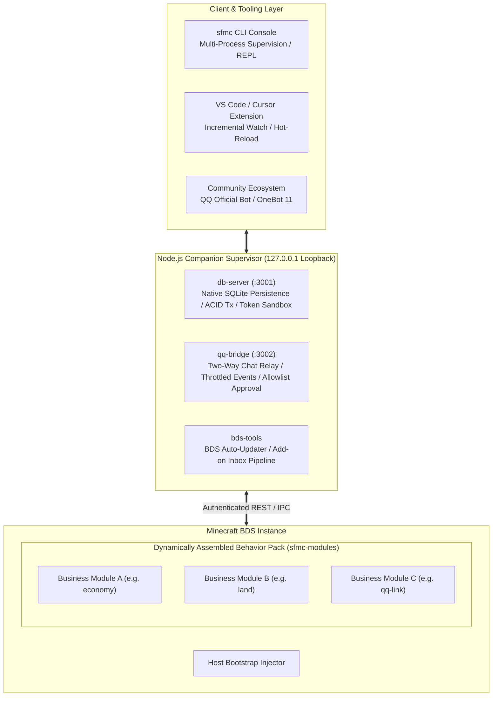

# Scripts For Minecraft Server (SFMC)

<p align="center">
  <strong>Microkernel Companion Architecture & Modern Server Engineering Toolkit for Minecraft Bedrock (BDS)</strong>
</p>

<p align="center">
  <a href="https://github.com/DogeLakeDev/ScriptsForMinecraftServer/actions/workflows/ootb.yml"></a>
  <a href="https://github.com/DogeLakeDev/ScriptsForMinecraftServer/tags"></a>
  <a href="./LICENSE"></a>
  <a href="https://nodejs.org"></a>
  <a href="https://www.typescriptlang.org"></a>
  <a href="https://www.npmjs.com/package/@sfmc-bds/sfmc"></a>
  <a href="https://github.com/Tanya7z/sfmc-modules"></a>
  <a href="https://www.minecraft.net/en-us/download/server/bedrock"></a>
</p>

<p align="center">
  <a href="https://dogelakedev.github.io/ScriptsForMinecraftServer/">📚 Online Documentation</a> ·
  <a href="https://github.com/Tanya7z/sfmc-modules">📦 Module Index</a> ·
  <a href="./docs/en/guide/index.mdx">🚀 Quick Start Guide</a> ·
  <a href="./README.md">中文版本</a>
</p>

---

## 💡 What is SFMC?

**Scripts For Minecraft Server (SFMC)** is a modern development framework and multi-process companion architecture engineered specifically for the official **Minecraft Bedrock Dedicated Server (BDS)**.

Combining Minecraft's native **Script API (SAPI)** with a high-performance local **Node.js companion supervisor**, SFMC delivers a true production-grade engineering workflow to Bedrock server operations. It decisively resolves traditional ecosystem pain points: plugin fragmentation, data loss/corruption, lack of sandbox isolation, and frequent downtime caused by restarts.


```mermaid
flowchart TD
  subgraph Client_Layer ["Client & Tooling Layer"]
    CLI["sfmc CLI Console<br/>Multi-Process Supervision / REPL"]
    IDE["VS Code / Cursor Extension<br/>Incremental Watch / Hot-Reload"]
    QQ_Client["Community Ecosystem<br/>QQ Official Bot / OneBot 11"]
  end

  subgraph Companion_Layer ["Node.js Companion Supervisor (127.0.0.1 Loopback)"]
    DB_Svc["db-server (:3001)<br/>Native SQLite Persistence / ACID Tx / Token Sandbox"]
    QQ_Svc["qq-bridge (:3002)<br/>Two-Way Chat Relay / Throttled Events / Allowlist Approval"]
    BDS_Tools["bds-tools<br/>BDS Auto-Updater / Add-on Inbox Pipeline"]
  end

  subgraph Game_Layer ["Minecraft BDS Instance"]
    Bootstrap["Host Bootstrap Injector"]
    subgraph SAPI_Bundle ["Dynamically Assembled Behavior Pack (sfmc-modules)"]
      ModA["Business Module A (e.g. economy)"]
      ModB["Business Module B (e.g. land)"]
      ModC["Business Module C (e.g. qq-link)"]
    end
  end

  Client_Layer <==> Companion_Layer
  Companion_Layer <== Authenticated REST / IPC ==> Game_Layer
```

---

## ✨ Key Features & Architectural Highlights

- 🗄️ **Industrial-Grade Data Persistence (ACID SQLite)**  
  Say goodbye to fragile Dynamic Properties with storage limits and world-corruption risks. The local `db-server` provides transaction-protected (ACID) SQLite storage with WAL high-concurrency writing and reliable cold backup workflows.
- 🧩 **Dynamic Behavior Pack Assembly Pipeline**  
  At server startup or reload, the platform inspects `module-lock.json` and uses esbuild to compile all enabled TypeScript modules into a **single, unified native behavior pack**, eradicating UUID collisions and dependency chaos.
- 🛡️ **Microkernel Sandbox & Strongly-Typed RPC Contracts**  
  Modules explicitly declare database tables and required service dependencies in `manifest.json`. The platform issues scope-restricted Bearer Tokens to enforce data isolation, while cross-module communication relies on typed RPC services rather than global namespace pollution.
- ⚡ **Sub-Second Hot-Reload Development Workflow**  
  With the official "SFMC Module" VS Code extension, editing module source code immediately triggers incremental bundling and in-game `/reload`, eliminating tedious server restarts and player disconnections.
- 🤖 **Turnkey Multi-Platform Social Bridge (QQ Bridge)**  
  Native support for Tencent QQ Open Platform official bots and OneBot 11 (LLBot), featuring in-group server status queries, rich interactive card actions, bi-directional chat relay, intelligent event throttling, and asynchronous allowlist approval.
- 📦 **Add-on Inbox Pipeline**  
  Drop `.mcpack` or `.mcaddon` files into the `packs/` inbox for automated parsing and deployment, complete with version conflict detection, CurseForge remote updates, and resource pack cache busting (`packs bump`).

---

## 🚀 Quick Start

### Track A: Server Operators (Ready in 3 Minutes)

Ensure **Node.js ≥ 22.13.0** is installed (required for native `node:sqlite` support).

```bash
# 1. Install SFMC CLI globally
npm install -g @sfmc-bds/sfmc

# 2. Create and enter your server workspace
mkdir my-bedrock-server && cd my-bedrock-server

# 3. Launch the interactive REPL console
sfmc

# 4. Start all companion services and BDS in one command
sfmc> start -all

# 5. Search and install gameplay modules from the official index
sfmc> mod install economy land teleport
```

### Track B: Module Authors (Build in 5 Minutes)

You don't need to clone this monorepo! Scaffold your standalone module repository directly:

```bash
# 1. Interactively scaffold your author repository
npm create @sfmc-bds/module@latest

# 2. Open the created project in VS Code or Cursor
# 3. Install the official "SFMC Module" extension
# 4. Press Ctrl + Shift + P to execute:
#    - SFMC: Link to SFMC Root   (mount directly into your local testing server)
#    - SFMC: Start Watch         (enable real-time incremental watch & hot-reload)
```

---

## 🗺️ Monorepo Package Map

This repository houses the SFMC core platform and tooling packages, organized with strict microkernel separation:

| Package Path | npm Distribution | Role & Responsibilities |
| :--- | :--- | :--- |
| `modules/sdk/@sfmc-sdk` | `@sfmc-bds/sdk` | Core runtime SDK for SAPI & Node services (db / config / service / runtime) |
| `packages/cli` | `@sfmc-bds/cli` | Server orchestration CLI and interactive REPL console |
| `packages/db-server` | `@sfmc-bds/db-server` | High-performance SQLite HTTP data hub, transaction engine, and token sandbox |
| `packages/qq-bridge` | `@sfmc-bds/qq-bridge` | Tencent QQ Official Bot and OneBot 11 two-way communication gateway |
| `packages/bds-tools` | `@sfmc-bds/bds-tools` | BDS version updater and add-on inbox deployment pipeline |
| `packages/create-module` | `@sfmc-bds/create-module` | Official module scaffolding engine (`npm create @sfmc-bds/module`) |
| `packages/devkit` | `@sfmc-bds/devkit` | Incremental transpiler (esbuild), file watcher, and reload core |
| `packages/sfmc-extension`| `@sfmc-bds/sfmc-extension` | Official VS Code / Cursor IDE extension ("SFMC Module") |
| `packages/meta` | `@sfmc-bds/sfmc` | Meta-package aggregator distribution |
| `modules/sdk/@sfmc-eslint-plugin` | `@sfmc-bds/eslint-plugin` | Platform-tailored ESLint rules (Msg helpers, boundary checks) |

---

## 🌟 Featured Module Ecosystem

All official modules are published to npm and curated in the [Official Module Repository](https://github.com/Tanya7z/sfmc-modules):

| Module ID | Display Name | Features & Highlights |
| :--- | :--- | :--- |
| `feature-economy` | Economy System | Unified Scoreboard & SQLite currency abstraction with cross-player transfers |
| `feature-land` | Land Claims | 3D visual selection, granular permission controls (break, interact, container), and transfers |
| `feature-teleport` | Teleport Hub | Personal homes, public warps, and inter-player TPA requests across dimensions |
| `feature-auth` | Authentication | Mixed offline/online authentication, auto-login memory, and movement freeze |
| `feature-qq-link` | QQ Account Link | In-game verification code binding, bi-directional chat, and remote allowlist approval |
| `feature-afk` | AFK Detection | Smart idle status detection, invulnerability shields, and scheduled rewards |

---

## 📖 Documentation Hub

Comprehensive architecture guides, API signatures, and developer tutorials are published on our [Documentation Site](https://dogelakedev.github.io/ScriptsForMinecraftServer/):

- 📘 **[User Guide](./docs/zh/guide/index.mdx)**: Service orchestration, configuration reference, module management, and backups.
- 🛠️ **[Developer Guide](./docs/zh/dev/index.mdx)**: Author workflow, architecture design, testing strategy, and Manifest contracts.
- 🔌 **[API & Protocol Reference](./docs/zh/api/index.mdx)**: HTTP REST endpoints, dual auth model, RPC discovery, and database transactions.
- 📚 **[SDK Type Reference](./docs/zh/reference/index.md)**: Complete TypeScript API documentation auto-generated via TypeDoc.

---

## 📄 License

The SFMC platform is open-source under the [AGPL-3.0 License](./LICENSE). Package-specific details can be found in [LICENSES.md](./LICENSES.md):

- **Platform & Services (AGPL-3.0)**: Community improvements are welcomed. Distributing modified versions of the platform or backend services requires making corresponding source code available under the same license.
- **Module Independence (Author Choice)**: Business modules built with the **ISC-licensed** `@sfmc-bds/sdk` are **not subject to AGPL copyleft viral effects**. Module authors retain full freedom to license their works under any open-source or proprietary commercial terms.
