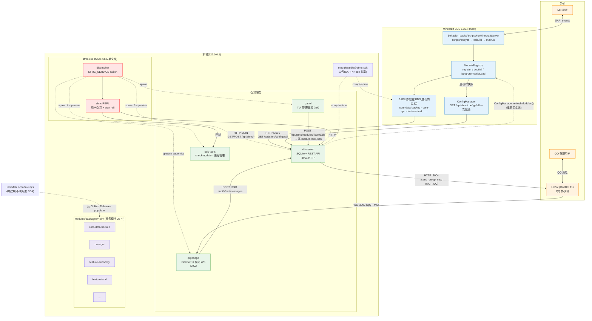
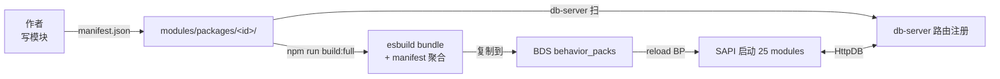

# SFMC - ScriptsForMinecraftServer

> 一套 Minecraft Bedrock Script API (SAPI) 行为包 + Node.js 仓顶服务的 monorepo。

* 提供基于Minecraft SAPI的**原生SDK**
* 外置**模块化管理**
* 多功能、适用BDS的**cil工具**
* 为模块提供**Sqlite数据库管理SDK**及其路由服务
* QQ桥接，群服互通

[English version →](./README.en.md)

[](https://github.com/DogeLakeDev/ScriptsForMinecraftServer/tags)
[](./LICENSE)
[](https://nodejs.org)
[](https://www.typescriptlang.org)
[](https://nodejs.org/api/single-executable-applications.html)
[](./modules/catalog.json)
[](https://www.minecraft.net/en-us/download/server/bedrock)
[](./qq-bridge)

---

## 项目概览

SFMC 把 Bedrock Dedicated Server 的SAPI能力扩成一套完整的服务端体系:

* **模块化设计体系，目前已提供25 个即装即用模块** (`modules/packages/<id>/`)
* **5 个仓顶服务** (`db-server`供模块使用的sqlite数据库管理系统 / `qq-bridge`提供ws服务实现**Q群 ⇄ 服务器互通** / `bds-tools` / `sfmc` / `remote-controller`)
* **使用sea打包的cil程序** — 一键启动、开服、管理
* **SDK 伞包** `@sfmc/sdk` — 跨 SAPI / Node 两侧共享底层契约
* **构建时模块** 一次性 CLI `tools/fetch-module.mjs` 从 GitHub Releases 拉模块(SEA 进程不联网)

## 架构图



## 模块流程图



## 快速开始

```bash
# 1. 安装
git clone https://github.com/DogeLakeDev/ScriptsForMinecraftServer
cd ScriptsForMinecraftServer
npm install

# 2. 自检环境
node tools/check-ootb.js

# 3. 进入cil并初始化
sfmc

# 4. 安装模块
node tools/fetch-module.mjs install feature-land \
  --from github:DogeLakeDev/ScriptsForMinecraftServer@v2-module-system
# 也可以直接 cp -r modules/packages/feature-* <你想塞的>

# 5. 部署 BP 到 BDS
cd scriptsforminecraftserver && npm run build:deploy

# 6. 启动
sfmc> start -all
```

## 目录速览

```
ScriptsForMinecraftServer/
├── bds-tools/             BDS 自动更新 + 进程管理
├── db-server/             SQLite HTTP REST API (port 3001)
├── qq-bridge/             QQ 桥(LLBot OneBot 11)
├── sfmc/                  REPL 管理 CLI (走 SEA)
├── remote-controller/     远程 agent
├── scriptsforminecraftserver/   行为包壳(BP manifest + esbuild 入口)
├── modules/
│   ├── catalog.json       22 业务模块清单
│   ├── module-lock.json   启/禁状态
│   ├── sdk/@sfmc-sdk/     单一伞包
│   └── packages/          25 个业务模块
├── tools/                 自检 + 构建 + fetch-module.mjs
├── configs-default/       默认配置 JSON
├── build-sea.mjs          SEA 构建入口
└── docs/                  中英双语文档
    ├── user-guide.zh.md
    ├── marketplace.zh.md
    └── dev/{module-author,sdk-reference,manifest-contract}.zh.md
```

## 文档索引

| 中文 | English | 面向 |
|------|---------|------|
| [使用文档](./docs/user-guide.zh.md) | [User Guide](./docs/user-guide.en.md) | 运维 / 用户 |
| [模块管理指南](./docs/marketplace.zh.md) | [Module Management](./docs/marketplace.en.md) | 运维(SEA 装模块) |
| [模块作者指南](./docs/dev/module-author.zh.md) | [Module Author Guide](./docs/dev/module-author.en.md) | SAPI 模块开发者 |
| [SDK 三抽屉 API](./docs/dev/sdk-reference.zh.md) | [SDK Reference](./docs/dev/sdk-reference.en.md) | 模块作者(查表) |
| [manifest 契约](./docs/dev/manifest-contract.zh.md) | [Manifest Contract](./docs/dev/manifest-contract.en.md) | 模块作者(写契约) |
| [CLAUDE.md](./CLAUDE.md) | 同 | 给 Claude Code 的项目说明 |

## 系统要求

| 组件 | 要求 |
|------|------|
| Node.js | 22.5+(db-server 原生 `node:sqlite`)+ 18+(SAPI 打包) |
| OS | Windows 10/11(主要),Linux/macOS 也支持 |
| BDS | Bedrock Dedicated Server 1.26.x |
| 磁盘 | ~500 MB(含 BP + 服务 + node_modules) |

Windows 上需给 BDS 配 Loopback Exemption:

```powershell
cd scriptsforminecraftserver
npm run enablemcloopback
npm run enablemcpreviewloopback
```

## 端口速查

| 端口 | 用途 |
|------|------|
| `3001` | db-server REST API(BP / sfmc / qq-bridge 都打这里) |
| `3002` | qq-bridge 接入 LLBot OneBot 11 的反向 WebSocket |
| `3004` | db-server → LLBot(MC→QQ 直连,**不开 3003**) |

## 路线图

* ✅ **Stage I**:per-module manifest + emit-manifest + db-server reader
* ✅ **Stage J**:`shared/*` 迁入 `@sfmc/sdk`,22 模块迁出
* ✅ **Stage K**:SEA slim —— 模块从 SEA 剥离,populate 由 `tools/fetch-module.mjs` 完成
* 🚧 **Stage L**:模块 zip 自动解压、`sfmc module install --enable-and-deploy` 一条龙
* 🚧 **Stage M**:模块签名 / 公钥验证(取代纯 SHA-256 指纹)
* 🚧 **Stage N+**:服务网格(多 BDS 实例 / 跨节点)

## 许可证

[MIT](./LICENSE)

---

[English version →](./README.en.md)
