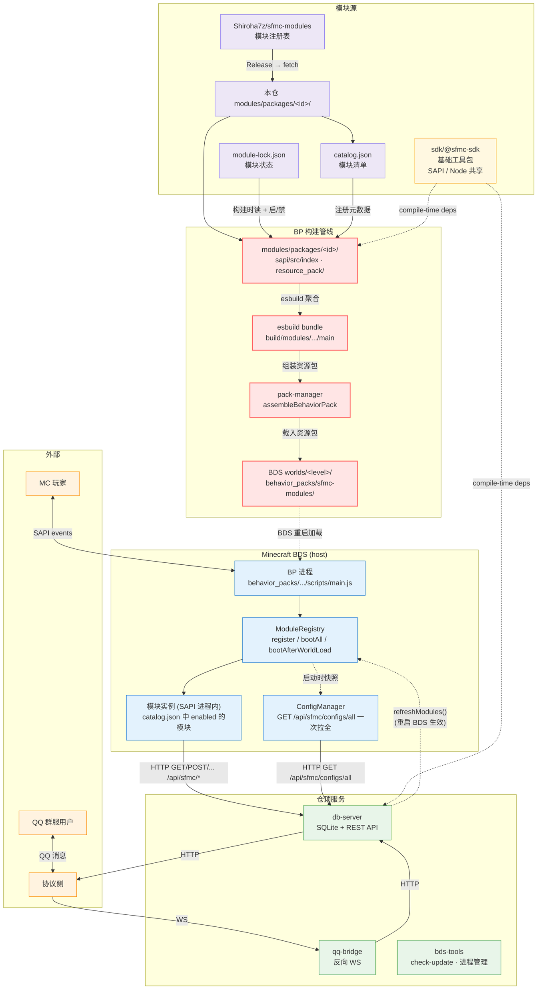
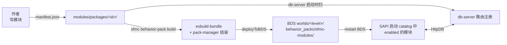

# SFMC - ScriptsForMinecraftServer

> 一套 Minecraft Bedrock Script API (SAPI) 行为包 + Node.js 仓顶服务的 monorepo。

* 提供基于Minecraft SAPI的**原生SDK**
* 外置**模块化管理**
* 多功能、适用BDS的**cli工具**
* 为模块提供**Sqlite数据库管理SDK**及其路由服务
* 依赖与[LLBOT]()的QQ桥接，群服互通服务

[English version →](./README.en.md)

[](https://github.com/DogeLakeDev/ScriptsForMinecraftServer/tags)
[](./LICENSE)
[](https://nodejs.org)
[](https://www.typescriptlang.org)
[](https://nodejs.org/api/single-executable-applications.html)
[](./modules/catalog.json)
[](https://www.minecraft.net/en-us/download/server/bedrock)

---

## 项目概览

SFMC 把 Minecraft SAPI扩成一套完整的服务端体系:

* **模块化设计体系**,基于 `modules/packages/<id>/` 的模块包结构 —— 通过 `modules/catalog.json` 注册并由 `ModuleRegistry` 装载
* **仓顶服务** (`db-server` SQLite REST API / `qq-bridge` Q群 ⇄ 服务器互通 / `bds-tools` BDS 进程管理)
* **使用 sea 打包的 cli 程序** —— 一键启动与管理BDS及SFMC的相关服务,**上手简单，即开即用**
* **SDK 工具包** `@sfmc/sdk` —— 位于 `modules/sdk/@sfmc-sdk/`,**跨 SAPI / Node 两侧共享底层契约**，让原生脚本的开发更加顺畅与强大。

## 架构图



## 模块流程图



## 快速开始

SFMC 提供两条等价的上手路径,选你最舒服的就行。

### ⚡ SFMC - SEA

```bash
# 1. 下载对应平台的 sfmc.exe(从 GitHub Releases),放到一个空目录
# 2. 自检环境
node tools/check-ootb.js     # 或者直接在 exe 同目录跑 ./sfmc.exe wizard

# 3. 首次启动会跑 wizard:填 BDS 路径 / LLBot 路径 / 备份目录,
#    然后选 1+ 个模块 → 自动 install → build → deploy 到 BDS
./sfmc.exe                   # 等同 sfmc

# 4. REPL 起动后,装更多模块不用重启 BDS(锁变更就行)
sfmc> module install <id>
sfmc> behavior-pack build && behavior-pack deploy

# 5. 启动全部服务
sfmc> start -all
```

### ⚙️ npm monorepo(开发者 — 改 BP 脚本 / 写自定义模块)

```bash
# 1. clone + 装依赖
git clone https://github.com/DogeLakeDev/ScriptsForMinecraftServer
cd ScriptsForMinecraftServer
npm install

# 2. 自检 + 跑 wizard(填 BDS/LLBot/备份目录)
node tools/check-ootb.js
node sfmc/dist/main.js       # 同 sfmc

# 3. 装模块(默认从第一方 sfmc-modules 注册表)
node tools/fetch-module.mjs install peace
node tools/fetch-module.mjs search                  # 看可用模块

# 4. 写自定义 BP / 自定义模块 → 改完
npm run build --workspaces   # 重 build 全部 SDK + 装配工具
sfmc> behavior-pack build && behavior-pack deploy

# 5. 启动
sfmc> start -all
```

两条路**共用同一份**:

* 第一方模块注册表 `Shiroha7z/sfmc-modules`(GitHub Releases)
* `tools/fetch-module.mjs` 拉模块
* `sfmc behavior-pack build/deploy` 走同一套 bds-tools/pack-manager
* `modules/module-lock.json` 启/禁状态

SEA 不含固定 BP — 行为包是你装了模块后**实时装配**出来的。未知来源模块(不在第一方 index)会触发顶部黄字警告,确认无误可继续。

## 目录速览

```
ScriptsForMinecraftServer/
├── bds-tools/             BDS 自动更新 + 进程管理
├── db-server/             SQLite HTTP REST API (port 3001)
├── qq-bridge/             QQ 桥(LLBot OneBot 11)
├── sfmc/                  REPL 管理 CLI (走 SEA)
├── remote-controller/     远程 agent
├── modules/
│   ├── catalog.json       22 业务模块清单
│   ├── module-lock.json   启/禁状态
│   ├── sdk/@sfmc-sdk/     单一伞包
│   └── packages/          25 个业务模块
├── tools/                 自检 + 构建 + fetch-module.mjs
├── configs-default/       默认配置 JSON
├── build-sea.mjs          SEA 构建入口
└── docs/                  中英双语文档
    ├── user-guide.zh.md
    ├── marketplace.zh.md
    └── dev/{module-author,sdk-reference,manifest-contract}.zh.md
```

## 文档索引

| 中文 | English | 面向 |
|------|---------|------|
| [使用文档](./docs/user-guide.zh.md) | [User Guide](./docs/user-guide.en.md) | 运维 / 用户 |
| [模块管理指南](./docs/marketplace.zh.md) | [Module Management](./docs/marketplace.en.md) | 运维(SEA 装模块) |
| [模块作者指南](./docs/dev/module-author.zh.md) | [Module Author Guide](./docs/dev/module-author.en.md) | SAPI 模块开发者 |
| [SDK 三抽屉 API](./docs/dev/sdk-reference.zh.md) | [SDK Reference](./docs/dev/sdk-reference.en.md) | 模块作者(查表) |
| [manifest 契约](./docs/dev/manifest-contract.zh.md) | [Manifest Contract](./docs/dev/manifest-contract.en.md) | 模块作者(写契约) |
| [CLAUDE.md](./CLAUDE.md) | 同 | 给 Claude Code 的项目说明 |

## 系统要求

| 组件 | 要求 |
|------|------|
| Node.js | 22.5+(db-server 原生 `node:sqlite`)+ 18+(SAPI 打包) |
| OS | Windows 10/11(主要),Linux/macOS 也支持 |
| BDS | Bedrock Dedicated Server 1.26.x |
| 磁盘 | ~500 MB(含 BP + 服务 + node_modules) |

Windows 上需给 BDS 配 Loopback Exemption(命令已合并到 wizard):

```powershell
CheckNetIsolation LoopbackExempt -is -n=Microsoft.MinecraftUWP_8wekyb3d8bbwe
```

## 端口速查

| 端口 | 用途 |
|------|------|
| `3001` | db-server REST API(BP / sfmc / qq-bridge 都打这里) |
| `3002` | qq-bridge 接入 LLBot OneBot 11 的反向 WebSocket |
| `3004` | db-server → LLBot(MC→QQ 直连,**不开 3003**) |

## 路线图

* ✅ **Stage I**:per-module manifest + emit-manifest + db-server reader
* ✅ **Stage J**:`shared/*` 迁入 `@sfmc/sdk`,22 模块迁出
* ✅ **Stage K**:SEA slim —— 模块从 SEA 剥离,populate 由 `tools/fetch-module.mjs` 完成
* 🚧 **Stage L**:模块 zip 自动解压、`sfmc module install --enable-and-deploy` 一条龙
* 🚧 **Stage M**:模块签名 / 公钥验证(取代纯 SHA-256 指纹)
* 🚧 **Stage N+**:服务网格(多 BDS 实例 / 跨节点)

## 许可证

[MIT](./LICENSE)

---

[English version →](./README.en.md)
