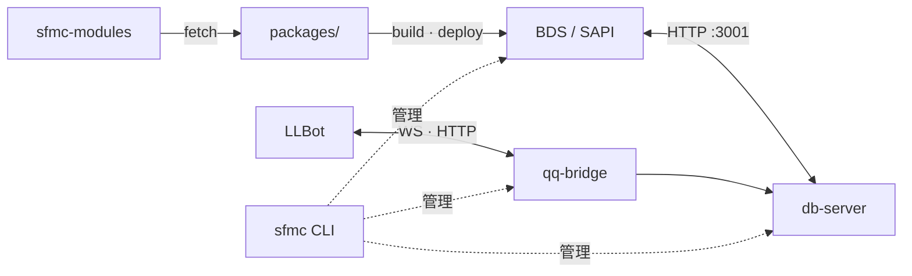

# SFMC - **S**cripts**F**or**M**ine**c**raftServer

> 一套 Minecraft Bedrock Script API (SAPI) 行为包 + Node.js 仓顶服务的 monorepo。
>
> 🎉 在**原生BDS**即可获得类似插件服的**高效、安全、扩展丰富**的体验

* 提供基于[Minecraft Script API](https://learn.microsoft.com/zh-cn/minecraft/creator/scriptapi/?view=minecraft-bedrock-stable)的**原生脚本SDK**
* 外置可拆卸的**模块化管理**服务，拥有类似插件服的舒适体验；目前已开发[22+实用模块](https://github.com/Tanya7z/sfmc-modules)
* 为BDS服务器提供的多功能、易用的cli工具，涵盖**自动更新**，**模块管理**，**资源包管理**，**远程控制**等功能
* 为模块提供**Sqlite数据库管理SDK**及其路由服务
* 自建工作流，使模组/模块开发更轻松
* 依赖于[LLBOT](https://www.llonebot.com/zh-CN/)的QQ桥接服务，轻松实现群服互通

[模块仓库 →](https://github.com/Tanya7z/sfmc-modules)  
[English version →](./README.en.md)

[](https://github.com/DogeLakeDev/ScriptsForMinecraftServer/tags)
[](./LICENSE)
[](https://nodejs.org)
[](https://www.typescriptlang.org)
[](https://nodejs.org/api/single-executable-applications.html)
[](./modules/catalog.json)
[](https://www.minecraft.net/en-us/download/server/bedrock)

---

## 🔍 架构图



### 数据流摘要

* **模块**：注册表 → `modules/packages/` → esbuild 装配 → 写入 BDS 行为包  
* **游戏内**：SAPI 经 HTTP 访问 db-server（配置 / 数据 / 模块启停）  

> **为什么用外置数据库？**  
> SAPI 只发请求，读写 SQLite 在 Node 里完成。经济、领地这类操作可以走事务和幂等，比纯游戏内处理更稳，也更好备份。

详细说明见 [文档中心](./docs/README.md)。

## ⚡️ 快速开始

### SFMC - SEA(.exe)

[Releases](https://github.com/DogeLakeDev/ScriptsForMinecraftServer/releases)

---

### npm 聚合包

```bash
> cd my-server
> npm install -g @sfmc-bds/sfmc
> sfmc
```

## 📖 快速入门

| 分类 | 入口 |
| ------ | ------ |
| 使用指南 | [docs/guide/](./docs/guide/README.md) |
| 开发指南 | [docs/dev/](./docs/dev/README.md) |
| 接口指南 | [docs/api/](./docs/api/README.md) |

## 🗺️ 路线图

* ✅ **Stage I**:per-module manifest + emit-manifest + db-server reader
* ✅ **Stage J**:`shared/*` 迁入 `@sfmc-bds/sdk`,22 模块迁出
* ✅ **Stage K**:SEA slim —— 模块从 SEA 剥离,populate 由 `tools/fetch-module.mjs` 完成
* 🚧 **Stage L**:模块 zip 自动解压、`sfmc module install --enable-and-deploy` 一条龙
* 🚧 **Stage M**:模块签名 / 公钥验证(取代纯 SHA-256 指纹)
* 🚧 **Stage N+**:服务网格(多 BDS 实例 / 跨节点)

## 🧾 许可证

[AGPL-3.0](./LICENSE)  

* **自由**：您可以运行、复制、分发、修改程序，但必须保持这些自由。
* **Copyleft**：如果您分发修改后的版本，必须以相同许可证（AGPL v3）提供完整的源代码。
* **源代码**：必须提供“对应源代码”（Corresponding Source），包括所有脚本、接口定义、共享库等，以便他人能重新构建和修改。
* **附加条款**：您可以添加额外许可，但不能增加限制（第 7 条）。

---
> ⚠️ AI辅助内容声明 
> 该资源部分使用人工智能（AI）工具协助进行研究、起草、格式化、优化和开发工作流程。
>
> 所有AI生成的内容在发布前均经过人工审查、编辑和验证。
> AI用于提高生产力、可访问性和工作流程效率，而非取代人工监督、专业或判断。

[English version →](./README.en.md)
