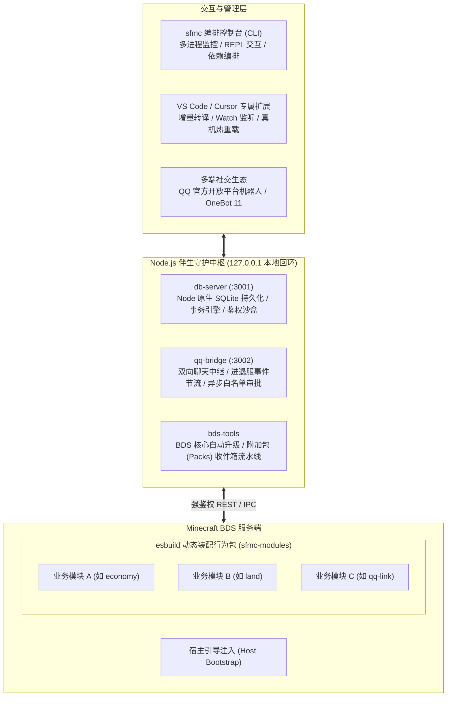

# Scripts For Minecraft Server (SFMC)

<p align="center">
  <strong>面向 Minecraft 基岩版（BDS）的微内核伴生架构开发平台与现代化开服套件</strong>
</p>

<p align="center">
  <a href="https://github.com/DogeLakeDev/ScriptsForMinecraftServer/actions/workflows/ootb.yml"></a>
  <a href="https://github.com/DogeLakeDev/ScriptsForMinecraftServer/tags"></a>
  <a href="./LICENSE"></a>
  <a href="https://nodejs.org"></a>
  <a href="https://www.typescriptlang.org"></a>
  <a href="https://www.npmjs.com/package/@sfmc-bds/sfmc"></a>
  <a href="https://github.com/Tanya7z/sfmc-modules"></a>
  <a href="https://www.minecraft.net/en-us/download/server/bedrock"></a>
</p>

<p align="center">
  <a href="https://dogelakedev.github.io/ScriptsForMinecraftServer/">📚 官方在线文档</a> ·
  <a href="https://github.com/Tanya7z/sfmc-modules">📦 官方模块中心</a> ·
  <a href="./docs/zh/guide/index.mdx">🚀 快速开始指南</a> ·
  <a href="./README.en.md">English Version</a>
</p>

---

## 💡 什么是 SFMC？

**Scripts For Minecraft Server (SFMC)** 是专为 Minecraft 基岩版专用服务端（Bedrock Dedicated Server, BDS）设计的**现代工程化开发平台与多进程伴生开服架构**。

借助官方原生 **Script API (SAPI)** 与本地高性能 **Node.js 守护中枢**，SFMC 为基岩版服务端注入了真正的工业级开发与运维体验：彻底攻克传统插件碎片化、数据易丢失损坏、环境缺乏隔离以及配置频繁重启等历史痛点。


```mermaid
flowchart TD
  subgraph Client_Layer ["交互与管理层"]
    CLI["sfmc 编排控制台 (CLI)<br/>多进程监控 / REPL 交互 / 依赖编排"]
    IDE["VS Code / Cursor 专属扩展<br/>增量转译 / Watch 监听 / 真机热重载"]
    QQ_Client["多端社交生态<br/>QQ 官方开放平台机器人 / OneBot 11"]
  end

  subgraph Companion_Layer ["Node.js 伴生守护中枢 (127.0.0.1 本地回环)"]
    DB_Svc["db-server (:3001)<br/>Node 原生 SQLite 持久化 / 事务引擎 / 鉴权沙盒"]
    QQ_Svc["qq-bridge (:3002)<br/>双向聊天中继 / 进退服事件节流 / 异步白名单审批"]
    BDS_Tools["bds-tools<br/>BDS 核心自动升级 / 附加包 (Packs) 收件箱流水线"]
  end

  subgraph Game_Layer ["Minecraft BDS 服务端"]
    Bootstrap["宿主引导注入 (Host Bootstrap)"]
    subgraph SAPI_Bundle ["esbuild 动态装配行为包 (sfmc-modules)"]
      ModA["业务模块 A (如 economy)"]
      ModB["业务模块 B (如 land)"]
      ModC["业务模块 C (如 qq-link)"]
    end
  end

  Client_Layer <==> Companion_Layer
  Companion_Layer <== 强鉴权 REST / IPC ==> Game_Layer
```

---

## ✨ 核心特性与架构优势

- 🗄️ **工业级数据持久化（ACID SQLite）**  
  彻底告别脆弱、有存储上限且易随存档损坏的 Dynamic Properties。由 `db-server` 提供受事务保护（ACID）的本地 SQLite 存储，具备 WAL 高并发写入与安全的冷备份保障。
- 🧩 **动态行为包装配管线（Dynamic Packaging Pipeline）**  
  开服或热重载时，平台依据 `module-lock.json` 自动将所有启用的 TypeScript 独立模块通过 esbuild 增量编译并聚合成**单一原生行为包**，彻底根除 UUID 碰撞与依赖冲突。
- 🛡️ **微内核权限沙盒与强类型 RPC 契约**  
  各模块在 `manifest.json` 中显式声明所需的数据表权限与服务依赖，由系统统一颁发限权 Token 进行安全防腐；模块间通过强类型 RPC（`service`）解耦协作，杜绝全局污染。
- ⚡ **毫秒级真机热重载开发流（Hot-Reload Workflow）**  
  搭配专属 VS Code 扩展「SFMC Module」，在本地编写 TypeScript 模块源码，文件保存即触发增量构建与世界热更新（`/reload`），告别断开玩家与频繁重启服务端的繁琐流程。
- 🤖 **开箱即用的多端社交通信桥（QQ Bridge）**  
  原生支持腾讯 QQ 开放平台官方机器人与 OneBot 11（LLBot），提供群内服务器状态查询、富文本指令卡片、聊天双向互通、智能事件窗口节流（防止封号）与全自动入服白名单审批。
- 📦 **第三方附加包收件箱流水线（Add-on Inbox Pipeline）**  
  现成的 `.mcpack`、`.mcaddon` 拖入 `packs/` 收件箱即可自动解析部署，支持版本冲突智能检测、CurseForge 远程更新源绑定以及客户端材质强制抬版刷新（RP bump）。

---

## 🚀 快速开始

### 方案 A：服主开服运维（3 分钟就绪）

确保本地运行环境具备 **Node.js ≥ 22.13.0**（提供原生内置 `node:sqlite` 支持）。

```bash
# 1. 全局安装平台运维编排 CLI
npm install -g @sfmc-bds/sfmc

# 2. 创建并进入专属开服目录
mkdir my-minecraft-server && cd my-minecraft-server

# 3. 初始化并启动交互式控制台
sfmc

# 4. 在控制台内一键拉起全部伴生服务与 BDS
sfmc> start -all

# 5. 从官方索引极速检索并安装核心玩法模块
sfmc> mod install economy land teleport
```

### 方案 B：业务模块开发（5 分钟上手）

开发者无需克隆平台主仓，直接利用脚手架创建独立的作者代码仓：

```bash
# 1. 交互式初始化模块作者仓
npm create @sfmc-bds/module@latest

# 2. 使用 VS Code / Cursor 打开新建的模块项目
# 3. 安装官方配套扩展「SFMC Module」
# 4. 按下 Ctrl + Shift + P 执行：
#    - SFMC: Link to SFMC Root   (软链接挂接到你的本地测试服务端)
#    - SFMC: Start Watch         (开启增量监听与毫秒级真机热重载)
```

---

## 🗺️ Monorepo 平台包地图

本仓库（monorepo）作为 SFMC 平台核心与生态工具的集装箱，遵循严格的微内核单向依赖原则：

| 平台包路径 | 发布包名 | 核心定位与职责 |
| :--- | :--- | :--- |
| `modules/sdk/@sfmc-sdk` | `@sfmc-bds/sdk` | 面向 SAPI 与 Node 伴生服务的核心 SDK（db / config / service / runtime） |
| `packages/cli` | `@sfmc-bds/cli` | 平台统一运维编排命令行工具与交互式 REPL 控制台 |
| `packages/db-server` | `@sfmc-bds/db-server` | 高性能 SQLite HTTP 数据中枢、分布式事务引擎与鉴权沙盒 |
| `packages/qq-bridge` | `@sfmc-bds/qq-bridge` | 腾讯官方机器人与 OneBot 11 多协议双向消息网桥 |
| `packages/bds-tools` | `@sfmc-bds/bds-tools` | BDS 版本管理、自动更新与附加包收件箱装配引擎 |
| `packages/create-module` | `@sfmc-bds/create-module` | 官方业务模块脚手架（`npm create @sfmc-bds/module`） |
| `packages/devkit` | `@sfmc-bds/devkit` | 模块增量转译（esbuild）、热重载与文件监视核心库 |
| `packages/sfmc-extension`| `@sfmc-bds/sfmc-extension` | VS Code / Cursor 专属官方开发扩展「SFMC Module」 |
| `packages/meta` | `@sfmc-bds/sfmc` | 平台元包聚合分发入口 |
| `modules/sdk/@sfmc-eslint-plugin` | `@sfmc-bds/eslint-plugin` | 平台定制 ESLint 规则集（规范消息助手、防腐边界） |

---

## 🌟 精选官方模块生态

所有模块均发布至 npm 并在 [官方模块索引库](https://github.com/Tanya7z/sfmc-modules) 统一汇聚，开箱即用：

| 模块标识 | 模块名称 | 核心玩法与能力简介 |
| :--- | :--- | :--- |
| `feature-economy` | 经济账户系统 | 计分板与 SQLite 双轨统一的经济中枢，支持跨玩家转账与货币抽象 |
| `feature-land` | 领地保护系统 | 3D 自由框选圈地、访客权限精细控制（破坏/容器/交互）与领地转让 |
| `feature-teleport` | 传送中枢 | 个人家园（Home）、公共地标（Warp）与玩家间互传（TPA）体系 |
| `feature-auth` | 账号安全验证 | 离线与正版混合模式认证、自动登录记忆与非登录状态防恶意移动 |
| `feature-qq-link` | QQ 群绑定与联动 | 游戏内输入验证码核销绑定 QQ，实现双向聊天互通与白名单异步审批 |
| `feature-afk` | 挂机检测 | 智能挂机状态探测、全自动无敌保护与定时挂机奖励 |

---

## 📖 文档导航矩阵

完整的架构原理、API 签名与实战教程已在 [官方文档站](https://dogelakedev.github.io/ScriptsForMinecraftServer/) 详尽发布：

- 📘 **[使用指南 (Guide)](./docs/zh/guide/index.mdx)**：涵盖服务管理、配置手册、模块与附加包运维、冷备份与无损升级。
- 🛠️ **[开发指南 (Dev)](./docs/zh/dev/index.mdx)**：涵盖模块作者开发流、架构设计、测试策略、代码约定与 Manifest 契约。
- 🔌 **[接口与通信协议 (API)](./docs/zh/api/index.mdx)**：涵盖底层 HTTP REST 端点、双重鉴权模型、RPC 服务发现与数据库事务。
- 📚 **[SDK 类型参考 (Reference)](./docs/zh/reference/index.md)**：由 TypeDoc 自动生成的完备 TypeScript 类型与函数签名手册。

---

## 📄 开源许可证

SFMC 平台采用 [AGPL-3.0](./LICENSE) 许可证开源，各子包分立许可详见 [LICENSES.md](./LICENSES.md)：

- **平台与服务（AGPL-3.0）**：鼓励社区共同建设。若分发修改后的平台或后端服务版本，须以相同许可证开源对应源码。
- **业务模块隔离保护（作者自主）**：通过采用 **ISC 许可证** 授权的 `@sfmc-bds/sdk` 开发的独立业务模块，**不会受到 AGPL 的传染限制**。模块开发者可为其作品自由选择闭源商用或任意开源许可证。
