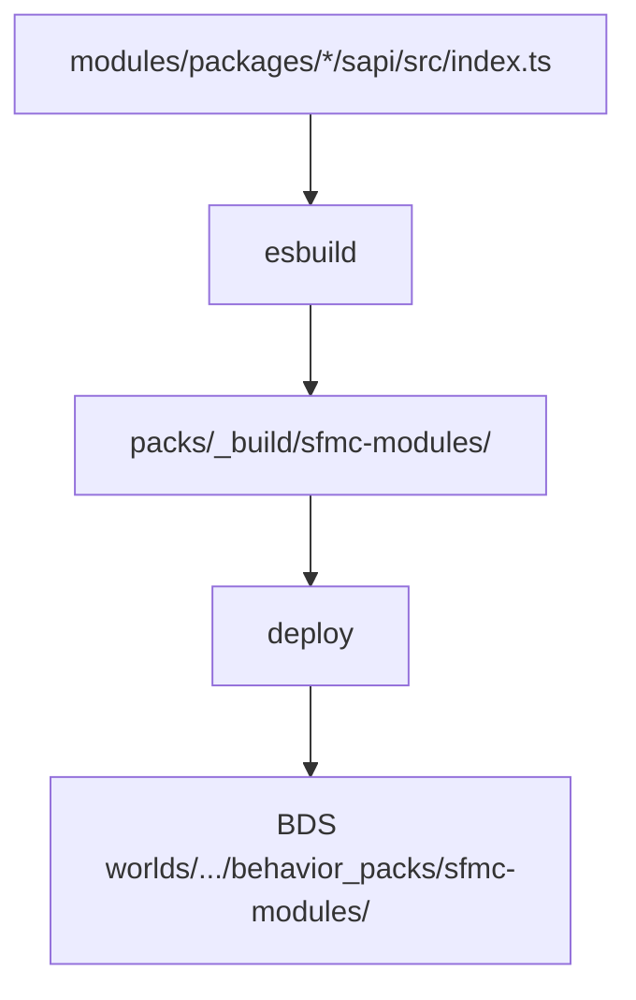

# 构建与装载

行为包在部署时组装，仓库里没有固定的 BP 壳。已启用模块打成一份 BP（及配套 RP）写入当前世界。

## 流程



| 阶段 | 位置 |
| ------ | ------ |
| 中间产物 | `packs/_build/sfmc-modules/`（及 RP） |
| 部署 BP | `<BDS>/worlds/<level>/behavior_packs/sfmc-modules/` |
| 部署 RP | `…/resource_packs/sfmc-modules-rp/` |
| 装载 catalog | BP 内 `sfmc-deploy-catalog.json` |

## 打包规则

- 只打包 **lock 中 enabled** 且 catalog 有的模块
- 每个入口须 `ModuleRegistry.register`
- 无一启用 → 仍生成合法空包
- `@minecraft/*` 作为 external，由 BDS 提供

## 命令

```bash
sfmc> mod build
sfmc> mod reload
sfmc> mod reload --build-only
```

| 命令 | 作用 |
| ------ | ------ |
| `mod build` | 仅构建 |
| `mod reload` | 构建、部署，并向 BDS 请求 `reload` |
| `mod reload --build-only` | 只构建部署；之后需游戏内手动 `reload` |

`start bds` 前装载闸门会比对 catalog：不一致则先重编再启动。见 [服务管理](../guide/services.md)。

相关实现：`sfmc` CLI、`bds-tools` pack-manager、`@sfmc-bds/sdk/behavior-pack-build`（平台内部）。

## 改完后

| 改动 | 需要 |
| ------ | ------ |
| 模块 SAPI 源码 | `mod reload` 或装载闸门 + 游戏内 `reload` |
| `configs/*.json` / manifest | 重启 BDS |
| 仅 db-server / Node | 重启对应服务，不必 redeploy BP |

开发期用 `--link` 指向作者仓时，仍走同一装载路径。细节见 [模块开发](./module-author.md)。
