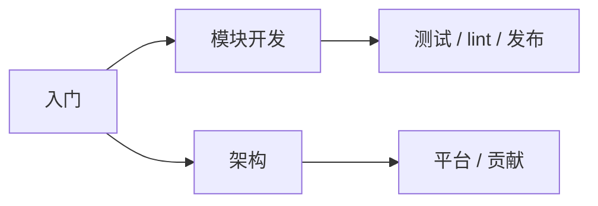

# 入门

面向模块作者与平台贡献者。读完后，您应能分清作者仓 / 主仓 / 薄 index，选好编辑器与工具，并进入对应开发路径。

运维安装与日常启停见 [使用指南](../guide/index.md)。接口与 HTTP 见 [接口指南](../api/index.md)。



## 三层边界

| 角色 | 是什么 | 不是什么 |
| ------ | ------ | ------ |
| **作者仓** | 唯一写码面：template / 扩展脚手架 | 不是在主仓 `packages/` 里写业务 |
| **npm** | 官方发布源 | 不是用 git 树当分发面 |
| **`sfmc-modules`** | 薄 index（检索） | 不是工作区、不是 monorepo |
| **主仓 `modules/packages/`** | install 落点（可 `--link`） | 不是日常业务源码树 |

## 推荐环境

| 项目 | 建议 |
| ------ | ------ |
| 系统 | Windows 10 / 11（当前主要支持） |
| Node.js | [22.13+](https://nodejs.org/)（`node:sqlite` 需此版本） |
| 包管理 | **npm** workspaces；勿用 pnpm 的 `workspace:*` |
| 编辑器 | [Cursor](https://cursor.com/) 或 [VS Code](https://code.visualstudio.com/) |
| CLI | `npm i -g @sfmc-bds/sfmc@beta`（运维）；作者联调优先扩展 |

### 推荐扩展（Cursor / VS Code）

| 扩展 | 用途 |
| ------ | ------ |
| **SFMC Module** | New Module、Run Tests、Start Watch、Reload to BDS |
| ESLint | `@sfmc-bds/eslint-plugin` 诊断（SFMC Module 会提示依赖安装） |
| nodejs-testing | Testing 面板跑 `node --test` |
| Prettier | 与根 / 模板格式对齐 |

作者仓模板已带 `.vscode/extensions.json`。主仓 [`.vscode/settings.json`](https://github.com/DogeLakeDev/ScriptsForMinecraftServer/blob/main/.vscode/settings.json) 绑定配置与 manifest 的 JSON Schema。

### 常用工具

| 工具 | 用途 |
| ------ | ------ |
| 扩展「SFMC Module」 | 脚手架、测试、Watch（作者主路径） |
| `@sfmc-bds/sdk/testing` | `createSandbox` 假引擎 + 宿主分相 |
| `@sfmc-bds/devkit` | Watch / scaffold（扩展依赖；一般不必手调） |
| `sfmc` / `mod` | 安装、启停、build / reload（运维） |
| `@sfmc-bds/eslint-plugin` | Msg、SDK 导入、跨模块等约定 |
| GitHub CLI `gh` | 向薄 index 开 PR 时可选 |

!!! warning "注意"
    `sfmc mod test` / `watch` / `publish` 已移除。测试与 Watch 用扩展；发布用 `npm publish`，见 [发布你的模块](./publish.md)。

## 你要走哪条路

=== "写业务模块"

    1. [模块开发](./module-author.md) — 模板 / 扩展、联调  
    2. [测试沙箱](./testing.md) — `createSandbox`  
    3. [ESLint 约定](./eslint.md) · [发布你的模块](./publish.md)

=== "改平台 / SDK"

    1. 克隆本仓 → `npm i` → `npm run build --workspaces --if-present`  
    2. [架构](./architecture.md) → [平台开发](./platform.md)  
    3. [贡献指南](./contributing.md) · [代码约定](./conventions.md)

```bash
# 模块作者最小闭环（作者仓）
node scripts/rename.mjs my-feature --scope <npm用户> --name "我的功能"
npm i && npm test
# 联调：扩展「SFMC Module」→ Start Watch（设 sfmc.root）
# 或运维机：
sfmc mod install my-feature --from dir:<作者仓绝对路径> --link
sfmc mod enable my-feature
sfmc mod reload
```

## 章节索引

| 章节 | 内容 |
| ------ | ------ |
| [模块开发](./module-author.md) | 模板、扩展、命名、联调 |
| [测试沙箱](./testing.md) | `createSandbox`、L0–L2 |
| [manifest 契约](./manifest.md) | v2 字段与权限 |
| [构建与装载](./build-pipeline.md) | 行为包装配 |
| [ESLint 约定](./eslint.md) | 插件与规则 |
| [工具脚本](./tools.md) | `tools/*.mjs`、平台冒烟 |
| [发布你的模块](./publish.md) | npm 与薄 index |
| [架构](./architecture.md) | 分层与启动序 |
| [平台开发](./platform.md) | SDK / db / CLI / devkit |
| [贡献指南](./contributing.md) | 根脚本与 PR |
| [代码约定](./conventions.md) | Msg、边界、Prettier |
| [专题：附加包更新](./pack-update.md) | CurseForge 实现细节 |
