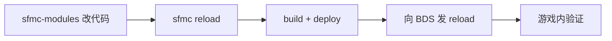

# 模块开发

业务模块写在 [sfmc-modules](https://github.com/Tanya7z/sfmc-modules)，经 **link / install** 落到主仓 `modules/packages/<folder>/`，再组装进行为包。

## 仓库与环境

| 仓 | 角色 |
|----|------|
| `ScriptsForMinecraftServer` | 平台（SDK、db-server、sfmc CLI、BP 组装） |
| `sfmc-modules` | 业务模块源码（与主仓**同级**放置最省事） |

```bash
# 主仓
cd ScriptsForMinecraftServer
npm install && npm run build --workspaces --if-present

# 模块仓（同级）
cd ../sfmc-modules
npm install   # workspaces + 自动 junction 到主仓 SDK
npm run typecheck
```

非同级时设置：

```bash
# PowerShell
$env:SFMC_PLATFORM_ROOT = "D:\path\to\ScriptsForMinecraftServer"
$env:SFMC_MODULES_ROOT  = "D:\path\to\sfmc-modules"
```

sfmc CLI 也会把探测到的模块根写入 `configs/runtime.json#sfmc_modules_root`。

## 命名约定

| 层 | 规则 | 示例 |
|----|------|------|
| 文件夹 / install id | 短名 kebab，**禁止** `feature-`/`core-` 前缀 | `land`、`my-mod`、`area` |
| npm | `@sfmc-bds/module-<folder>`（与平台同组织） | `@sfmc-bds/module-land` |
| manifest.id | `feature-<folder>` 或 `core-<folder>` | `feature-land` |
| configKey | folder 的 `-` → `_` | `land`、`my_mod`、`online_time` |

## 日常开发闭环

> 若 IDE 仍报找不到 `sdk/@sfmc-sdk/tsconfig.json`，确认 `sapi/tsconfig.json` 的 `extends` 为 `../../../tsconfig.base.json`，然后执行 **TypeScript: Restart TS Server**。



### 推荐：交互式（少打路径）

```bash
sfmc module create    # 问 id/名称 → 写到 sfmc-modules → 可选 link / enable / build
sfmc module link      # 从 packages/* 选择并 --link
sfmc module link land # 非交互 link
sfmc module dev       # link + enable + build + deploy
```

### 迭代装载

```bash
sfmc reload              # = pack build + deploy + 向 BDS 发送 reload
sfmc reload --build-only # 只部署；随后在 BDS/游戏内手动输入 reload
```

**`reload` 语义（重要）：**

1. 把新 `main.js` 部署到世界行为包目录  
2. 向 BDS 控制台发送命令 `reload`（**不是** `restart bds`）  
3. BDS / 游戏内也可自行输入 `reload`

改 `configs/*.json` 仍需**重启对应进程**（SAPI 配置启动时缓存）；那是配置问题，与模块代码 `reload` 不同。

### 命令行等价

```bash
sfmc mod link land
# 或
sfmc mod install land --from dir:../sfmc-modules/packages/land --link

sfmc pack build && sfmc pack deploy
# 然后: send bds reload   或在游戏内 / BDS 控制台输入 reload
```

底层脚本：

```bash
node tools/new-module.mjs my-mod --name "我的模块" --root ../sfmc-modules
node tools/fetch-module.mjs install land --from dir:../sfmc-modules/packages/land --link
```

`--link` 使用 Windows junction / POSIX symlink，改 sfmc-modules 源码即反映到主仓 packages，不必反复拷贝。发布给服务器时用默认 **copy** 安装，不要用 `--link`。

## 目录结构

```
packages/land/
├── package.json              # @sfmc-bds/module-land
├── sapi/
│   ├── manifest.json         # id: feature-land
│   ├── tsconfig.json
│   └── src/
│       ├── index.ts          # ModuleRegistry.register
│       ├── types.ts          # 本模块权威类型（可选）
│       └── client.ts         # 对外简洁 API（有 provides 时推荐）
├── configs-default/          # 可选
└── resource_pack/            # 可选
```

## 最小入口

```ts
import { ModuleRegistry } from "@sfmc-bds/sdk/module-loader";
import { Permission, Command } from "@sfmc-bds/sdk/sapi/runtime";

ModuleRegistry.register({
  id: "feature-afk",
  afterWorldLoad: false,
  lifecycle: {
    registerPermissions() {
      Permission.register("afk.use", Permission.Any);
    },
    registerCommands() {
      Command.register("afk", "afk.use", (player) => { /* … */ }, "AFK");
    },
    async init() { /* db / config / service */ },
    cleanup() {},
  },
});
```

## SDK 四抽屉

| 导入 | 用途 |
|------|------|
| `@sfmc-bds/sdk/sapi/runtime` | 消息、命令、权限、菜单、`Money`（余额**缓存**） |
| `@sfmc-bds/sdk/sapi/db` | 表定义、CRUD、事务 |
| `@sfmc-bds/sdk/sapi/config` | 模块配置读写 |
| `@sfmc-bds/sdk/sapi/service` | 调其它模块的 service（无 typed client 时） |

查表见 [SDK 接口](../api/sdk/README.md)。各模块对外能力见 [模块服务目录](../api/modules/README.md)。

## 跨模块调用规则

1. **不要** import 其它模块业务源码；**不要**直接读写对方私有表（如 `sfmc_economy_*`）。  
2. 优先用对方提供的 **typed client**（例：`@sfmc-bds/module-economy/client`）。  
3. 无 client 时用 `service.get("name", input)`；在 `db.tx` 内用 `tx.call` / `economy.account.inTx(tx)`。  
4. `package.json` 声明对 `@sfmc-bds/module-*` 的依赖；`manifest.requires` / `services.requires` 声明运行时依赖。  
5. 玩家消息用 `Msg.*`，别直接 `player.sendMessage()`。

```ts
import { economy } from "@sfmc-bds/module-economy/client";

await economy.account.get({ playerId });
await db.tx(async (tx) => {
  await economy.account.inTx(tx).debit({ playerId, amount: 10, reason: "buy" });
});
```

## `@minecraft/*` 版本

以主仓 / sfmc-modules **仓库根** `devDependencies` + 主仓 `overrides` 为权威 pin。  
业务模块 **不要** 在 `package.json` 里声明 `@minecraft/*`（含 peerDependencies）；类型由 workspace 根提升提供。校验：

```bash
npm run check-minecraft-versions
```

详见 sfmc-modules `CONTRIBUTING.md`。

## Lint

使用 [`@sfmc-bds/eslint-plugin`](../../modules/sdk/@sfmc-eslint-plugin/README.md)（形态对齐 Minecraft 官方 lint 插件）：

| 规则 | 默认 | 说明 |
|------|------|------|
| `@sfmc-bds/no-player-send-message` | warn | 用 `Msg.*`，勿 `sendMessage` |
| `@sfmc-bds/no-sfmc-sdk-alias` | error | 用 `@sfmc-bds/sdk`，勿 `@sfmc/sdk` |
| `@sfmc-bds/no-sdk-deep-import` | error | 勿相对路径深挖 SDK 源码 |
| `@sfmc-bds/require-module-registry` | warn | `sapi/src/index.ts` 须 `ModuleRegistry.register` |

```bash
# 主仓：SDK 源码（Msg 实现处已关闭 no-player-send-message）
npm run lint

# sfmc-modules：packages/*/sapi/src
cd ../sfmc-modules && npm run lint
```

更严预设：`sfmc.configs.all`（见插件 README）。

## 发布

1. sfmc-modules 打 GitHub Release，更新 `index.json`  
2. 主仓 `sfmc mod install land`（默认 copy）  
3. `sfmc mod enable …` → `sfmc reload`（或 `start bds` 触发装载闸门）

契约字段见 [manifest](./manifest.md)。
