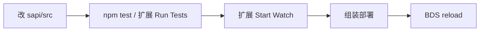

# 模块开发

从模板建仓，用 **VS Code/Cursor 扩展「SFMC Module」** 写测与 Watch；运维面仍用 `sfmc`（装模块、启停、对本机 `mod reload`）。

一模块一仓；**不要** clone `sfmc-modules` 写业务。

## 新建模块

=== "扩展（推荐）"

    命令面板 → `SFMC: New Module`，选空目录并填 id。

=== "模板"

    使用 [sfmc-module-template](https://github.com/Tanya7z/sfmc-module-template)（GitHub *Use this template*），在仓库根目录：

    ```bash
    node scripts/rename.mjs my-feature --scope <npm用户> --name "我的功能"
    npm i
    npm run typecheck
    npm test
    ```

=== "new-module 脚本"

    ```bash
    mkdir my-feature && cd my-feature
    node <主仓>/tools/new-module.mjs my-feature --name "我的功能"
    ```

    详见 [工具脚本](./tools.md)。

## 命名规范

| 层 | 规则 | 例 |
| ------ | ------ | ----- |
| 文件夹 / install id | 短名 kebab | `my-feature` |
| npm（社区） | `@<user>/sfmc-module-<id>` | `@alice/sfmc-module-my-feature` |
| npm（官方） | `@sfmc-bds/module-<id>` | `@sfmc-bds/module-economy` |
| `manifest.id` | `feature-<id>` 或 `core-<id>` | `feature-my-feature` |
| `configKey` | `-` → `_` | `my_feature` |

## 作者工作流


```mermaid
flowchart LR
  A[改 sapi/src] --> B[npm test / 扩展 Run Tests]
  B --> C[扩展 Start Watch]
  C --> D[组装部署]
  D --> E[BDS reload]
```

1. **先测**：`npm test` 或扩展 `SFMC: Run Module Tests`（假引擎，秒级）。详情见 [测试沙箱](./testing.md)（宿主分相、L0–L2、与 Watch 分工）。
2. **再联调**：扩展 `SFMC: Start Watch` / `SFMC: Reload to BDS`（设置 `sfmc.root` 为含 `configs/`、`modules/` 的工作目录；扩展会写 `${sfmc.root}/modules/module-lock.json`，与 `sfmc` CLI 同一权威源）；或运维机 `sfmc mod install --link` + `mod reload`。

!!! tip "全表面 ≠ 假 BDS"
    沙箱能 `import` 大范围 `@minecraft/*`，未实现 API 会**硬失败**（不是静默 noop）。进服仍是终检：世界交互与版本 quirk 用 Watch / 日志。

| 入口 | 作用 |
| ------ | ------ |
| 扩展 Run Tests | 跑模块仓 `npm test` |
| 扩展 Start Watch | 源码变更 → `@sfmc-bds/devkit` 重建部署 |
| `sfmc mod build` / `reload` | **运维**对本机已装模块组装部署 |
| `sfmc mod install/enable` | **运维**安装与启停 |

!!! warning "注意"
    `sfmc mod test` / `mod watch` / `mod publish` 已移除；作者发布用模板/`npm publish`，联调用扩展。

### 安装源（运维）

| 来源 | 何时用 |
| ------ | -------- |
| `npm:@scope/name`（默认） | 已发布 |
| `dir:` / `local:` + `--link` | 作者仓联调到服务器工作目录 |

## 作者仓结构

```text
my-feature/
├── package.json
├── .vscode/          # ESLint / SFMC Module / 测试推荐扩展
├── eslint.config.js
├── scripts/rename.mjs
├── sapi/
│   ├── manifest.json
│   ├── tsconfig.json
│   └── src/index.ts
└── test/
```

## SDK 导入

| 路径 | 用途 |
| ------ | ------ |
| `@sfmc-bds/sdk/sapi/runtime` | Msg、命令、权限、菜单 |
| `@sfmc-bds/sdk/sapi/db` | 表、CRUD、事务 |
| `@sfmc-bds/sdk/testing` | 测试沙箱 `createSandbox` |
| `@sfmc-bds/devkit` | Watch / 脚手架（扩展依赖） |

## 接下来

| 章节 | 内容 |
| ------ | ------ |
| [测试沙箱](./testing.md) | 假引擎保真、L0/L2、与 Watch 分工 |
| [ESLint 约定](./eslint.md) | 约定检查 |
| [发布你的模块](./publish.md) | npm 发布 |
