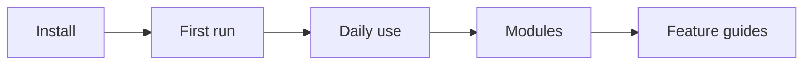

import { Tabs, Tab } from '@rspress/core/theme';

# Getting started

Install SFMC locally and bring your server online.

This page is for operators and module authors. After reading it, you should be able to:

- Complete installation and first-time setup
- Manage services and modules with common commands
- Tell modules apart from add-ons, and know where development workflow begins

Details live in later chapters; see [Command reference](./commands.md) for a quick lookup.



## System requirements

| Item | Requirement |
| ------ | ------ |
| OS | Windows 10 / 11 (primary support today) |
| Node.js | [22.13 or newer](https://nodejs.org/) |
| Disk | Space for BDS, backups, and modules |

## Quick start


<Tabs>
  <Tab label="npm (recommended)">

```bash
npm i -g @sfmc-bds/sfmc@beta
mkdir my-server && cd my-server
sfmc
```

  </Tab>
  <Tab label="monorepo">

```bash
git clone https://github.com/DogeLakeDev/ScriptsForMinecraftServer.git
cd ScriptsForMinecraftServer
npm i
npm run build --workspaces --if-present
sfmc
```

  </Tab>
</Tabs>

:::tip Note
Only **beta** is published today; install with `@beta`.  
Data defaults to the current directory; set `SFMC_ROOT` to use another root.  
Build the monorepo once before first use.  
Type `help` in the console for available commands.  
For module development, install the **SFMC Module** extension (test / Watch); see [Module authoring](../dev/module-author.md).

:::

## First run and daily use

The first run opens the setup wizard: pick BDS, data directory, and optional LLBot. After that, the workspace looks roughly like:

```text
{workspace}/
├── {BDS}/
├── configs/
├── data/
├── packs/
└── modules/
```

```bash
sfmc> start -all
sfmc> status
```

Services start in order **db → qq → llbot → bds**. Before BDS starts, the module behavior pack is checked; if it is out of date, it is rebuilt first. A failed build blocks the game process.

| Command | Purpose |
| ------ | ------ |
| `start db\|qq\|bds\|-all` | Start |
| `stop` / `restart` | Stop / restart |
| `mod list` | Installed modules |
| `mod enable <id>` | Enable a module |

:::warning Important
After editing `configs/*.json` or a module's `sapi/manifest.json`, restart BDS.  
Configs and manifests are not hot-reloaded; during development use the **SFMC Module** extension Watch, or on the server run `mod reload`.

See [Service management](./services.md) for services, logs, and load gates. See [Configuration](./config.md) for config files.

:::

## Modules

A **module** is an SFMC business feature package (installed with `mod`).  
An **add-on** is a third-party behavior or resource pack installed into the world (managed with `packs` / `addon`). Do not mix the two command families.


<Tabs>
  <Tab label="Install existing modules">

```bash
sfmc> mod search
sfmc> mod install afk
sfmc> mod enable afk
sfmc> mod reload
```

  </Tab>
  <Tab label="Develop your own module">

Create with `npm create @sfmc-bds/module@latest`:

```bash
npm create @sfmc-bds/module@latest
cd my-feature && npm i && npm test
```

Link into your SFMC workspace (module short id required). Authors use extension Link / Watch; on the server:

```bash
sfmc mod install my-feature --from dir:<absolute-path-to-author-repo> --link
sfmc mod enable my-feature
sfmc mod reload
```

  </Tab>
</Tabs>

| Layer | Rule | Example |
| ------ | ------ | ----- |
| Install id | Short kebab-case name | `my-feature` |
| manifest / descriptor | `feature-<id>` | `feature-my-feature` |
| npm (community) | `@<user>/sfmc-module-<id>` | `@alice/sfmc-module-my-feature` |

Enable/disable, behavior pack assembly, and reload are covered in [Modules](./modules.md). Full author workflow: [Module authoring](../dev/module-author.md).

## Common issues

| Symptom | Check first |
| ------ | ------------ |
| `/api/health` unreachable | Is db running? Node.js ≥ 22.13? |
| Module commands do nothing | Enabled? Restarted BDS after changes? |
| `npm test` errors / missing deps | Running `npm test` per template? See [Test sandbox](../dev/testing.md) |

More in [Troubleshooting](./troubleshooting.md).

## Next steps

| Chapter | Contents |
| ------ | ------ |
| [Service management](./services.md) | Start/stop, logs, load gate |
| [Configuration](./config.md) | `configs/` and reload behavior |
| [Modules](./modules.md) | Install, enable, behavior pack |
| [Add-ons](./addons.md) | Third-party behavior / resource packs |
| [QQ bridge](./qq-bridge.md) | Group ↔ server bridge |
| [Command reference](./commands.md) | Command cheat sheet |
| [Backup and upgrade](./backup-upgrade.md) | BDS updates and backups |
| [Troubleshooting](./troubleshooting.md) | Symptoms and fixes |
