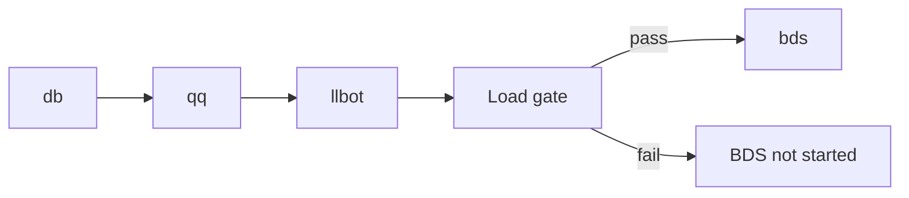

# Service management

Manage db, qq, llbot, bds, and other processes. The module behavior pack must pass the load gate before BDS starts.

```bash
sfmc> start -all
sfmc> status
```

## Start order

`start -all` brings up **db → qq → llbot → bds**. The bds step includes the load gate: validation failure prevents the game process from starting.



## Common commands

| Command | Purpose |
| ------ | ------ |
| `start db\|qq\|llbot\|bds\|-all` | Start (`bds` validates and rebuilds the module behavior pack if needed) |
| `stop …` / `restart …` | Stop / restart |
| `status` | Running state |
| `logs <svc> [-n N] [-f]` | View logs; `Ctrl+L` opens the in-memory view |
| `init` | Re-run the setup wizard |
| `update [--check-only]` | Check or install a BDS update |

Persistent logs live under `<SFMC_ROOT>/.sfmc/logs/`. Full command list: [Command reference](./commands.md); type `help` in the console for what is available now.

## Load gate

Before `bedrock_server` starts (`start bds` / `restart bds` / `start -all`):

1. Scan `<SFMC_ROOT>/packs/` inbox and install pending add-ons (see [Add-ons](./addons.md))
2. Compare `sfmc-deploy-catalog.json` in the module behavior pack with local enable state and fingerprints
3. On mismatch, build and deploy the module behavior pack; write `server-net` permissions when required
4. Print a load summary; failure blocks BDS

Manual build: `mod build`. Dev reload: `mod reload`. Details: [Modules](./modules.md).

## Related chapters

| Chapter | Contents |
| ------ | ------ |
| [Configuration](./config.md) | `configs/` files |
| [Modules](./modules.md) | Enable/disable and behavior pack |
| [Add-ons](./addons.md) | Inbox and third-party packs |
