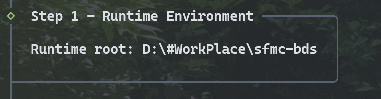
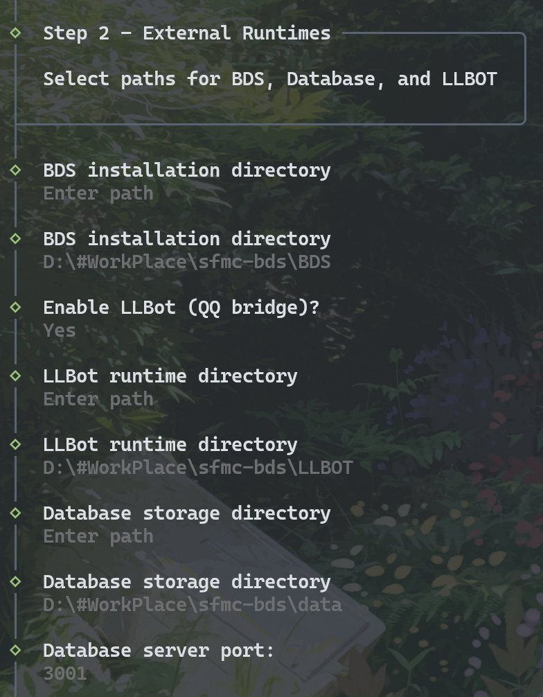
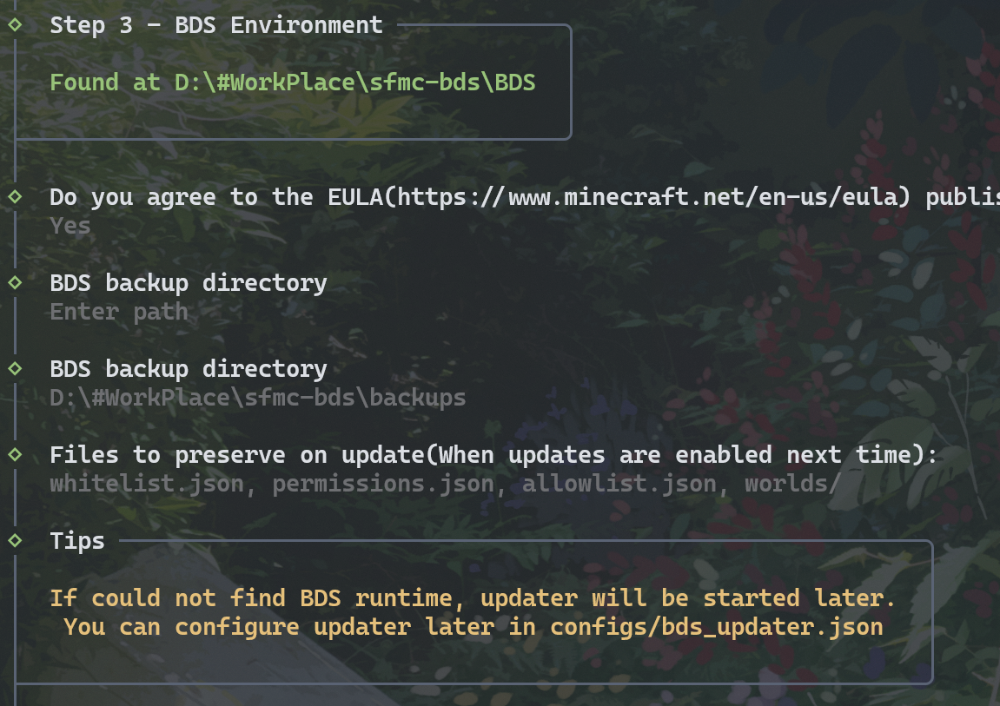

# 首次运行

## 🪁 向导

### S1: 工作环境目录（自动判断）

### S2: 选择运行时

  - BDS：选择 BDSever 的运行文件夹，可选择已经安装的目录；如未检测到会在之后提示下载。
  - LLBOT: 需要前往[LLBOT](https://www.llonebot.com/)下载，也可选择已安装的目录（CLI）可不选。
  - DataBase: 数据库储存目录。

### S3: BDS环境检查

  - 选择备份目录文件与目录：建议全选

> 输入`help`查看帮助。

## 🛠️ 配置文件

| 文件 | 用途 |
| ------ | ------ |
| `db_config.json` | db-server 端口、数据路径、模块目录 |
| `qq_config.json` | QQ 桥、LLBot 连接 |
| `bds_updater.json` | BDS 更新与备份 |
| `permissions.json` | 权限种子 |

> 模块配置在 `modules/packages/<id>/configs-default/`，安装模块后由平台合并。

下一章：[服务管理](./services.md)
