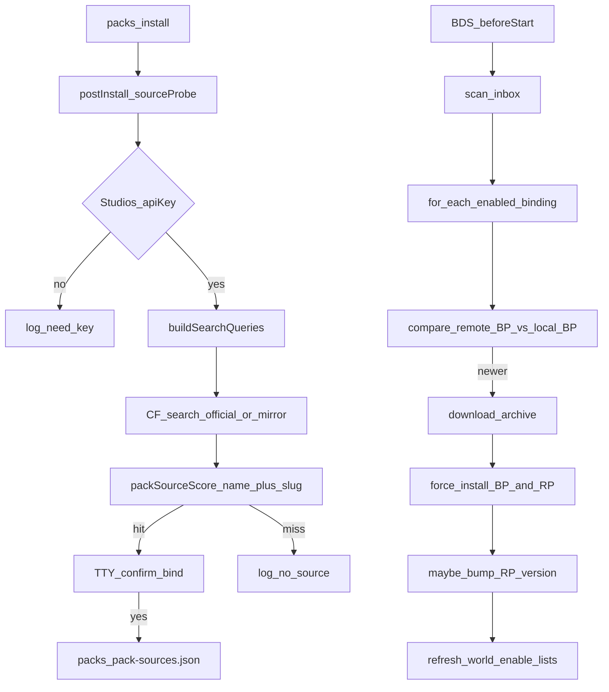

# CurseForge 世界包更新（技术路线）

本文描述 `sfmc packs` / `addon` 的**第三方世界 BP/RP 远程更新**完整设计与实现细节（与 SFMC 业务模块 `mod` / GitHub registry **无关**）。

相关代码：

| 路径 | 职责 |
|------|------|
| [`sfmc/src/pack-update/`](../../sfmc/src/pack-update/) | 配置、绑定、CF Provider、探测/检查/应用 |
| [`sfmc/src/world-packs.ts`](../../sfmc/src/world-packs.ts) | CLI 接线、安装后探测钩子 |
| [`sfmc/src/services.ts`](../../sfmc/src/services.ts) | BDS `beforeStart` 检查/应用 |
| [`bds-tools/src/world-packs.ts`](../../bds-tools/src/world-packs.ts) | 安装/enable/抬版权威实现 |
| [`modules/sdk/@sfmc-sdk/src/logs/terminal-progress.ts`](../../modules/sdk/@sfmc-sdk/src/logs/terminal-progress.ts) | 进度条与日志共存 |
| [`configs/pack-update.json`](../../configs/pack-update.json) | 运行时配置（首次由 sfmc ensure 写入内置 DEFAULTS） |

通用收件箱安装见 [资源包管理](./world-packs.md)。

---

## 1. 目标与边界

**目标**：为已装进世界目录的第三方 addon（如 OrdinaryWorld 的 Slash Blade BP）找到 CurseForge 更新源，并在启动或手动命令时检查/应用更新。

**边界**：

- 只管理**世界侧** `behavior_packs` / `resource_packs`，不管理 SFMC `modules/packages` 业务模块。
- 多来源预留 `SourceProvider` 抽象；当前唯一实现是 CurseForge Bedrock。
- 下载物仍走既有 `installPackDirectory` / `enableInstalledPack`（DRY，无第二套拷贝逻辑）。

验收样例：本地「Slash Blade v4」BP ↔ CF 项目 slug `slash-blade-addon`。

---

## 2. 总览流程



---

## 3. 配置与播种（DRY）

### 3.1 文件位置

| 文件 | 作用 |
|------|------|
| `configs/pack-update.json` | 策略、Provider、启动行为 |
| `packs/pack-sources.json` | 每 BP uuid → CF 绑定（可手改/`enabled: false`） |

`apiKey` 也可用环境变量 `CURSEFORGE_API_KEY` 覆盖（避免把 key 写进可分享配置）。

### 3.2 启动时如何生成配置

不再从 `configs-default` 拷贝。`createServices()` / `ensurePackUpdateConfigFile()` 在文件缺失时写入代码内 `DEFAULTS`，并附带 `$schema`（见 `@sfmc-bds/sdk/schemas/pack_update.schema.json`）。

权威实现：[`sfmc/src/pack-update/config.ts`](../../sfmc/src/pack-update/config.ts) 的 `ensurePackUpdateConfigFile`。

### 3.3 `pack-update.json` 关键字段

```json
{
  "enabled": true,
  "checkOnBdsStart": true,
  "applyOnBdsStart": true,
  "askConfirmOnBind": true,
  "probeSourceAfterInstall": true,
  "defaultBindingEnabled": false,
  "match": {
    "nameMinScore": 0.6,
    "stripFolderTags": true
  },
  "providers": {
    "curseforge": {
      "enabled": true,
      "apiKey": "",
      "baseUrl": "https://api.curseforge.com",
      "searchBaseUrl": "https://api.curse.tools/v1/cf",
      "gameId": 78022,
      "classId": 4984,
      "pageSize": 10,
      "preferredReleaseTypes": ["release", "beta", "alpha"]
    }
  },
  "versionPolicy": {
    "authority": "behavior_pack",
    "onUpdateOverwriteBoth": true,
    "rpBumpWhenSameMajor": true,
    "rpBumpComponent": "patch",
    "majorHigherSkipRpBump": true
  },
  "startup": {
    "sequential": true,
    "delayMsBetweenPacks": 0,
    "skipDisabledBindings": true,
    "failMode": "continue"
  },
  "uninstall": {
    "recycleBin": true,
    "trashRelativeDir": "packs/_trash"
  }
}
```

| 字段 | 含义 |
|------|------|
| `defaultBindingEnabled` | 新建绑定的默认 `enabled`（**默认 `false`**）。仍写入 `pack-sources.json`，但需手改为 `true`（或改此默认）才参与启动检查/自动更新。 |
| `uninstall.recycleBin` | `packs uninstall` 是否移入回收站（默认 `true`）；`false` 或 CLI `--purge` 则直接删除 |
| `uninstall.trashRelativeDir` | 回收站相对 `SFMC_ROOT` 的路径（默认 `packs/_trash`） |
| `match.nameMinScore` | 安装后自动绑定的最低相似度阈值（源无关，顶层）。 |
| `match.stripFolderTags` | 清洗时是否去掉方括号标签（如 `[BP]`/`[玩法]`）。 |
| `gameId` | **Minecraft Bedrock = `78022`**。历史误用 `459` 无效，加载时会纠正。Java Minecraft 是 `432`，不要混用。 |
| `classId` | Bedrock **Addons = `4984`**；`null` 时用 `/v1/categories?classesOnly=true` 解析「Addons」。 |
| `baseUrl` | 官方 Core API：getMod / files / download-url。 |
| `searchBaseUrl` | 搜索镜像；官方 search 403 时回退。 |

### 3.4 绑定文件示例

```json
{
  "bindings": {
    "3116e462-9838-48bf-be53-354958c1810f": {
      "enabled": false,
      "provider": "curseforge",
      "projectId": 1055810,
      "slug": "slash-blade-addon",
      "websiteUrl": "https://www.curseforge.com/minecraft-bedrock/addons/slash-blade-addon",
      "pairedResourceUuid": "6796f9a6-d1f4-4f90-8737-988dce8b4eaf",
      "lastFileId": null,
      "lastCheckedAt": null,
      "lastAppliedFileId": null
    }
  }
}
```

关闭某包自动更新：将该条 `enabled` 设为 `false`，或 `packs unbind <id>`。  
`packs list` 文案：开启 `src=cf:slug`，关闭 `src=cf:slug:off`（与 `sources` 的开/关一致，不再丢成单独的 `src=off`）。

检查/应用：**仅在成功写入世界目录后**才更新 `lastAppliedFileId`。同一 fileId 已应用则跳过下载；版本未更高但尚未 apply 过该文件时仍会覆盖安装（同步 CF 内容）。

---

## 4. CurseForge API 鉴权（易踩坑）

CurseForge 存在**两套完全不同**的「API Token」，不可混用。

| | Upload / Legacy API Tokens | CurseForge for Studios（本功能需要） |
|--|--|--|
| 文档 | [support 文章 9000197321](https://support.curseforge.com/support/solutions/articles/9000197321-curseforge-api) | [docs.curseforge.com](https://docs.curseforge.com/rest-api/) |
| 申请 | 站点「API Tokens」 | [console.curseforge.com](https://console.curseforge.com/) |
| 形态 | UUID（约 36 字符） | 常见 `$2a$10$…`（更长） |
| 请求头 | `X-Api-Token` | **`x-api-key`** |
| 用途 | 上传项目文件等 | `api.curseforge.com` 搜索/元数据/下载 |
| 对本功能 | **无效** → 403 | **正确** |

本仓库请求官方 API 时只发送 `x-api-key`。若 key 形如 UUID，403 错误信息会提示换 Studios Key。

JSON 中 `$` **无需**加倍；仅当把 key 放进 **shell / docker-compose 环境变量** 时，`$` 可能被展开，需按运行环境转义（常见写法是 `$$`）。

---

## 5. 搜索端点与镜像回退

实测（Studios Key）：

| 端点 | 结果 |
|------|------|
| `GET /v1/games`、`/v1/games/78022` | 200 |
| `GET /v1/categories?gameId=78022` | 200 |
| `GET /v1/mods/{id}`、`/files` | 200 |
| `GET /v1/mods/search?...` | **部分 key 恒 403**（`Forbidden: API Key missing or invalid`） |
| `GET https://api.curse.tools/v1/cf/mods/search?...` | 200（社区镜像，路径约定与官方类似） |

实现策略（[`providers/curseforge.ts`](../../sfmc/src/pack-update/providers/curseforge.ts)）：

1. 先打官方 `baseUrl` + `/v1/mods/search`。
2. 若返回 403 → 静默改打 `searchBaseUrl`（默认 `https://api.curse.tools/v1/cf`）的 `/mods/search`。
3. **getMod / files / download-url / CDN 下载**仍走官方 + Studios Key（下载也带 `x-api-key`，以应对 CDN 鉴权收紧）。

---

## 6. 搜索与匹配（name + slug）

### 6.1 CF Bedrock 命名规律

- 项目 **slug 无空格**：小写 + 连字符，例如 `slash-blade-addon`。
- 展示名可有空格/本地化：`Slash Blade Addon`。
- 本地文件夹常带标签与版本：`[BA] [玩法] …Slash Blade v4 BP`。

因此「只把带空格的清洗名丢进 searchFilter、只比 name」成功率偏低。

### 6.2 查询词派生 `buildSearchQueries`

探测与 `packs search` 共用。安装后探测固定两源：`manifest.header.name`（`header`）与安装文件夹名（`folder`），**分别派生后再轮询合并**，避免某一源占满配额。

每个原始字符串先经 `collectQuerySeeds` 做多级清洗，再派生 slug。  
**只要合并结果里已有拉丁字母候选，就丢弃纯中文查询**（CF Bedrock 几乎不靠中文命中）。

1. 去 `§`、方括号标签 `[BP]`/`[BA]`/`[玩法]`、扩展名  
2. **CJK/拉丁粘连分界**：`拔刀剑Slash` → `拔刀剑 Slash`  
3. 去整词包角色：`BP`/`RP`/`Addon`/`行为包`…  
4. 去版本尾巴：`v4`、`1.21.100`  
5. **提取拉丁短语**（CF 主路径）：`Slash Blade v4 BP` → … → `Slash Blade`  
6. 对每个种子再生成：`slash-blade`、`Slash-Blade`、`slash-blade-addon`（大小写不敏感去重，故 `Slash-Blade` 与 `slash-blade` 只保留一条）

**样例文件夹** `[BP] [BA] [玩法] 拔刀剑Slash Blade v4 BP` 的种子链约等于：

```text
拔刀剑 Slash Blade v4 BP
→ Slash Blade v4 BP
→ Slash Blade v4
→ Slash Blade
→ Slash-Blade / slash-blade / slash-blade-addon
```

查询列表按「slug-addon > slug > Title-Slug > 拉丁短语 > 含 CJK」排序并截断（默认最多 14 条），避免 API 打爆同时保住核心 slug。

仅读 header 若全是中文/无英文，仍可靠文件夹名命中 CF。

### 6.3 综合打分 `packSourceScore`

对每个候选 hit，取 `max(按 name 相似度, 按 slug 相似度)`：

| 条件 | 约分 |
|------|------|
| slug 完全相等 | 1.0 |
| slug = `{q}-addon` 或以 `{q}-` 为前缀 | 0.96 |
| slug 互相包含 | 0.88 |
| 否则把 `-` 当空格做 token Jaccard / 包含 | 同 nameSimilarity |
| 纯展示名相等 / 包含 / token 交并比 | 1.0 / 0.85 / 交并 |

安装后自动绑定要求 `score >= match.nameMinScore`（默认 `0.6`）。

**样例**：本地 `Slash Blade v4` ↔ CF `slash-blade-addon` → slug 前缀规则约 **0.96**，会排在 `Terra Blade` 等弱相关结果之前。

### 6.4 CLI 行为

- `packs search <q>`：多查询 + 按 score 降序；每行显示 `id` / `slug` / `score`。
- `packs bind <id> <projectId|slug|url>`：手动绑定，不依赖探测分数。
- 安装成功后的探测：分数达标后写入 `packs/pack-sources.json`（`enabled` 取 `defaultBindingEnabled`，默认关）。TTY 且 `askConfirmOnBind=true` 时先确认；**非 TTY** 自动写入绑定。开启自动更新请把对应条改为 `"enabled": true`。

---

## 7. 版本策略（以 BP 为准）

权威：本地 BP `header.version` vs 远程归档内 BP `header.version`。  
**忽略**用户曾对手改 RP 小版本号的干扰。

| 情况 | 行为 |
|------|------|
| 远程 BP ≤ 本地 BP，且该 fileId **已成功 apply** | 无更新 |
| 远程 BP ≤ 本地 BP，但 `lastAppliedFileId` 未记录该文件 | **仍覆盖安装**（同步 CF 内容；避免汉化包等同版本号跳过写入） |
| 远程 BP 更大，且 **major 相同** | `force` 覆盖 BP + 配对 RP；再把 **RP** 版本抬高一级（默认 patch+1，且严格大于旧 RP），并同步 `world_resource_packs.json`，以便玩家进服触发客户端 RP 刷新 |
| 远程 BP **major 更高** | 直接覆盖双方，**不再**额外 bump RP（`majorHigherSkipRpBump`） |
| BP 自身 | 保持远程原版，不额外 bump |

`lastAppliedFileId` **仅在成功写入世界目录后**更新；不可在「仅下载比较」阶段提前写入。

配对 RP：绑定里的 `pairedResourceUuid`，或新 BP `dependencies[].uuid`，或 mcaddon 内与之对齐的 resource 包。

抬版原语：`bds-tools` 的 `ensureVersionGreaterThan` / `writePackHeaderVersion`。

---

## 8. 检查 / 应用 / 启动钩子

### 8.1 CLI

| 命令 | 行为 |
|------|------|
| `packs check [id]` | 下载最新归档，按 BP 版本比较，**不安装** |
| `packs update <id\|--all>` | 比较并应用（含 RP 抬版策略） |
| `packs sources` | 打印配置路径与全部绑定 |
| `packs path` | 含 `pack-sources.json` 路径 |

### 8.2 BDS `beforeStart` 顺序

1. `scanAndInstallInbox`（收件箱）  
2. `runPackUpdatesOnBdsStart`（若 `checkOnBdsStart`；若 `applyOnBdsStart` 则一并应用）  
3. `ensurePacksReady`（SFMC 模块聚合 BP/RP）

逐个 binding 顺序处理（`startup.sequential`）；失败默认 `failMode: continue`，不阻断开服。

### 8.3 应用步骤摘要

1. Provider `getLatestFile(projectId)` → 带进度下载到临时目录。  
2. `extractArchiveToTemp` + `discoverPackRoots`。  
3. 读远程 BP 版本 → `decideVersionPolicy`。  
4. `installPackDirectory(..., force: true)` 装 BP / RP。  
5. 按需 `ensureVersionGreaterThan` 抬 RP。  
6. `enableInstalledPack` 刷新世界 enable 列表。  
7. 更新 binding 的 `lastAppliedFileId` / `lastCheckedAt`。

进度条：`createTerminalProgress`（stderr）；日志 sink / REPL 写行前 `pauseAllProgress`、写完 `resumeAllProgress`（与 BDS 更新器共用，DRY）。

---

## 9. 代码结构（OCP / DIP）

```text
sfmc/src/pack-update/
  types.ts              # PackSourceProvider 契约、配置/绑定类型
  config.ts             # load / ensure pack-update.json
  bindings.ts           # packs/pack-sources.json
  version-policy.ts     # 版本比较、slug/name 查询与打分
  providers/curseforge.ts
  service.ts            # probe / search / check / apply / BDS 钩子
```

新增来源（如 Modrinth）时：实现 `PackSourceProvider`，在配置 `providers` 注册，不必改核心 switch 链。

---

## 10. 排障清单

| 现象 | 排查 |
|------|------|
| 启动没有 `pack-update.json` | 确认跑的是会调用 `createServices` 的 sfmc；看 `SFMC_ROOT` 是否指向期望数据根 |
| `403` + UUID 形 key | 用了 Upload Token；改去 console.curseforge.com 申请 Studios Key |
| Studios Key 仍 search 403 | 正常现象之一；应已自动走 `searchBaseUrl`。确认配置里 `gameId=78022` |
| `gameId=459` | 无效；改为 `78022`（新版本会纠正） |
| 搜不到 Slash Blade | 看 slug 是否 `slash-blade-addon`；用 `packs search "slash blade"` 看 score；或 `packs bind <uuid> slash-blade-addon` |
| 更新了但客户端 RP 不刷新 | 同 major 路径应抬 RP；确认 `world_resource_packs.json` 版本已变并重启 BDS / 重进服 |
| 进度条与日志抢行 | 应使用 SDK `createTerminalProgress`；勿直接 `cli-progress` 写 stdout |

---

## 11. 相关命令速查

```bash
# 配置 API Key 后
sfmc packs search "Slash Blade v4"
sfmc packs bind <uuid|folder> slash-blade-addon
sfmc packs sources
sfmc packs check
sfmc packs update --all
sfmc packs path
```

别名：`addon` ≡ `packs`。
