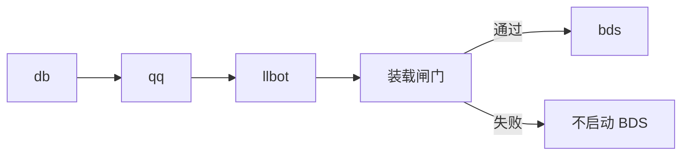

# 服务管理

管理 db、qq、llbot、bds 等进程，并在启动 BDS 前完成模块行为包装载。

```bash
sfmc> start -all
sfmc> status
```

## 启动顺序

`start -all` 按 **db → qq → llbot → bds** 拉起。其中 bds 步骤含装载闸门：校验失败则不会启动游戏进程。



## 常用命令

| 命令 | 作用 |
| ------ | ------ |
| `start db\|qq\|llbot\|bds\|-all` | 启动（`bds` 前会校验并按需重编模块行为包） |
| `stop …` / `restart …` | 停止 / 重启 |
| `status` | 查看运行状态 |
| `logs <svc> [-n N] [-f]` | 查看日志；快捷键 `Ctrl+L` 打开内存视图 |
| `init` | 重新进入初始化向导 |
| `update [--check-only]` | 检查或安装 BDS 更新 |

持久日志在 `<SFMC_ROOT>/.sfmc/logs/`。完整命令见 [命令列表](./commands.md)；控制台输入 `help` 可看当前可用项。

## 装载闸门

`start bds` / `restart bds` / `start -all` 在拉起 `bedrock_server` **之前**会：

1. 扫描 `<SFMC_ROOT>/packs/` 收件箱，安装待处理的附加包（见 [附加包](./addons.md)）
2. 比对模块行为包内的 `sfmc-deploy-catalog.json` 与本机启停 / 指纹
3. 不一致则编译并部署模块行为包，必要时写入 `server-net` 权限
4. 打印装载摘要；失败则不启动 BDS

手动编译：`mod build`。开发期重装：`mod reload`。详见 [模块](./modules.md)。

## 相关章节

| 章节 | 内容 |
| ------ | ------ |
| [配置](./config.md) | `configs/` 文件 |
| [模块](./modules.md) | 启停与行为包装配 |
| [附加包](./addons.md) | 收件箱与第三方包 |
| [远程控制](./remote.md) | `remote enroll` |
