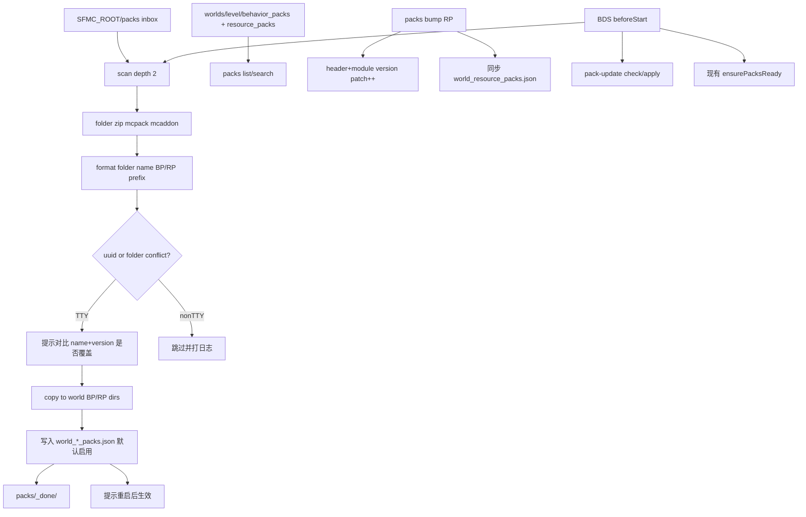

# 资源包管理（`sfmc packs`）

管理世界目录里的**任意**行为包 / 资源包（第三方 `.mcpack` / `.mcaddon` 等）。

与 [`sfmc mod build` / `mod reload`](./behavior-pack.md)（模块聚合 BP/RP）职责不同，请勿混用。

## 收件箱

路径：`<SFMC_ROOT>/packs/`

| 内容 | 说明 |
| ------ |------ |
| 待装文件/目录 | `.zip` / `.mcpack` / `.mcaddon` / 含 `manifest.json` 的文件夹（可嵌套，扫描深度 2） |
| `_done/` | 安装成功后的源归档 |
| `_failed/` | 识别失败或安装失败 |
| `inbox-state.json` | 源指纹 → 已装 uuid，防重复 |

`start bds` 前会自动 `scan` 收件箱（空收件箱不打日志）。也可手动：



```bash
sfmc packs scan
sfmc packs install --inbox
```

## 命令

别名：`addon` ≡ `packs`。

| 命令 | 行为 |
| ------ | ------ |
| `packs list [--kind bp\|rp\|all] [--search q]` | 按 BP/RP 分组列表（BP 行带 `src=cf:…`） |
| `packs search <q>` | **CurseForge** 远程搜索（需 API Key） |
| `packs bind <id> <project\|slug\|url>` | 为已装 BP 绑定更新源 |
| `packs unbind <id>` | 解除绑定 |
| `packs sources` | 打印配置路径与全部绑定 |
| `packs check [id]` | 按 BP 版本检查更新（下载比对，不安装） |
| `packs update <id\|--all>` | 检查并应用更新（同 major 时抬高 RP 版本） |
| `packs enable \| disable <id>` | id = uuid 或文件夹名；**需重启 BDS 后生效** |
| `packs bump <id>` | **仅 RP**：`header`/`modules` patch 版本 +1；若已启用则同步 `world_resource_packs.json`；提示重启并重进服 |
| `packs install [path\|--inbox] [--force]` | 指定路径或扫收件箱；成功后探测 CF 源 |
| `packs scan [--force] [--dry-run]` | 同启动前收件箱逻辑 |
| `packs doctor` | 清单缺目录、已装未启用、版本不一致 |
| `packs path` | 打印 bdsRoot、level、世界包目录、收件箱、`pack-sources.json` |

## CurseForge 自动更新

世界第三方包的远程搜索 / 绑定 / 版本策略 / API 鉴权 / slug 匹配等**完整技术路线**见：

→ **[CurseForge 世界包更新（技术路线）](./pack-update.md)**

配置：`configs/pack-update.json`（首次由 sfmc ensure 写入内置默认）。  
绑定：`packs/pack-sources.json`。  
进度条与 BDS 更新器共用 `@sfmc-bds/sdk/logs` 的 `createTerminalProgress`。

## 安装即启用

安装成功后会写入对应的 `world_behavior_packs.json` / `world_resource_packs.json`（默认启用）。

BDS **不支持**热加载世界包，因此仍会提示「需重启 BDS 后生效」；不必再手动 enable，除非你后来 `disable` 过。

## 冲突策略

目标已存在同 uuid 或同格式化文件夹名时：

- **交互（TTY / `packs install|scan`）**：打印双方 `name`、`version`、uuid、路径，询问是否覆盖；否 → 跳过。
- **非交互（BDS `beforeStart`、无 TTY）**：**不静默覆盖**，跳过并 warn；可用 `--force` 强制覆盖。

## 文件夹名格式化

落盘前规范化目标文件夹名：

1. 去掉 Minecraft 格式码（`§` + 后一字符）
2. 去掉末尾 `.zip` / `.mcpack` / `.mcaddon`
3. 种类前缀：`[BP]` / `[RP]`（例：`[RP] Cool Textures`）
4. 空白折叠；空名则回退简短占位

## 安装源识别

| 输入 | 处理 |
| ------ | ------ |
| 含 `manifest.json` 的文件夹 | 直接安装 |
| 嵌套文件夹 | `maxDepth=2` 找包根（可一次装多个） |
| `.zip` / `.mcpack` | 解压后发现包根 |
| `.mcaddon` | 同上，常含 BP+RP |

`modules[].type`：`resources` → RP；`data` / `script` / `javascript` → BP。无法判定 → `_failed/`。
