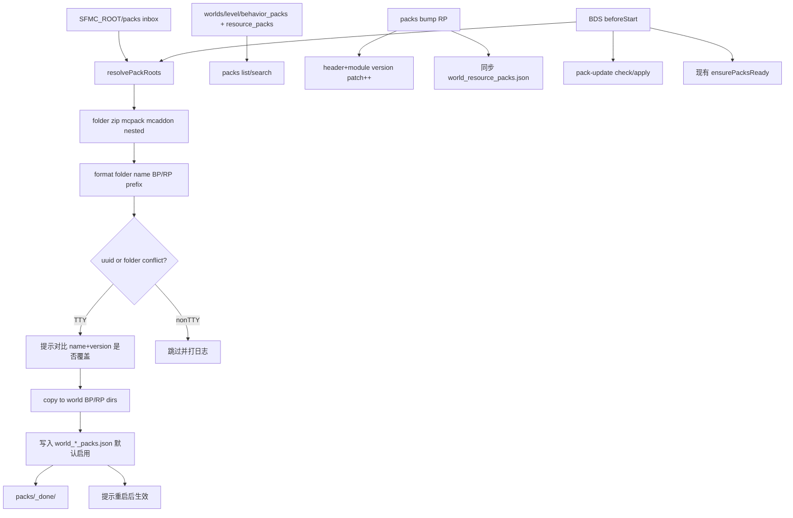

# 资源包管理

使用 `packs` 或 `addons` 命令管理世界目录里的**任意**行为包 / 资源包，兼容 `zip`/`.mcpack` / `.mcaddon` 等）。

```bash
sfmc> packs scan
sfmc> packs install --inbox
```

## 收件箱

路径：`<SFMC_ROOT>/packs/`

| 内容 | 说明 |
| ------ | ------ |
| 待装文件/目录 | `.zip` / `.mcpack` / `.mcaddon` / 含 `manifest.json` 的文件夹；嵌套归档由 `resolvePackRoots` 自动展开；安装侧读取 `manifest.json` 并解析其内容 |
| `_done/` | 安装成功后的源归档 |
| `_failed/` | 识别失败或安装失败 |
| `_trash/` | **卸载回收站**（`packs uninstall` 默认移入此处） |
| `_build/` | 模块打包后的 BP/RP 构建产物 |
| `inbox-state.json` | 源指纹 |
| `pack-sources.json` | CF 等更新源绑定 |

> 可设置 `start bds` 前自动 `scan` 收件箱（默认关闭）。但仍建议手动使用 `packs scan` 命令，便于识别更新源、解决覆盖冲突问题等。


```mermaid
flowchart TB
  inbox["SFMC_ROOT/packs inbox"] --> scan[resolvePackRoots]
  scan --> detect[folder zip mcpack mcaddon nested]
  detect --> formatName[format folder name BP/RP prefix]
  formatName --> conflict{uuid or folder conflict?}
  conflict -->|TTY| prompt[提示对比 name+version 是否覆盖]
  conflict -->|nonTTY| skipWarn[跳过并打日志]
  prompt --> install[copy to world BP/RP dirs]
  install --> enable[写入 world_*_packs.json 默认启用]
  enable --> done["packs/_done/"]
  enable --> restartHint[提示重启后生效]
  world["worlds/level/behavior_packs + resource_packs"] --> list[packs list/search]
  bump[packs bump RP] --> manifest[header+module version patch++]
  bump --> enableList[同步 world_resource_packs.json]
  beforeStart[BDS beforeStart] --> scan
  beforeStart --> packUpdate[pack-update check/apply]
  beforeStart --> ensurePacksReady[现有 ensurePacksReady]
```

## 命令

别名：`addon` ≡ `packs`。

| 命令 | 行为 |
| ------ | ------ |
| `packs list [--kind bp\|rp\|all] [--search q]` | 按 BP/RP 分组列表（BP 行带 `src=cf:…`） |
| `packs search <q>` | **CurseForge** 远程搜索 **（需 API Key）** |
| `packs bind <id> <project\|slug\|url>` | 为已装 BP 绑定更新源 |
| `packs unbind <id>` | 解除绑定 |
| `packs sources` | 打印配置路径与全部绑定 |
| `packs check [id]` | 按 BP 版本检查更新（下载比对，不安装） |
| `packs update <id\|--all>` | 检查并应用更新（同 major 时抬高 RP 版本） |
| `packs enable \| disable <id>` | id = uuid 或文件夹名 |
| `packs uninstall [id...] [--purge] [--no-paired]` | 卸出世界：disable + 移入 `packs/_trash`（或 `--purge` 无需确认直接删除）；BP 默认连带配对 RP。无参数且 TTY → 多选确认；可一次传多个 id |
| `packs bump <id>` | **仅 RP**：`header`/`modules` patch 版本 +1；若已启用则同步 `world_resource_packs.json` |
| `packs install [path\|--inbox] [--force]` | 指定路径或扫收件箱；成功后探测 CF 源 |
| `packs scan [--force] [--dry-run]` | 同启动前收件箱逻辑 |
| `packs doctor` | 清单缺目录、已装未启用、版本不一致等问题诊断 |
| `packs path` | 打印 bdsRoot、level、世界包目录、收件箱、`pack-sources.json` |

## CurseForge **自动更新**

通过识别资源包的名称进行搜索 / 绑定 / 版本策略 / API 鉴权 / slug 匹配等，**完整技术路线**见：

→ **[CurseForge 资源包更新（技术路线）](./pack-update.md)**

## 卸载清理范围

> `packs uninstall` 相对 `install` 进行对称清理。

| 清理项 | 是否处理 | 说明 |
| -------- | ---------- | ------ |
| `world_*_packs.json` enable 条目 | ✅ | 同 `packs disable` |
| 世界内 BP/RP 目录 | ✅ | 同 `packs uninstall` |
| 配对 RP（卸 BP 时） | ✅ 默认 | 来自 `pack-sources` 的 `pairedResourceUuid` 或 BP `dependencies`；`--no-paired` 跳过 |
| `packs/pack-sources.json` 绑定 | ✅若存在 | `removeBinding` |
| `packs/inbox-state.json` | ✅ | 去掉指向该 uuid 的指纹条目 |
| `packs/_done` 里的源归档 | ❌ | - |
| `sfmc-modules` / `sfmc-modules-rp` | ❌ 拒绝 | - |

配置（`configs/pack-update.json`）：

```json
"uninstall": {
  "recycleBin": true,
  "trashRelativeDir": "packs/_trash"
}
```

## 安装即启用

安装成功后会写入对应的 `world_behavior_packs.json` / `world_resource_packs.json`（默认启用）。

## 冲突策略

目标已存在同 uuid 或同格式化文件夹名时：

- **交互（TTY / `packs install|scan`）**：打印双方 `name`、`version`、uuid、路径，询问是否覆盖；否 → 跳过。
- **非交互（BDS `beforeStart`、无 TTY）**：**不静默覆盖**，跳过并 warn；可用 `--force` 强制覆盖。

## 文件夹名格式化

落盘前规范化目标文件夹名：

1. 去掉 Minecraft 格式码（`§` + 后一字符）
2. 去掉末尾 `.zip` / `.mcpack` / `.mcaddon`
3. 添加种类前缀：`[BP]` / `[RP]`（例：`[RP] Cool Textures`）
4. 空白折叠；空名则回退简短占位

## 安装源识别

| 输入 | 处理 |
| ------ | ------ |
| 含 `manifest.json` 的文件夹 | 直接作为包根（及子目录扫描，默认深度 4） |
| 嵌套文件夹（无归档） | 同上发现多个包根 |
| `.zip` / `.mcpack` / `.mcaddon` | 解压到临时目录 → 展开树内嵌套归档 → 发现包根 |
| 归档内再套 `.mcpack` | 自动多轮展开（默认最多 3 轮），不改用户原文件 |

> `modules[].type`：`resources` → RP；`data` / `script` / `javascript` → BP。无法判定 → `_failed/`。

## 安装冲突与覆盖

| 情况 | 行为 |
| ------ | ------ |
| 无相同 UUID | 写入新目录；撞文件夹名则加 uuid 后缀 |
| 相同 UUID 且新版本 **更高** | **静默覆盖** |
| 相同 UUID 且版本 **≤** 已有 | TTY 确认 / 非 TTY 默认跳过，可后续手动执行命令覆盖 |
| 覆盖路径 | 固定为已有文件夹名，禁止旁路新目录 |
