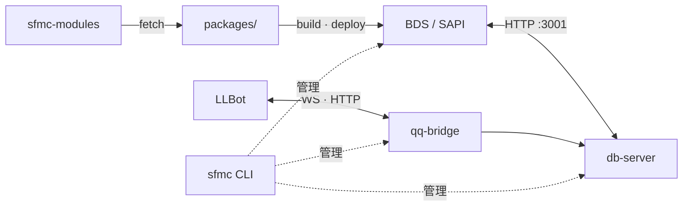

# ScriptsForMinecraftServer

> 一套 Minecraft Bedrock Script API (SAPI) 行为包 + Node.js 仓顶服务的 monorepo。
>
> 在**原生 BDS**即可获得类似插件服的**高效、安全、扩展丰富**的体验

在线地址：<https://dogelakedev.github.io/ScriptsForMinecraftServer/>

* 提供基于 [Minecraft Script API](https://learn.microsoft.com/zh-cn/minecraft/creator/scriptapi/?view=minecraft-bedrock-stable) 的**原生脚本 SDK**
* 外置可拆卸的**模块化管理**服务，拥有类似插件服的舒适体验；目前已开发 [22+ 实用模块](https://github.com/Tanya7z/sfmc-modules)
* 为 BDS 服务器提供的多功能、易用的 CLI 工具，涵盖**自动更新**、**模块管理**、**资源包管理**、**远程控制**等功能
* 为模块提供 **SQLite 数据库管理 SDK** 及其路由服务
* 自建工作流，使模组/模块开发更轻松
* 依赖于 [LLBot](https://www.llonebot.com/zh-CN/) 的 QQ 桥接服务，轻松实现群服互通

[模块仓库 →](https://github.com/Tanya7z/sfmc-modules)

[](https://github.com/DogeLakeDev/ScriptsForMinecraftServer/tags)
[](https://github.com/DogeLakeDev/ScriptsForMinecraftServer/blob/main/LICENSE)
[](https://nodejs.org)
[](https://www.typescriptlang.org)
[](https://www.npmjs.com/package/@sfmc-bds/sfmc)
[](https://github.com/DogeLakeDev/ScriptsForMinecraftServer/blob/main/modules/catalog.json)
[](https://www.minecraft.net/en-us/download/server/bedrock)

---

## 快速开始

### npm 聚合包

```bash
node -v   # 需要 v22.13+
npm install -g @sfmc-bds/sfmc@beta
mkdir my-server && cd my-server
sfmc
```

> 当前阶段仅发 **beta**；请带 `@beta` 安装。见 [npm 发布指南](./dev/npm-publish.md)。

开发者也可克隆本仓 monorepo，见 [安装指南](./guide/install.md)。

## 架构图



## 按角色入口

| 你是谁 | 从这里开始 |
|--------|------------|
| 服主 / 运维 | [使用指南](./guide/index.md) |
| 写业务模块 | [开发指南 · 模块开发](./dev/module-author.md) |
| 改平台 | [开发指南 · 平台开发](./dev/platform.md) |
| 查 HTTP / 模块服务 | [接口指南](./api/index.md) |
| 查 SDK 类型 | [SDK 类型参考](./reference/index.md)（CI / `npm run docs:api` 生成） |

## 文档目录

| 分类 | 入口 |
|------|------|
| 使用指南 | [guide/](./guide/index.md) |
| 开发指南 | [dev/](./dev/index.md) |
| 接口指南 | [api/](./api/index.md) |
| SDK 类型参考 | [reference/](./reference/index.md)（`npm run docs:api`） |

## 本地预览

在仓库根目录：

```bash
pip install -r docs/requirements.txt
npm install
npm run docs:serve
```

浏览器打开 http://127.0.0.1:8000 。

- `npm run docs:api` — 仅 TypeDoc → `docs/reference/sdk/`
- `npm run docs:build` — TypeDoc + MkDocs → `site/`

## 路线图

* ✅ **Stage I**: per-module `sapi/manifest.json` + db-server reader
* ✅ **Stage J**: `shared/*` 迁入 `@sfmc-bds/sdk`，22 模块迁出
* ✅ **Stage K**: 模块按需安装 —— populate 由 `tools/fetch-module.mjs` / `sfmc module install` 完成
* 🚧 **Stage L**: 模块 zip 自动解压、`sfmc module install --enable-and-deploy` 一条龙
* 🚧 **Stage M**: 模块签名 / 公钥验证（取代纯 SHA-256 指纹）
* 🚧 **Stage N+**: 服务网格（多 BDS 实例 / 跨节点）

## 许可证

[AGPL-3.0](https://github.com/DogeLakeDev/ScriptsForMinecraftServer/blob/main/LICENSE)

* **自由**：您可以运行、复制、分发、修改程序，但必须保持这些自由。
* **Copyleft**：如果您分发修改后的版本，必须以相同许可证（AGPL v3）提供完整的源代码。
* **源代码**：必须提供「对应源代码」（Corresponding Source），包括所有脚本、接口定义、共享库等，以便他人能重新构建和修改。
* **附加条款**：您可以添加额外许可，但不能增加限制（第 7 条）。
