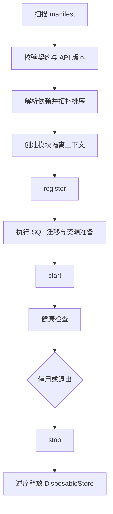

# SFMC 模块架构与实施顺序

> 状态：第一阶段已建立基础包骨架。本文作为后续模块拆分、目录命名和接口归属的统一依据。

## 1. 设计目标

1. SAPI、Node 服务与管理端可以独立构建、部署和升级。
2. 模块只依赖稳定契约，不直接依赖其他模块的内部实现。
3. 核心负责注册、编排、生命周期与基础设施；业务功能按能力模块拆分。
4. 所有可注销资源统一进入模块的 `DisposableStore`，由运行时集中清理。
5. SAPI 继续使用 `@sfmc/logs`，通过 `@sfmc/sapi-sdk` 提供的适配器避免引入 Node API。
6. 模块安装、启停、迁移和健康检查由总控运行时执行，模块不得自行修改全局状态。

## 2. 核心包边界

| 包                | 职责                             | 可以包含                                                                                                                | 不应包含                                                    |
| ----------------- | -------------------------------- | ----------------------------------------------------------------------------------------------------------------------- | ----------------------------------------------------------- |
| `@sfmc/contracts` | 跨运行时的稳定接口和轻量基础实现 | manifest、生命周期、config、command、permission、data/SQL、log、基础 tools/economy、事件、调度、RPC、消息和基础 UI 契约 | Minecraft API、Node 文件系统、HTTP 服务器具体实现、业务规则 |
| `@sfmc/sapi-sdk`  | SAPI 模块开发与宿主适配          | SAPI 上下文、模块控制器、SAPI 日志适配、Minecraft 类型桥接                                                              | 数据库和文件系统实现、具体玩法模块                          |
| `@sfmc/node-sdk`  | Node 模块开发与宿主适配          | Node 上下文、路由/文件/数据库/资源接口、模块控制器、Node 日志适配                                                       | db-server 或 sfmc 的私有实现、具体业务路由                  |
| `@sfmc/logs`      | 统一日志实现                     | Node sink、SAPI/browser-safe sink、格式与等级                                                                           | 模块生命周期和业务日志规则                                  |

依赖方向必须保持单向：

```text
能力模块 -> @sfmc/sapi-sdk / @sfmc/node-sdk -> @sfmc/contracts -> @sfmc/logs
```

`@sfmc/contracts` 中的实现必须保持轻量、确定性且不访问外部环境。目前允许保留的基础实现只有：资源释放容器、manifest 校验、基础 tools、economy 数值规范化和模块日志包装。

## 3. 核心能力与接口归属

| 能力               | 核心契约                                                   | 宿主实现位置                                        | 业务扩展位置                                |
| ------------------ | ---------------------------------------------------------- | --------------------------------------------------- | ------------------------------------------- |
| 模块注册与生命周期 | `ModuleManifest`、`ModuleDefinition`、`ModuleHealth`       | SAPI/Node runtime controller                        | 各模块入口                                  |
| 配置               | `ModuleConfigApi`、`ModuleConfigStore`                     | SAPI 配置快照；Node 配置仓库                        | 模块自己的默认配置和校验器                  |
| 命令               | `CommandApi`、`CommandDefinition`                          | SAPI 聊天命令适配器；Node/CLI 命令适配器            | 模块命令定义                                |
| 权限               | `PermissionApi`、`PermissionDefinition`                    | SAPI 玩家权限适配器                                 | 模块权限声明                                |
| 数据网关           | `DataGatewayApi`                                           | SAPI HTTP 网关                                      | 模块数据客户端                              |
| SQL 与迁移         | `ModuleDatabase`、`SqlSchemaDefinition`、`MigrationRunner` | db-server/Node 数据库宿主                           | 模块 schema 和迁移列表                      |
| 日志               | `ModuleLogger`                                             | `createSapiModuleLogger` / `createNodeModuleLogger` | 模块子 scope                                |
| 基础工具           | `BaseToolsApi`                                             | 核心默认实现                                        | 与世界/玩法有关的工具进入工具包             |
| 基础经济           | `EconomyCoreApi`                                           | 核心数值实现                                        | 账户、账本、交易、商店进入 economy 能力模块 |
| 事件与调度         | `EventBusApi`、`SchedulerApi`                              | 各运行时适配器                                      | 模块事件处理器和任务                        |
| 跨包通信           | `RpcApi`、`ServiceRegistryApi`                             | 总控通信总线                                        | 模块公开服务                                |
| 消息与基础 UI      | `PlayerMessageApi`、`UiApi`                                | SAPI 消息/Form 适配器                               | 复杂页面和业务表单进入 UI/能力模块          |
| 路由、文件、资源包 | Node contracts                                             | db-server/sfmc 宿主                                 | 模块路由、资源描述和安装数据                |

## 4. 目录与命名规范

### 4.1 框架包

```text
shared/
  sfmc-contracts/
  sfmc-logs/
  sfmc-sapi-sdk/
  sfmc-node-sdk/
```

包目录使用 `sfmc-<name>`，npm 包名使用 `@sfmc/<name>`。源码文件使用 kebab-case；公开类型和类使用 PascalCase；函数和变量使用 camelCase。

### 4.2 独立模块

保留现有 `modules/catalog.json` 和 `modules/module-lock.json`，新的独立模块统一放入：

```text
modules/
  catalog.json
  module-lock.json
  packages/
    <module-id>/
      manifest.json
      package.json
      sapi/
        src/index.ts
      node/
        src/index.ts
      schemas/
        index.ts
      config/
        defaults.json
      assets/
        behavior-packs/
        resource-packs/
      tests/
```

规则：

- `<module-id>` 必须是小写 kebab-case，并与 manifest `id` 完全一致。
- 不需要的运行时目录可以省略，不创建空目录。
- `schemas/` 只保存声明式 schema/迁移，不直接打开数据库。
- `assets/` 只保存可安装资源，不保存运行时生成文件。
- 构建产物统一输出到模块根目录的 `dist/sapi`、`dist/node`。
- 模块运行数据统一由 `ModuleFileStore` 写入宿主数据目录，禁止写回模块源码目录。

### 4.3 宿主适配器

现有工程先使用兼容层迁移，避免一次性改写：

```text
scriptsforminecraftserver/scripts/core/
  adapters/
  runtime/

db-server/src/core/
  adapters/
  runtime/

sfmc/src/modules/
  manager/
  installer/
  runtime/
```

`adapters/` 只负责把现有实现转换为 contracts；`runtime/` 只负责发现、排序、启动、停止、健康检查和资源回收。业务逻辑不得放入这两个目录。

## 5. 模块分层

### 核心层

必须随宿主存在，不能被普通模块卸载：

- contracts 与两个 SDK
- 模块运行时和注册中心
- config、command、permission 基础设施
- 数据网关和 SQL 迁移执行器
- log
- 基础 tools
- economy 数值基础
- 事件、调度、RPC/service registry
- 消息与基础 UI
- Node 路由、文件和资源管理接口及宿主实现

### 能力模块

可独立启停，为多个业务模块提供能力：

- economy：账户、余额、账本、原子交易、幂等处理
- land：领地数据、规则和查询服务
- chat/bridge：频道、跨端消息和过滤
- moderation：封禁、审计、违规物品和管理动作
- player-profile：玩家资料和持久状态

### 功能模块

面向具体玩法：

- area、peace、fly、afk、spawn-protect
- shop、transfer、daily-reward 等经济消费者
- coop、doge 等独立玩法

### 工具包

无独立生命周期或业务状态：

- 核心保留 ID、时间、查询字符串等纯工具。
- 世界、玩家、实体、物品、坐标、记分板等 SAPI 工具进入独立工具包。
- 文件、压缩、下载、校验、进程等 Node 工具进入独立工具包。

## 6. 总控运行流程



启用、禁用、安装、更新和卸载必须通过一个 `ModuleManager` 总控入口完成。对外命令、HTTP 路由和未来远程控制都只调用该入口，不各自复制状态变更逻辑。

## 7. 实施顺序

### 阶段 1：契约与 SDK 基线（已完成）

- 建立 `@sfmc/contracts`、`@sfmc/sapi-sdk`、`@sfmc/node-sdk`。
- 为 `@sfmc/logs` 增加 SAPI-safe 入口。
- 提供根级 `module-core:*` 构建、检查和测试命令。

### 阶段 2：SAPI 兼容适配层

按以下顺序适配现有实现，暂不迁移业务模块：

1. log 与消息。
2. config。
3. permission 与 command。
4. data gateway。
5. event、scheduler 和 disposables。
6. 基础 UI、tools、economy。
7. 用新的 SAPI runtime controller 接管 `entry.ts` 的模块生命周期。

### 阶段 3：Node 宿主能力

1. db-server 路由注册中心。
2. 模块文件隔离和安全路径校验。
3. SQLite 模块数据库与迁移执行器。
4. 配置仓库、资源包安装接口和健康检查。
5. sfmc 中建立唯一 `ModuleManager`，统一 install/enable/disable/update/uninstall。

### 阶段 4：能力模块拆分

优先拆低耦合、易验证模块，再拆共享状态较多的模块：

1. AFK、Fly、Peace、SpawnProtect。
2. Area、Chat/Bridge、Moderation。
3. Economy 能力模块及其消费者。
4. Land、Coop 等复杂数据模块。

### 阶段 5：真实包管理

- 模块归档格式、签名和校验和。
- 依赖解析、版本冲突报告、事务式安装与回滚。
- 行为包/资源包安装。
- CLI、HTTP、远程控制统一调用 `ModuleManager`。
- 开发模式可支持重载；生产和 SEA 默认以安全重启生效。

## 8. 验收标准

每个阶段必须同时满足：

- `npm run module-core:verify` 通过。
- manifest、依赖和 SQL migration 有自动化校验。
- 任一模块停止后没有遗留事件订阅、定时器、命令或路由。
- 模块只能访问上下文中显式提供的能力。
- SAPI 构建不包含 `node:*` 模块。
- Node 模块不直接导入 Minecraft API。
- 现有功能在兼容层迁移期间保持可运行，完成适配后再删除旧入口。
