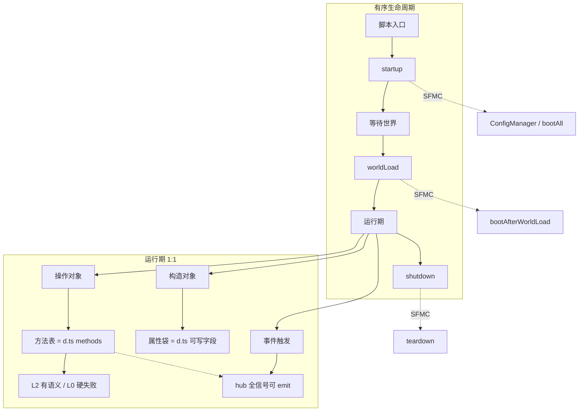

#     Script API 事件流程（沙箱 / Playground）

**设计锁定（2026-07-31）：第一轮 = SAPI 1:1 映射，不设「最小集」。**


| 块        | 1:1 含义                                                                                                       |
| -------- | ------------------------------------------------------------------------------------------------------------ |
| **构造对象** | 按 pin 版 `.d.ts` 的类型表面构造/挂入：可写属性可设，只读由引擎填；无公开 ctor 的用 SAPI 同等入口（`spawnEntity` / 坐标 setBlock / 沙箱 `addPlayer`） |
| **操作对象** | 实例上 **全部** 方法可点选调用；未实现语义 → 既有 L0 硬失败（诚实）                                                                     |
| **事件触发** | `system`/`world` 的 **全部** before/after 信号可显式 emit；方法若应带事件则同总线自动发                                             |


快捷创建糖、聊天框糖等 **次轮**。生命周期有序段不变（startup → worldLoad → shutdown + SFMC 子步）。

**来源：** `[sapi-typedoc](../../../../sapi-typedoc)` / [Learn v2](https://learn.microsoft.com/en-us/minecraft/creator/documents/scripting/v2-overview)。权威契约 = npm `.d.ts`；L0 生成器已覆盖声明面。

---

## 总图




---

## 构造对象


| 类型 | 入口 | 属性 |
| ---- | ---- | ---- |
| Player | 无 `new`；`sandbox.addPlayer(属性袋)` | Entity 可写 + Player 可写（见 d.ts）；只读创建后生成 |
| Entity | `dimension.spawnEntity` + 随后赋可写属性 | 全表面；未实现 setter → L0 |
| ItemStack | `new ItemStack(...)` + 可写字段 | 全表面 |
| Block | 坐标 `setBlockType` / `setPermutation` 等 | 定位字段 + 可变状态方法 |
| **\*Event** | 属性袋（无公开 ctor）；`objects.create('ChatSendBeforeEvent', …)` | 全字段可填（含只读）；嵌套 `Player` 等用 `{"$ref":"实例id"}` |
| World / System | 不构造 | 生命周期后已有 |


属性袋 / 方法表 / **hub→Event 类型** 由 `gen-playground-meta` 从 `.d.ts` 产出（`PLAYGROUND_META.classes` + `eventTypes`），Playground 与宿主共用。

---

## 操作对象

```text
选实例 → 列出该类全部 method → 填参调用 → 返回值/抛错进系统日志
```

与真机一致：改状态的方法在实现里 **emit 对应事件**（有 L2 映射则发；尚无映射则至少不静默吞掉——文档标明或硬失败）。

---

## 事件触发

```text
选 hub 信号 → 按 Event 类型填 payload（字段来自 d.ts）→ emit
```

含全部 `WorldAfterEvents` / `WorldBeforeEvents` / `SystemBeforeEvents` / `SystemAfterEvents` 属性。成对 before/after 可一并或单发。

---

## 与既有 L0/L2

- **L0：** 声明面已 1:1 可 import；未实现方法硬失败 — 操作面板直接复用  
- **L2：** 已有语义的 overrides 继续加深；1:1 **不要求**第一轮所有方法都有真语义，但 **要求**表面与可调用入口齐全  
- Playground 对 L0 方法显示「将硬失败」警告仍可调用（便于作者看到堆栈）

---

## 事件 hub 速查


| Hub                   | 内容                                       |
| --------------------- | ---------------------------------------- |
| `system.beforeEvents` | `startup` `shutdown` `watchdogTerminate` |
| `system.afterEvents`  | `scriptEventReceive`                     |
| `world.beforeEvents`  | 16 个信号                                   |
| `world.afterEvents`   | 65 个信号                                   |


完整字段以 `sapi-typedoc` / 生成元数据为准。