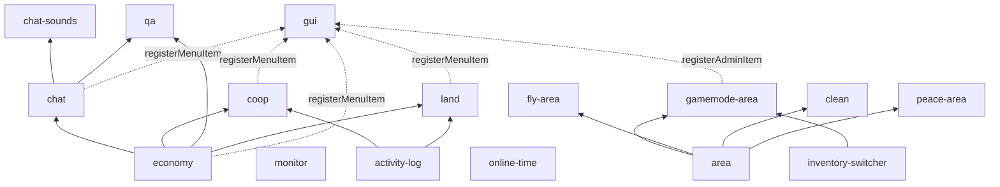

# 第一方模块设计方案索引

本目录是 **20 个官方业务模块** 的行为权威规格（阶段 1）。实现时按 [AGENT_BRIEF.md](./AGENT_BRIEF.md) 一模块一仓从脚手架重建；旧 `sfmc-modules` archive 仅作参考。

**命名（已定）：** `manifest.id` ≡ install 短名（如 `economy`）。**不加** `feature-` / `core-` 前缀。`requires` 同样写短名。

## 依赖图

叶子模块（无模块间 `requires` 且纯被动事件监听）：`afk` `spawn-protect`。  
**全平台五大中枢能力插槽提供者（Core Slot Providers）：**
1. **资金账户插槽**：`economy`（`economy.account.*`，业务零账本负担）
2. **审计日志插槽**：`activity-log`（`activity.record` / `activity.query`，业务零审计表负担）
3. **聊天管道插槽**：`chat`（`chat.registerInterceptor` / `chat.onMessage` / `chat.broadcast` / `chat.send`，独占原生聊天流，业务零裸监听冲突）
4. **空间规则插槽**：`area`（`area.registerFeature` / `area.registerArea` / `area.byPoint`，微内核空间引擎，业务零空间边界循环负担）
5. **交互导航插槽**：`gui`（`gui.registerMenuItem` / `gui.registerAdminItem` / `gui.openMainMenu`，微内核表单导航容器，业务零硬编码菜单负担）

基础环境与通用服务提供者：`data-backup`（全服世界/玩家/计分板快照检索与灾备服务）· `inventory-switcher`（背包多槽位快照与置换服务）· `monitor`（实时刻速与多维负载综合监控）· `online-time`。

**economy 要点（见规格）：** 计分板权威余额 + DB 实时留档；无每日任务；`economy.stats.query` 通用统计（非白皮书业务）。`daily-task` 整模块 **deferred**。

## 状态表

| install id | 规格 | 状态 | 波次 |
|------------|------|------|------|
| economy | [economy-design.md](./economy-design.md) | draft | A |
| monitor | [monitor-design.md](./monitor-design.md) | draft | A |
| area | [area-design.md](./area-design.md) | draft | A |
| online-time | [online-time-design.md](./online-time-design.md) | draft | A |
| activity-log | [activity-log-design.md](./activity-log-design.md) | draft | A |
| gui | [gui-design.md](./gui-design.md) | draft | B |
| afk | [afk-design.md](./afk-design.md) | draft | B |
| data-backup | [data-backup-design.md](./data-backup-design.md) | draft | B |
| inventory-switcher | [inventory-switcher-design.md](./inventory-switcher-design.md) | draft | B |
| spawn-protect | [spawn-protect-design.md](./spawn-protect-design.md) | draft | B |
| chat | [chat-design.md](./chat-design.md) | draft | B |
| chat-sounds | [chat-sounds-design.md](./chat-sounds-design.md) | draft | C |
| coop | [coop-design.md](./coop-design.md) | draft | C |
| daily-task | [daily-task-design.md](./daily-task-design.md) | **deferred** | C（暂缓开仓） |
| qa | [qa-design.md](./qa-design.md) | draft | C |
| land | [land-design.md](./land-design.md) | draft | C |
| gamemode-area | [gamemode-area-design.md](./gamemode-area-design.md) | draft | C |
| fly-area | [fly-area-design.md](./fly-area-design.md) | draft | C |
| clean | [clean-design.md](./clean-design.md) | draft | C |
| peace-area | [peace-area-design.md](./peace-area-design.md) | draft | C |

## 共享文件

| 文件 | 用途 |
|------|------|
| [_TEMPLATE.md](./_TEMPLATE.md) | 单模块规格强制章节 |
| [AGENT_BRIEF.md](./AGENT_BRIEF.md) | 开仓智能体共用规则 |
| [../../prompts/README.md](../../prompts/README.md) | Prompt Suite：全局规则 / 开工模板 / 分波次提示 / 自检 |

## 阶段与审阅闸门

| 步骤 | 内容 | 状态 |
|------|------|------|
| 2 | 规格契约瑕疵（inTx 清除、coop debit/credit、scoreboard 排除 `sfmc_money`、gui 弱依赖、land 表名与两阶段补偿等） | **已完成**（2026-09-04 核对） |
| 3 | 私有表统一 `sfmc_<id>_*` | **已完成**（含 `sfmc_lands*` / `sfmc_online_time` / `sfmc_monitor_*` / `sfmc_chat_avatars` 等） |
| 1 | SDK SAPI **进程内** `service.provide` + 本地优先路由 | **未完成（BLOCKER）** — 见 [AGENT_BRIEF.md](./AGENT_BRIEF.md) 开仓闸门 |
| 4 | 规格 `draft` → `approved` + 开仓指令 | **阻塞于步骤 1**；步骤 1 合并后由人工将状态表改为 `approved` |

1. 规格保持 `draft`，直至步骤 1 落地并人工确认  
2. 其后并行智能体按波次开仓（不在本阶段）
