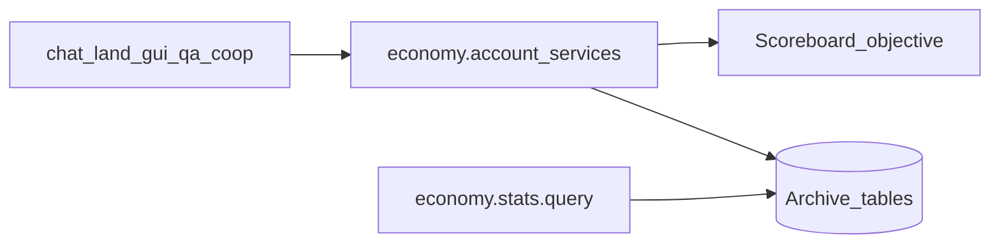

# economy — Design Spec

> **Status:** approved  
> **Spec authority:** this file. Legacy archive code is reference-only.

## 1. Goal / Non-goals

**Goal:** 以**计分板为权威余额存储**，经统一 `economy.account.*` 服务读写；数据库做**实时同步留档**（快照 + 流水），并提供**通用统计查询接口**（供看板/运维消费，不内置白皮书等业务广播）。

**Non-goals:**

- **不做**每日任务（`economy.dailyTasks.*` 删除；见 [daily-task-design.md](./daily-task-design.md) 搁置说明）
- **不**把月度白皮书、定时全服广播做成经济模块业务
- 不移植旧 db-server 账本为唯一真相、不移植双命名 payload
- 不提供玩家命令面（由 `gui` / `chat` 等消费）
- 不 npm 依赖其它业务模块
- 他模块**禁止**直接改计分板经济 objective、禁止直连经济归档表

## 2. Identity

| 字段 | 值 |
|------|-----|
| install id | `economy` |
| npm | `@sfmc-bds/module-economy` |
| manifest.id | `economy` |
| configKey | `economy` |
| enabledByDefault | true |
| canDisable | true |
| manifest.requires | `[]` |

## 3. Player surface

### Commands

无。

### GUI

无。展示可用 SDK `Money` 缓存，底层仍只调 `economy.account.get`（读计分板权威值）。

## 4. Architecture



| 层 | 角色 |
|----|------|
| **计分板** | **唯一权威余额**。每位玩家一个 score；credit/debit/transfer 先（或原子语义上）改分 |
| **数据库** | **实时留档**：每次变更写流水；账户快照 upsert；供对账、审计、`stats.query` |
| **服务** | 唯一对外突变/查询入口；消费方不得碰 objective 名或归档表 |

### 计分板约定与账户抽象

- Objective id / 显示名由配置给出（默认建议 id `sfmc_money`，显示「节操」）
- **参与者账户标识（`accountId`）**：
  - **个人玩家**：玩家唯一标识（如 `playerId` 或 `player:<xuid>`）；在线时绑定到 `Player` 实体
  - **组织/公账实体**：支持命名空间字符串（例如合作社公账 `coop:<cid>`、城镇 `town:<tid>` 等），依托 Minecraft SAPI 计分板原生支持的假名参与者（Fake Player / Scoreboard Identity）统一核算
  - **单向无环依赖原则**：`economy` 属于核心基础提供层（Wave A），**绝对不反向依赖任何具体业务模块（`manifest.requires: []`）**；经济系统仅将组织账户视作合法账户标识字符串，不感知合作社等业务实体的领域逻辑
- 余额为**非负整数**；无记录视为 `0`（首次变动时自动建分）
- 其他业务模块严格禁止绕过服务直连底层 Objective 或归档表

### 数据库留档（本模块 `defineTable` 或平台表 + 本模块权限）

| 表名 | 语义 |
|------|------|
| `sfmc_economy_accounts` | 快照：`account_id` PK（兼容原 `player_id`），`account_name_snapshot`，`balance`（与计分板对齐），`account_type`（player/org），`updated_at` |
| `sfmc_economy_transactions` | 流水：`id`，`type`（credit\|debit\|transfer），`actor_id`，`source_account_id`，`target_account_id`，`amount`，`balance_before`/`balance_after`，`reason`，`reference_*`，`idempotency_key?`，`created_at` |

**同步策略：**

1. 校验金额 / 幂等键（命中则重放归档结果，**不再改分**）
2. 读当前分 → 计算新分 → **写计分板**
3. **立即** upsert 快照 + insert 流水（同一逻辑操作内；DB 失败则记错误并进入重试队列，**不得静默丢流水**）
4. 返回变更结果（含 `balance` = 计分板新值）

冷启动 / 周期（可选）：扫描 objective 与快照对账，差异以**计分板为准**回写快照，并打审计日志。

货币展示名：**节操**。

## 5. Config

`configs/economy.json`：

```json
{
  "objectiveId": "sfmc_money",
  "objectiveDisplay": "节操",
  "unitName": "节操",
  "reconcileIntervalTicks": 12000
}
```

缺省用上表默认值。

## 6. Services

### provides

#### 账户（业务消费方使用）

| name | input | output | 语义 |
|------|-------|--------|------|
| `economy.account.get` | `{ accountId, accountName? }`（兼容 `{ playerId }`） | `{ accountId, balance, accountName? }` | **读计分板**；支持个人与组织公账，可附带刷新名称快照 |
| `economy.account.credit` | `{ accountId, amount, reason?, actorId?, idempotencyKey?, referenceType?, referenceId? }` | `{ transactionId, balance, replayed? }` | 加分 + 留档（支持个人与组织账户） |
| `economy.account.debit` | 同 credit | 同上或 `insufficient_funds` | 减分；余额不足失败且不改分 |
| `economy.account.transfer` | `{ fromAccountId, toAccountId, amount, actorId?, reason?, idempotencyKey? }` | 变更结果 | 账户间转账（天然支持：玩家↔玩家转账、玩家↔组织公账如合作社金库存取款）；双方计分板更新 + 留存流水 |

**跨模块调用与事务契约：**
- 计分板为内存与原生引擎实体，**不参与**且物理上无法支持 SQLite `db.tx` / `inTx` 事务。
- **不存在 `inTx` 经济服务**；**禁止**再造假 `db.tx` recorder。
- 跨模块业务消费方（如 `land`、`chat` 红包、`coop`）与经济交互统一遵循 **两阶段幂等补偿模式**：
  1. 消费方生成全局唯一业务幂等键 `idempotencyKey`（如 `land_buy_<req_id>`、`hb_send_<id>`）；
  2. 消费方先调用 `economy.account.debit` / `credit`（传入 `idempotencyKey` 与 `referenceType`/`referenceId`）；
  3. 经济变更成功后，消费方再提交本地数据库表变更；若本地写入发生致命故障，由消费方调用逆向操作实施补偿（如退款 credit）或保留错误现场待审计修复。网络超时重试时，相同 `idempotencyKey` 将重放原流水结果，**绝不发生双花/重复扣款**。
- 不提供 `dailyTasks.*`。

#### 统计（通用查询，非业务）

| name | input | output | 语义 |
|------|-------|--------|------|
| `economy.stats.query` | 见下 | 见下 | 只读归档聚合；**不**发广播、**不**改余额 |

**`economy.stats.query` input（规范信封）：**

```ts
{
  /** 指标名列表，实现至少支持下列 metric */
  metrics: Array<
    | "supply"              // 当前快照余额合计
    | "active_accounts"     // balance>0 账户数
    | "tx_count"            // 流水条数
    | "volume_credit"       // credit 金额合计
    | "volume_debit"        // debit 金额合计
    | "volume_transfer"     // transfer 金额合计
  >;
  /** 闭区间，Unix ms；省略则按 metric 语义用「当前」或「全部历史」 */
  from?: number;
  to?: number;
  /** 可选分桶：省略则返回单个汇总 */
  groupBy?: "day" | "month";
}
```

**output：**

```ts
{
  generatedAt: number;
  rows: Array<{
    bucket?: string;     // groupBy 时如 "2026-09" / "2026-09-04"
    values: Record<string, number>;  // metric → 值
  }>;
}
```

消费方（看板、QQ 桥、管理 GUI）自行决定如何展示；经济模块**不**内置「月初白皮书」定时广播。

### requires

无。

## 7. Lifecycle notes

- 冷启动 only
- `afterWorldLoad`: **true**（需 world scoreboard）
- `init`：确保 objective 存在；定义/确保归档表；可选对账 interval；注册 services
- `cleanup`：清 interval / 重试队列 flush

## 8. Acceptance criteria

- [ ] 余额权威在计分板；`get/credit/debit/transfer` 行为与 §6 一致
- [ ] 每次成功变更均有流水 + 快照；幂等键不双花
- [ ] 他模块无法（规范 + 权限）直接写经济 objective / 经济表
- [ ] **无** `economy.dailyTasks.*`；**无**定时白皮书业务
- [ ] `economy.stats.query` 支持所列 metrics，可按 day/month 分桶
- [ ] typecheck / lint / test 通过

## 9. Deferred

- 每日任务（独立模块 + 未来任务服务，不挂在 economy）
- 物价指数表 / 商店定价
- QQ/外部支付桥
- 多币种 objective

## 10. Legacy reference（仅参考）

- `sfmc-modules` `archive/monorepo-packages` → `packages/economy/`（旧：db 权威账本 + dailyTasks + monthly 广播 —— **全部废弃为行为参考，勿照搬**）
