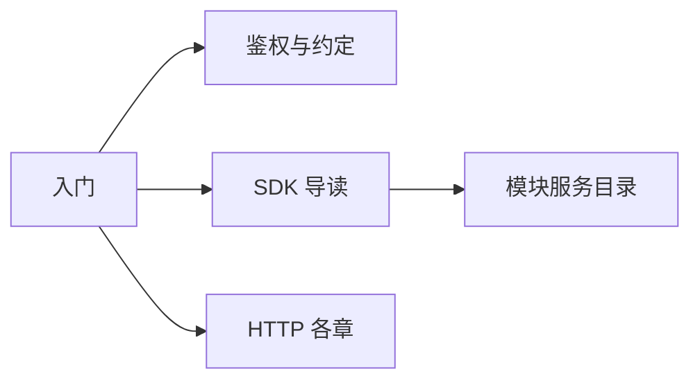

import { Tabs, Tab } from '@rspress/core/theme';

# 入门

db-server 的 HTTP API、`@sfmc-bds/sdk` 用法，以及各业务模块对外服务。

本页面向模块作者与需要直调 HTTP 的调试 / Node 侧开发。读完后，您应能：

- 分清「走 SDK」还是「对照 HTTP」
- 找到鉴权约定、四抽屉 SDK、模块服务与平台 HTTP 各章

完整类型签名见 [SDK 类型参考](../reference/index.md)（`npm run docs -- api`）。开发流程见 [开发指南](../dev/index.md)。



## Base URL

默认 `http://127.0.0.1:3001`，仅 loopback。端口见 `configs/db_config.json` 的 `db_port`。

```bash
curl http://127.0.0.1:3001/api/health
```

## SDK 与 HTTP

| 场景 | 做法 |
| ------ | ------ |
| 写模块业务 | SDK + 对方 typed client；**不要**直连 `127.0.0.1:3001` |
| 调试 / 写 Node 工具 | 可直调 HTTP（本指南各 HTTP 章） |
| 查签名 | [类型参考](../reference/index.md) |

## 你要走哪条路


<Tabs>
  <Tab label="模块作者">

1. [鉴权与约定](./overview.md)（错误码与身份）  
2. [SDK 导读](./sdk/index.md)  
3. [模块服务目录](./modules/index.md)（跨模块能力）

  </Tab>
  <Tab label="对照 HTTP / 调试">

1. [鉴权与约定](./overview.md)  
2. [模块控制](./module-control.md) · [配置](./config.md) · [数据库](./db.md) · [服务 RPC](./services.md) · [消息](./messages.md)

  </Tab>
</Tabs>

## 章节索引

| 章节 | 内容 |
| ------ | ------ |
| [鉴权与约定](./overview.md) | 鉴权、响应、路由索引 |
| [SDK 导读](./sdk/index.md) | runtime / db / config / service |
| [模块服务目录](./modules/index.md) | economy、land、area… |
| [模块控制](./module-control.md) | catalog、enable / disable |
| [配置](./config.md) | configs/all、configKey、legacy |
| [数据库](./db.md) | define-table、CRUD、tx |
| [服务 RPC](./services.md) | `GET /services`、与 tx.call |
| [消息](./messages.md) | 聊天与 QQ 桥 |
