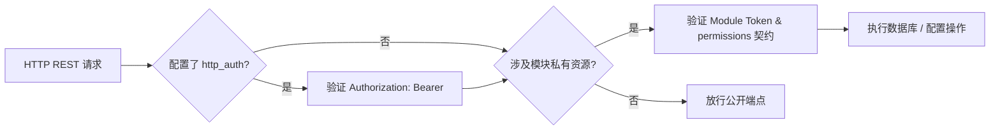

# 鉴权机制与通信约定

本文档系统阐释 SFMC 数据中枢（`db-server`）的请求鉴权模型、微内核沙盒隔离、标准响应结构与全局路由总览。

:::tip 模块业务首选 SDK
编写 SAPI 模块业务时，**请务必使用官方 SDK**（如 `db`、`config`、`service`），SDK 会透明完成模块身份与 Token 注入。本页主要用于底层调试、编写独立的外部 Node.js 工具或逆向排查通信问题。
:::

---

## 1. 双重鉴权体系（Dual Auth Model）

为了在保证数据安全的同时不破坏本地通信性能，SFMC 采用**「平台管控鉴权 + 模块沙盒身份」**的双层鉴权模型：



### ① 平台级管控鉴权（Platform Bearer Token）
- **配置源**：`configs/db_config.json` 的 `http_auth` 字段，或宿主环境变量 `HTTP_AUTH`。
- **生效范围**：主要保护关键写操作（如修改系统配置、敏感运维命令）。
- **传递方式**：在 HTTP 请求头中添加：
  ```http
  Authorization: Bearer <your_token_here>
  ```
- **缺省行为**：若 `http_auth` 为空字符串，则平台级鉴权处于开放状态（因仅限 Loopback 回环监听）。

### ② 模块沙盒身份注入（Module Sandbox Identity）
- **工作机制**：每个模块在冷启动阶段通过 `ConfigManager.init()` 获取平台自动颁发的专属 `module_token`。
- **鉴权参数**：所有涉及数据库（`/api/sfmc/db/*`）、模块私有配置（`/api/sfmc/configs/*`）以及跨模块 RPC（`/api/sfmc/services*`）的请求，必须携带模块身份：
  ```http
  POST /api/sfmc/db/query?moduleId=feature-economy
  Authorization: Bearer <module_token>
  ```
- **权限核验**：`db-server` 会严格比对该模块在 `manifest.json` 中声明的 `permissions` 列表。一旦试图读写未声明的数据表或命名空间，请求将被立刻拒绝（`403 Forbidden`）。

---

## 2. 标准响应与错误状态码规范

所有 REST 端点均返回标准 JSON 结构。

### 成功响应（HTTP 200 OK）

```json
{
  "success": true,
  "data": {
    "balance": 1500
  }
}
```

### 业务错误响应（HTTP 4xx / 5xx）

当发生业务冲突或鉴权未通过时，统一返回结构化错误实体：

```json
{
  "success": false,
  "error": "permission_denied",
  "message": "Module feature-teleport has no permission to write table 'wallets'"
}
```

#### 常见全局业务错误码一览

| 错误代码 (`error`) | 对应 HTTP 状态 | 根本原因与场景说明 |
| :--- | :---: | :--- |
| `unauthorized` | `401` | 未提供 Bearer Token，或 Token 校验不匹配。 |
| `permission_denied` | `403` | 试图访问未在 `manifest.json` 中声明的表或跨模块服务。 |
| `module_not_found` | `404` | 请求的模块 ID 在当前 `catalog.json` 中不存在。 |
| `dependency_unmet` | `400` | 试图启用某个模块，但其依赖的前置模块尚未安装或处于禁用状态。 |
| `module_cannot_disable` | `400` | 试图禁用标记为 `"type": "core"` 的平台基石模块。 |
| `service_not_found` | `404` | 请求调用的跨模块服务名称未被任何已启用模块注册。 |

---

## 3. 全局核心路由索引地图

| 路由端点 | HTTP 方法 | 鉴权要求 | 说明与手册链接 |
| :--- | :---: | :---: | :--- |
| `/api/health` | `GET` | 公开 | 服务健康状态探活接口。 |
| `/api/sfmc/status` | `GET` | 公开 | 服务运行时概要与在线状态统计（供 QQ Bot 查询）。 |
| `/api/sfmc/configs/all` | `GET` | 启动豁免 | SAPI 冷启动时的全量配置与 Token 一次性快照。 |
| `/api/sfmc/modules*` | `GET` / `POST` | 模块管控 | [模块控制 API](./module-control.md)：查询清单、启停切换。 |
| `/api/sfmc/configs/:key` | `GET` / `POST` | 模块身份 | [配置服务 API](./config.md)：单模块私有命名空间读写。 |
| `/api/sfmc/db/*` | `POST` | 模块身份 | [数据库操作 API](./db.md)：参数化 SQL、表定义、事务。 |
| `/api/sfmc/services*` | `GET` / `POST` | 模块身份 | [跨模块服务 RPC API](./services.md)：服务提供与消费调用。 |
| `/api/sfmc/messages*` | `GET` / `POST` | 平台/模块 | [消息中继 API](./messages.md)：游戏内外聊天消息中继队列。 |

---

## 4. 平台 QQ 身份绑定服务接口（QQ Link API）

用于支持 Minecraft 玩家与 QQ 账号的绑定认证联动：

| 方法 | 路由路径 | 请求体 / 查询参数 | 作用说明 |
| :---: | :--- | :--- | :--- |
| `POST` | `/api/sfmc/qq/bind/request` | `{ openid: string, qq_backend?: string }` | 申请绑定，生成一个高可读性的 6 位短验证码。 |
| `POST` | `/api/sfmc/qq/bind/confirm` | `{ code: string, xuid: string, name: string }` | 玩家在游戏内输入短码完成身份核销绑定。 |
| `POST` | `/api/sfmc/qq/bind/unbind` | `{ openid?: string, xuid?: string }` | 解除绑定关系。 |
| `GET` | `/api/sfmc/qq/bind/me` | `?openid=...` 或 `?xuid=...` | 查询指定玩家的当前绑定状态。 |
