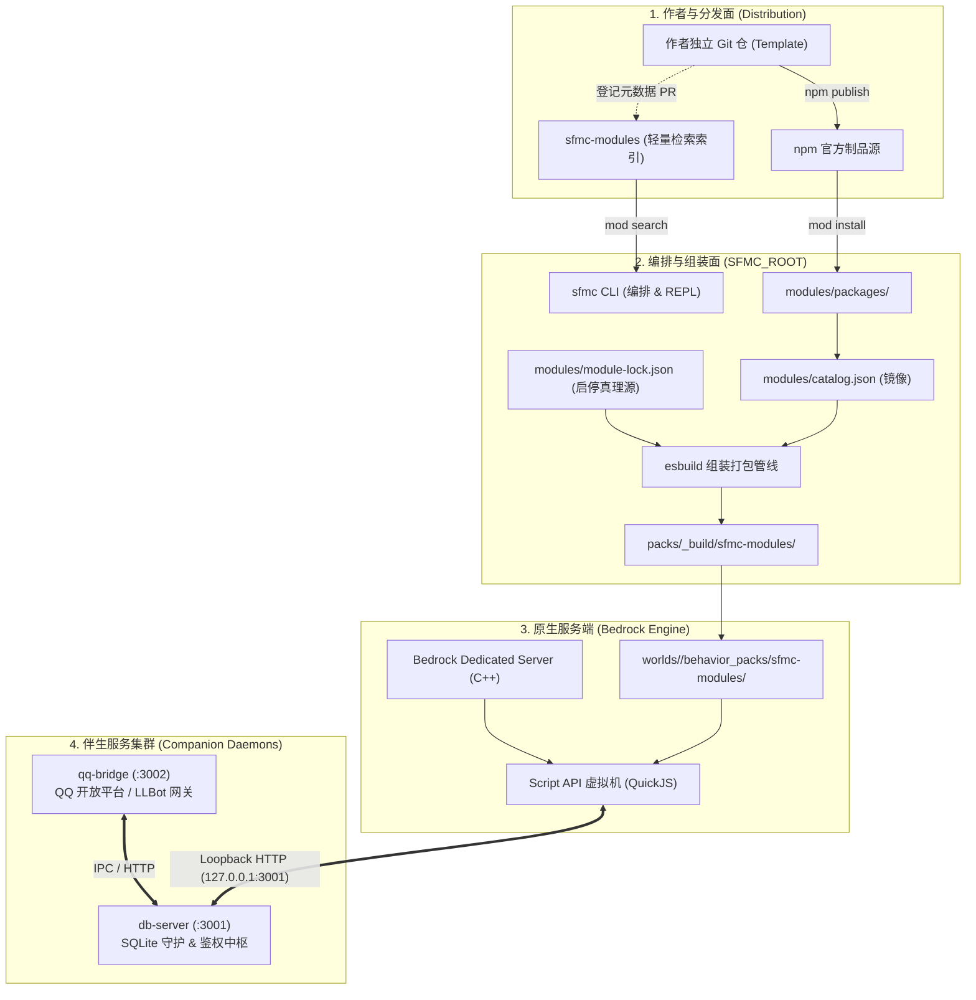
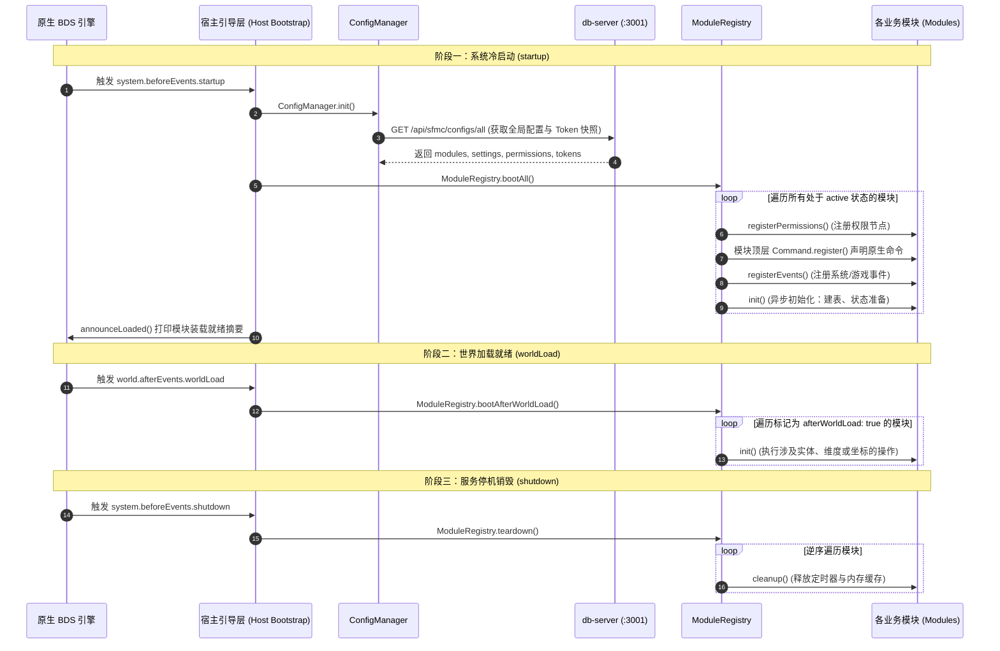

# 平台架构设计

本文档深入剖析 SFMC 的系统拓扑、通信协议、生命周期时序与状态真理源，阐述如何将**作者独立仓、npm 分发生态、伴生数据中枢与原生 Bedrock Dedicated Server**有机串联。

## 1. 系统分层与拓扑全景

SFMC 将复杂的开服系统划分为四个清晰解耦的层次：



## 2. SAPI 生命周期与启动序

Minecraft BDS 的脚本引擎基于事件钩子驱动。SFMC 的 `installHostBootstrap()` 宿主脚本在启动时精确接管生命周期：



### 单次配置快照设计（Zero-Polling）

在启动阶段，`ConfigManager` 仅发起**一次** `GET /api/sfmc/configs/all` 请求，拉取当前启用的模块清单、系统设置、全局权限表以及各模块私有的通信 Token。

- **不进行运行时轮询**：快照直接固化在 SAPI 内存中，完全避免高频 HTTP 请求拖慢 Minecraft 游戏主刻（Tick）。
- **Token 透明注入**：`ModuleRegistry.bootModule` 会自动将该模块的专用 Bearer Token 绑定至 `db` 客户端上下文。模块作者编写数据库操作时，无需手动管理任何鉴权密钥。

## 3. 模块标准注册描述符

每个模块在 `sapi/src/index.ts` 中声明自身的生命周期钩子：

```ts title="sapi/src/index.ts"
import { ModuleRegistry } from "@sfmc-bds/sdk/module-loader";
import { Command, Msg, Permission } from "@sfmc-bds/sdk/sapi/runtime";

// 原生命令必须在 startup 前声明，公开名称为 /sfmc:feature-teleport_tp。
Command.register(
  "tp",
  "tp.use",
  (player) => {
    if (player) Msg.info("正在发起传送...", player);
  },
  "传送至主城",
  "feature-teleport"
);

ModuleRegistry.register({
  id: "feature-teleport",
  afterWorldLoad: false, // 若需在 init 中查询世界实体/维度，设为 true
  lifecycle: {
    // 1. 声明模块所需权限节点
    registerPermissions() {
      Permission.register("tp.use", "使用传送功能", 0);
      Permission.register("tp.admin", "管理员强行传送", 2);
    },

    // 2. 注册 Minecraft 原生事件监听
    registerEvents() {
      // 推荐在此处通过 world.afterEvents 进行订阅
    },

    // 4. 模块异步初始化
    async init() {
      // 声明 SQLite 数据表、初始化模块内部状态
    },

    // 5. 停机或卸载时的资源清理
    cleanup() {
      // 清理定时器与内存缓存，防止内存泄漏
    },
  },
});
```

## 4. 状态真理源分布矩阵

SFMC 遵循严格的单一事实源（Single Source of Truth）原则：

| 领域数据           | 唯一权威真理源                             | 同步与维护机制                                       |
| :----------------- | :----------------------------------------- | :--------------------------------------------------- |
| **模块契约**       | `modules/packages/<id>/sapi/manifest.json` | 模块作者在模板中声明，定义版本、权限需求与外部依赖。 |
| **生态检索**       | `sfmc-modules/index.json`                  | 官方轻量索引库，记录模块的 npm 包名与元数据。        |
| **本地安装清单**   | `<SFMC_ROOT>/modules/catalog.json`         | 本地已安装模块的静态只读镜像。                       |
| **模块启停状态**   | `<SFMC_ROOT>/modules/module-lock.json`     | **唯一决定行为包是否打包该模块的布尔状态锁**。       |
| **持久化业务数据** | `<SFMC_ROOT>/data/sfmc_data.db`            | 由 `db-server` 托管的 SQLite 物理数据库。            |
| **平台级配置**     | `<SFMC_ROOT>/configs/*.json`               | 首次启动时自动生成默认值，支持环境变量按需覆盖。     |

## 5. Monorepo 工作区架构（Platform Workspace）

主仓源码采用 `pnpm` workspaces 架构统一管理：

```text
ScriptsForMinecraftServer/
├── modules/
│   ├── sdk/
│   │   ├── @sfmc-sdk/             # 统一 SDK 伞包（导出 runtime, db, config, module-loader）
│   │   └── @sfmc-eslint-plugin/   # 官方专属 ESLint 静态语法检查规则插件
│   └── packages/                  # SFMC_ROOT 下已安装业务模块的落地点（主仓默认留空）
├── packages/
│   ├── db-server/                 # 基于 node:sqlite 的轻量 HTTP 持久化中枢
│   ├── qq-bridge/                 # QQ 互通桥接服务（Official Bot & LLBot）
│   ├── bds-tools/                 # 官方 BDS 核心自动更新、备份与附加包管理
│   ├── devkit/                    # 模块文件监听（Watch）与脚手架转译引擎
│   ├── cli/                       # @sfmc-bds/cli 终端交互与进程 Supervisor
│   ├── meta/                      # @sfmc-bds/sfmc 全局命令行入口包装
│   ├── create-module/             # npm create @sfmc-bds/module 脚手架生成器
│   ├── sfmc-extension/            # VS Code / Cursor 官方开发专属扩展
│   └── tools/                     # 仓内专用测试、验证与文档生成工具集
└── docs/                          # 基于 Rspress 2 的多语言文档站源码
```

:::note 目录约定

- `packages/*`：平台级基础支撑包与核心工具，均可独立发版。
- `modules/packages/*`：具体业务模块的运行镜像目录；平台核心代码与业务功能物理隔离。
  :::
