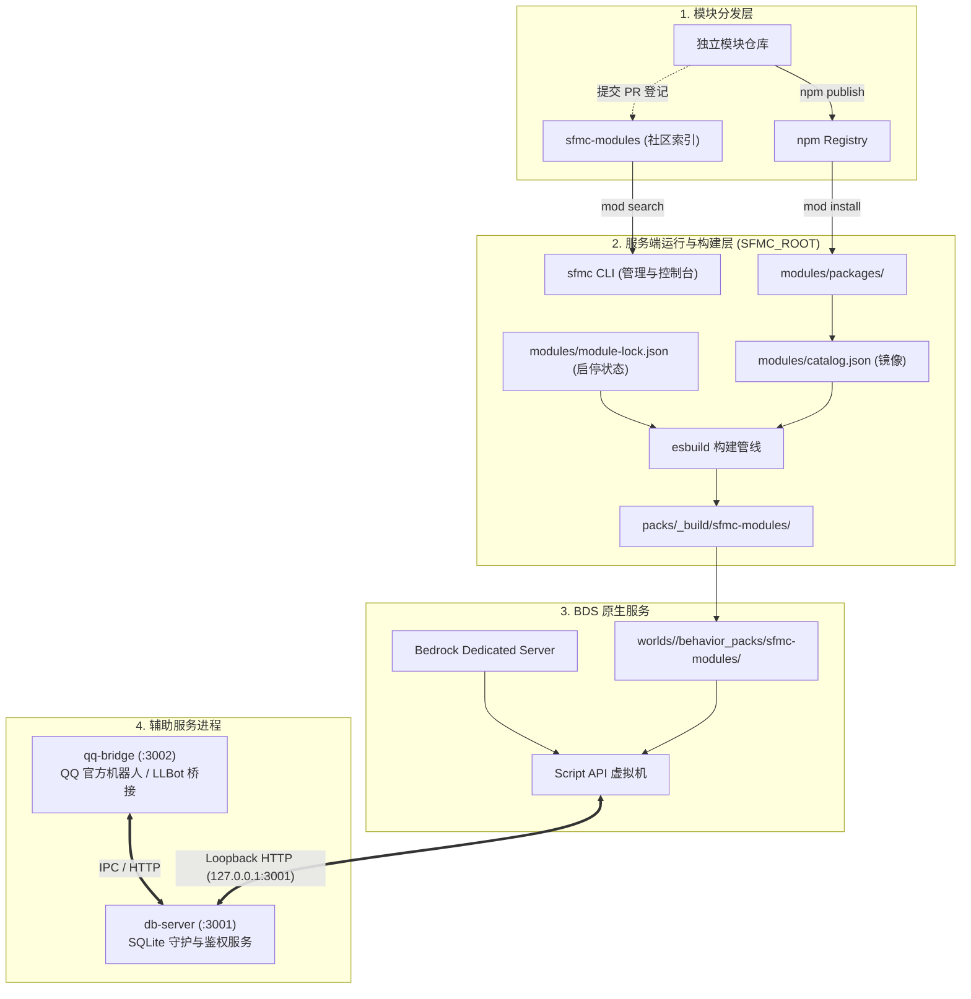
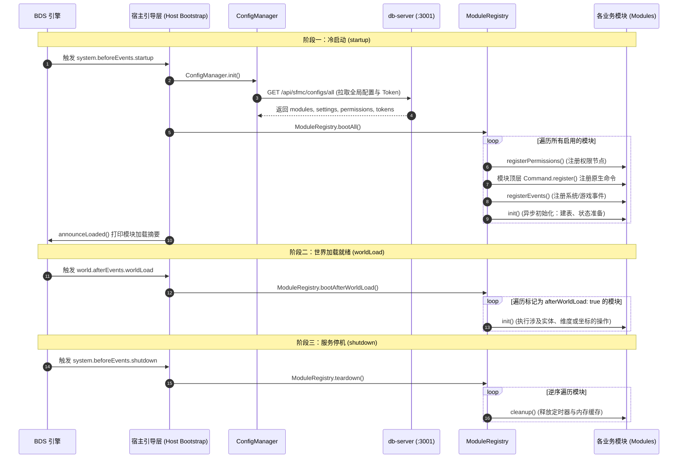

# 平台架构设计

本文介绍 SFMC 的系统架构分层、SAPI 模块生命周期、数据存储划分以及主仓工作区结构。

## 1. 系统分层与拓扑

SFMC 将系统划分为四个层次：


```mermaid
flowchart TD
  subgraph AuthorLayer ["1. 模块分发层"]
    Repo["独立模块仓库"] -->|npm publish| NPM["npm Registry"]
    Repo -.->|提交 PR 登记| Index["sfmc-modules (社区索引)"]
  end

  subgraph OpsLayer ["2. 服务端运行与构建层 (SFMC_ROOT)"]
    CLI["sfmc CLI (管理与控制台)"]
    Index -->|mod search| CLI
    NPM -->|mod install| Packages["modules/packages/<id>"]
    Packages --> Catalog["modules/catalog.json (镜像)"]
    Lock["modules/module-lock.json (启停状态)"] --> Assembler["esbuild 构建管线"]
    Catalog --> Assembler
    Assembler --> BP["packs/_build/sfmc-modules/"]
  end

  subgraph NativeLayer ["3. BDS 原生服务"]
    BP --> Deploy["worlds/<level>/behavior_packs/sfmc-modules/"]
    BDS["Bedrock Dedicated Server"] --> SAPI["Script API 虚拟机"]
    Deploy --> SAPI
  end

  subgraph ServiceLayer ["4. 辅助服务进程"]
    DB["db-server (:3001)<br/>SQLite 守护与鉴权服务"]
    QQ["qq-bridge (:3002)<br/>QQ 官方机器人 / LLBot 桥接"]
    QQ <== IPC / HTTP ==> DB
  end

  SAPI <== Loopback HTTP (127.0.0.1:3001) ==> DB
```

## 2. SAPI 生命周期与启动时序

BDS 脚本基于原生事件钩子执行。SFMC 的 `installHostBootstrap()` 宿主脚本在启动时统一调度生命周期：


```mermaid
sequenceDiagram
  autonumber
  participant BDS as BDS 引擎
  participant Boot as 宿主引导层 (Host Bootstrap)
  participant CM as ConfigManager
  participant DB as db-server (:3001)
  participant Reg as ModuleRegistry
  participant Mod as 各业务模块 (Modules)

  Note over BDS,Mod: 阶段一：冷启动 (startup)
  BDS->>Boot: 触发 system.beforeEvents.startup
  Boot->>CM: ConfigManager.init()
  CM->>DB: GET /api/sfmc/configs/all (拉取全局配置与 Token)
  DB-->>CM: 返回 modules, settings, permissions, tokens
  Boot->>Reg: ModuleRegistry.bootAll()

  loop 遍历所有启用的模块
    Reg->>Mod: registerPermissions() (注册权限节点)
    Reg->>Mod: 模块顶层 Command.register() 注册原生命令
    Reg->>Mod: registerEvents() (注册系统/游戏事件)
    Reg->>Mod: init() (异步初始化：建表、状态准备)
  end

  Boot->>BDS: announceLoaded() 打印模块加载摘要

  Note over BDS,Mod: 阶段二：世界加载就绪 (worldLoad)
  BDS->>Boot: 触发 world.afterEvents.worldLoad
  Boot->>Reg: ModuleRegistry.bootAfterWorldLoad()
  loop 遍历标记为 afterWorldLoad: true 的模块
    Reg->>Mod: init() (执行涉及实体、维度或坐标的操作)
  end

  Note over BDS,Mod: 阶段三：服务停机 (shutdown)
  BDS->>Boot: 触发 system.beforeEvents.shutdown
  Boot->>Reg: ModuleRegistry.teardown()
  loop 逆序遍历模块
    Reg->>Mod: cleanup() (释放定时器与内存缓存)
  end
```

### 单次配置快照与 Token 注入

启动阶段，`ConfigManager` 仅发起一次 `GET /api/sfmc/configs/all` 请求，拉取当前启用的模块列表、系统设置、全局权限表以及各模块专属通信 Token：

- **运行时无需轮询**：快照缓存在 SAPI 内存中，避免频繁发起 HTTP 请求影响游戏主刻（Tick）。
- **Token 自动注入**：`ModuleRegistry.bootModule` 会自动将该模块的专用 Bearer Token 绑定至 `db` 客户端上下文，业务模块无需手动配置鉴权密钥。

## 3. 模块注册示例

模块在 `sapi/src/index.ts` 中声明自身的生命周期钩子：

```ts title="sapi/src/index.ts"
import { ModuleRegistry } from "@sfmc-bds/sdk/module-loader";
import { Command, Msg, Permission } from "@sfmc-bds/sdk/sapi/runtime";

// 原生命令需在顶层注册，公开名称为 /c:tp
Command.register(
  "tp",
  "tp.use",
  (player) => {
    if (player) Msg.info("正在传送至主城...", player);
  },
  "传送至主城",
  "feature-teleport"
);

ModuleRegistry.register({
  id: "feature-teleport",
  afterWorldLoad: false, // 若需在 init 中查询世界实体或维度，设为 true
  lifecycle: {
    // 1. 声明模块所需权限节点
    registerPermissions() {
      Permission.register("tp.use", 0);
      Permission.register("tp.admin", 2);
    },

    // 2. 注册 Minecraft 原生事件监听
    registerEvents() {
      // 在此处通过 world.afterEvents 订阅事件
    },

    // 3. 模块异步初始化
    async init() {
      // 创建 SQLite 数据表、初始化模块内部状态
    },

    // 4. 停机或卸载时的资源释放
    cleanup() {
      // 清理定时器与缓存
    },
  },
});
```

## 4. 核心状态与数据划分

| 数据项 | 存储位置 | 说明 |
| :--- | :--- | :--- |
| **模块契约** | `modules/packages/<id>/sapi/manifest.json` | 模块元数据，定义版本、权限需求与服务依赖。 |
| **模块索引** | `sfmc-modules/index.json` | 社区索引库，记录模块的 npm 包名与说明。 |
| **本地安装清单** | `<SFMC_ROOT>/modules/catalog.json` | 本地已安装模块的元数据镜像。 |
| **模块启停状态** | `<SFMC_ROOT>/modules/module-lock.json` | 记录模块是否启用，决定构建时是否打包该模块。 |
| **业务数据** | `<SFMC_ROOT>/data/sfmc_data.db` | 由 `db-server` 托管的 SQLite 数据库文件。 |
| **平台全局配置** | `<SFMC_ROOT>/configs/*.json` | 服务启动配置，支持环境变量覆盖。 |

## 5. 主仓目录结构

平台主仓采用 pnpm workspaces 管理：

```text
ScriptsForMinecraftServer/
├── modules/
│   ├── sdk/
│   │   ├── @sfmc-sdk/             # SDK 核心包（导出 runtime, db, config, module-loader）
│   │   └── @sfmc-eslint-plugin/   # ESLint 代码规范规则插件
│   └── packages/                  # SFMC_ROOT 下已安装业务模块的目录（主仓默认不包含）
├── packages/
│   ├── db-server/                 # 基于 node:sqlite 的本地 HTTP 持久化中枢
│   ├── qq-bridge/                 # QQ 互通桥接服务（官方机器人与 LLBot）
│   ├── bds-tools/                 # 官方 BDS 核心自动更新、备份与附加包管理
│   ├── devkit/                    # 模块文件监听（Watch）与脚手架转译引擎
│   ├── cli/                       # @sfmc-bds/cli 终端交互与进程管理
│   ├── meta/                      # @sfmc-bds/sfmc 全局命令行入口包装
│   ├── create-module/             # @sfmc-bds/create-module 脚手架生成器
│   ├── sfmc-extension/            # VS Code / Cursor 官方开发扩展
│   └── tools/                     # 仓内专用测试、自检与构建脚本
└── docs/                          # 基于 Rspress 的多语言文档源码
```

:::note 目录约定
- `packages/*`：平台基础包与核心工具，均独立发布至 npm。
- `modules/packages/*`：运行时的业务模块目录，与平台核心代码相互独立。
:::
