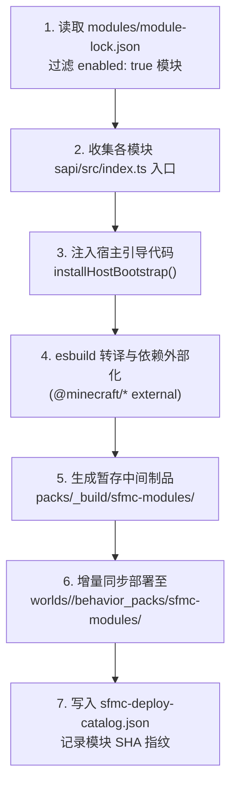

# 行为包动态构建与装载管线

在传统的 Minecraft 基岩版开服流程中，行为包通常作为静态文件手动放入世界目录。但在 SFMC 架构中，**仓库内没有固定的行为包壳子**——所有启用的模块均由装配引擎在开服前**按需动态编译、打包与注入**。

本篇文档向平台开发者与高级运维深入解析动态行为包（BP）与配套资源包（RP）的组装流水线。

---

## 1. 动态流水线时序拓扑

整个构建流程由 CLI 与 `@sfmc-bds/bds-tools` 的 pack-manager 协同编排：



### 产物目录对照

| 构建阶段 / 产物 | 落盘位置 | 说明 |
| :--- | :--- | :--- |
| **暂存构建制品** | `<SFMC_ROOT>/packs/_build/sfmc-modules/` | 经过打包工具混淆编译后的暂存中间产物。 |
| **配套资源包 (RP)** | `<SFMC_ROOT>/packs/_build/sfmc-modules-rp/` | 若启用的模块携带贴图、UI、音效，自动生成对应 RP。 |
| **目标世界 BP** | `<BDS>/worlds/<level>/behavior_packs/sfmc-modules/` | 实际注入当前世界的行为包产物。 |
| **目标世界 RP** | `<BDS>/worlds/<level>/resource_packs/sfmc-modules-rp/` | 实际注入当前世界的资源包产物。 |
| **部署镜像清单** | BP 根目录下 `sfmc-deploy-catalog.json` | 记录本次构建所包含的模块清单及源码哈希。 |

---

## 2. 核心打包规则与边界保护

1. **白名单准入**：仅打包在 `modules/module-lock.json` 中明确标记为 `"enabled": true` 且在本地 `catalog.json` 存在的模块。未启用模块的源码绝不参与打包。
2. **宿主引导注入**：以 `installHostBootstrap()` 脚本为总入口（Banner），在 `system.beforeEvents.startup` 挂载 `ConfigManager` 初始化，并统一触发各模块的 `ModuleRegistry.register` 注册。
3. **原生依赖外部化（External）**：所有 `@minecraft/server`、`@minecraft/server-ui`、`@minecraft/server-net` 原生导入均声明为 external，直接由 BDS 内部宿主引擎提供，严禁打包进 bundle。
4. **空包安全回退**：即使所有业务模块均被禁用，装配引擎仍会生成一个合法的空行为包骨架，确保服务端不会因资源包缺失而启动报错。

---

## 3. 手动控制与热重载命令

```bash
# 仅执行编译与组装，不复制到世界目录（测试语法与体积）
sfmc> mod build

# 组装、部署至世界，并向运行中的 BDS 请求热重载
sfmc> mod reload

# 仅组装并部署文件，不自动向游戏触发 reload 指令
sfmc> mod reload --build-only
```

:::tip 装载闸门自检
日常开服时，`sfmc /start bds` 会在拉起进程前自动执行装载闸门（Load Gate）。它会自动比对目标世界内的 `sfmc-deploy-catalog.json` 与当前本地模块源码指纹：
- **若完全一致**：秒级跳过，直接开服。
- **若检测到模块增删或源码变更**：自动执行全量构建部署，校验通过后才放行开服。
详情查阅 [服务编排与管理 · 装载闸门](../guide/services.mdx#装载闸门)。
:::

---

## 4. 变更生效矩阵速查

| 改动类型 | 推荐生效动作 | 底层机理 |
| :--- | :--- | :--- |
| **修改模块 SAPI 源码（`sapi/src/*.ts`）** | 执行 `sfmc mod reload` 或保存触发 Watch | 重新编译后通过 SAPI 热重载机制刷新运行时。 |
| **修改 `configs/*.json` 平台配置** | 必须**重启 BDS** 服务端 | 平台配置由 `ConfigManager` 在冷启动时固化为快照。 |
| **修改 `manifest.json` 契约** | 必须**重启 BDS** 服务端 | 权限变更需要 BDS 重新分配并由 db-server 重新颁发 Token。 |
| **修改 db-server 或 Node 伴生服务** | 仅重启对应 Node 进程（`restart db`） | SAPI 行为包无需重新构建部署。 |
