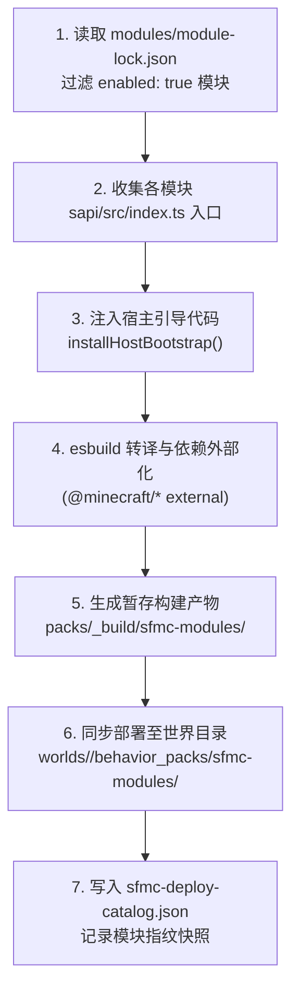

# 行为包动态构建管线

SFMC 采用动态打包机制：所有已启用的业务模块在开服或执行热重载时，由构建系统自动编译并注入到世界目录的 `sfmc-modules` 行为包（BP）与资源包（RP）中。本文介绍该构建管线的流程与关键规则。

## 1. 构建流程与产物

构建流程由 CLI 与 `@sfmc-bds/bds-tools` 的 pack-manager 协调执行：


```mermaid
flowchart TD
  Lock["1. 读取 modules/module-lock.json<br/>过滤 enabled: true 模块"] --> Collect["2. 收集各模块 sapi/src/index.ts 入口"]
  Collect --> Banner["3. 注入宿主引导代码<br/>installHostBootstrap()"]
  Banner --> Esbuild["4. esbuild 转译与依赖外部化<br/>(@minecraft/* external)"]
  Esbuild --> BuildOut["5. 生成暂存构建产物<br/>packs/_build/sfmc-modules/"]
  BuildOut --> Deploy["6. 同步部署至世界目录<br/>worlds/<level>/behavior_packs/sfmc-modules/"]
  Deploy --> Catalog["7. 写入 sfmc-deploy-catalog.json<br/>记录模块指纹快照"]
```

### 产物路径一览

| 产物类型 | 输出路径 | 说明 |
| :--- | :--- | :--- |
| **中间构建产物** | `<SFMC_ROOT>/packs/_build/sfmc-modules/` | esbuild 编译后的暂存产物。 |
| **配套资源包 (RP)** | `<SFMC_ROOT>/packs/_build/sfmc-modules-rp/` | 若启用的模块携带贴图、UI 或音效资源，自动生成配套 RP。 |
| **世界行为包 (BP)** | `<BDS>/worlds/<level>/behavior_packs/sfmc-modules/` | 实际注入当前世界的行为包。 |
| **世界资源包 (RP)** | `<BDS>/worlds/<level>/resource_packs/sfmc-modules-rp/` | 实际注入当前世界的资源包。 |
| **部署指纹清单** | BP 根目录下的 `sfmc-deploy-catalog.json` | 记录本次构建包含的模块列表及源码哈希。 |

## 2. 打包规则

1. **仅打包已启用模块**：只有在 `modules/module-lock.json` 中标记为 `"enabled": true` 的模块才会参与编译，禁用模块不会打包进产物。
2. **宿主引导注入**：以 `installHostBootstrap()` 脚本为入口，在 `system.beforeEvents.startup` 事件中初始化 `ConfigManager` 并集中触发各模块的注册。
3. **原生依赖外部化**：所有官方运行时包（`@minecraft/server`、`@minecraft/server-ui`、`@minecraft/server-net` 等）均声明为 external，由 BDS 引擎原生提供，不打入 bundle。
4. **空包容底保护**：若所有业务模块均被禁用，构建系统仍会生成合法的空行为包骨架，避免 BDS 因缺少包报错。

## 3. 常用构建与重载命令

```bash
# 仅执行编译与组装，不写入世界目录（用于检查语法与产物体积）
sfmc> mod build

# 编译、部署至世界，并向 BDS 发送热重载指令
sfmc> mod reload

# 仅编译并写入世界，不向游戏发送 reload 指令
sfmc> mod reload --build-only
```

:::tip 启动时自动检查 (Load Gate)
执行 `sfmc /start bds` 时，系统会自动比对世界目录内 `sfmc-deploy-catalog.json` 与当前本地模块的源码哈希：
- **无变更**：直接跳过构建开服。
- **检测到模块增删或源码变更**：自动执行增量构建并部署后再启动服务端。
:::

## 4. 常见变更与生效方式

| 改动内容 | 推荐生效操作 | 原理说明 |
| :--- | :--- | :--- |
| **修改模块 SAPI 源码（`sapi/src/*.ts`）** | 执行 `sfmc mod reload` 或保存触发 Watch | 重新编译后通过 SAPI 热重载刷新运行时。 |
| **修改全局配置（`configs/*.json`）** | **重启 BDS** | 配置由 `ConfigManager` 在启动时缓存。 |
| **修改模块清单（`manifest.json`）** | **重启 BDS** | 权限变更需要 BDS 重新分配并由 db-server 重新颁发 Token。 |
| **修改 db-server 或其他 Node 服务源码** | 仅重启对应服务（如 `restart db`） | SAPI 行为包不受影响，无需重新构建。 |
