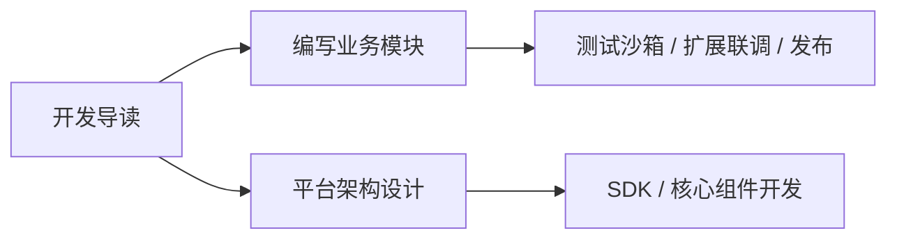

import { Tab, Tabs } from "@rspress/core/theme";

# 开发指南 · 导读

SFMC 提供了完备的现代化 TypeScript 开发套件。无论是希望为社区生态编写功能模块，还是参与平台核心与 SDK 建设，均可在此找到清晰规范的演进路径。



## 1. 三层工程边界与真理源

在动手编码之前，理解 SFMC 的三层职责边界至关重要：

| 角色层次 | 核心职责与真理源 | 严禁与避免的误区 |
| :--- | :--- | :--- |
| **作者独立仓（Template）** | **业务逻辑的唯一编码面**。每个模块均为独立的 Git 仓库，拥有自己的 `package.json`、单元测试与构建流程。 | 严禁直接在主仓 `packages/` 目录下添加具体业务逻辑。 |
| **npm 制品源** | **模块发布的唯一法定渠道**。版本通过 npm Registry 进行语义化分发（`@sfmc-bds/module-<id>` 或社区 scope）。 | 严禁依赖私有 Git 子模块或文件拷贝作为发布分发面。 |
| **模块索引（sfmc-modules）** | **社区检索的轻量索引**。仅包含 `index.json` 目录，供 CLI 搜索、版本匹配与展示。 | 该仓库并非 Monorepo 工作区，不承载任何实际模块代码。 |
| **主仓工作区（modules/packages/）** | **服务器运行态的安装目标**。可通过 `--link` 软链接挂接作者本地仓进行热联调。 | 并非日常业务开发的代码仓库。 |

## 2. 推荐开发环境配置

| 类别 | 推荐选项 | 说明 |
| :--- | :--- | :--- |
| **操作系统** | Windows 10 / 11 或 Linux (Ubuntu 22.04+) | 建议开发机配置好本地 Node.js 与 Git 环境。 |
| **Node.js** | **`≥ 22.13.0`** (LTS) | 必须满足该版本以获得 Node 原生内置的 `node:sqlite` 支持。 |
| **包管理** | **`pnpm`** (推荐) 或 `npm` | 主仓采用 pnpm workspaces；本地开发包严禁使用 `workspace:*` 外部依赖。 |
| **编辑器** | [Cursor](https://cursor.com/) 或 [VS Code](https://code.visualstudio.com/) | 搭配专属扩展体验最佳。 |

### 必备与推荐 VS Code / Cursor 扩展

- **SFMC Module**（官方专属扩展）：提供一键生成新模块（`New Module`）、假引擎单元测试（`Run Tests`）、实时监听热重载（`Start Watch`）与一键部署。
- **ESLint**：启用 `@sfmc-bds/eslint-plugin` 规则，实施消息规范、SDK 导入路径与跨模块契约的静态检查。
- **Node.js Testing**：在编辑器侧边栏以图形化测试树直接运行与调试 `node --test`。

## 3. 选择你的开发路线

<Tabs>
  <Tab label="路径 A：编写业务功能模块（新手与作者）">

适合希望为服务器增添玩法功能的开发者：

1. [模块开发全流程](./module-author.mdx) — 5 分钟脚手架、生命周期契约与 VS Code 扩展联调
2. [API 速查手册 (Cheatsheet)](./cheatsheet.mdx) — 消息、数据库、配置与服务通信代码范例
3. [测试与调试指南](./testing.md) — 了解模块作者的 Watch 热联调与平台单测分轨
4. [ESLint 规则手册](./eslint.md) · [发布你的模块](./publish.md) — 质量核检与 npm 发布

```bash
# 模块作者开发最小闭环
npm create @sfmc-bds/module@latest
cd my-feature && pnpm install && pnpm test

# 联调：通过 VS Code 扩展点击 "Link to SFMC Root"
# 或在运维服务器控制台直接挂接：
sfmc mod install my-feature --from dir:D:/WorkSpace/my-feature --link
sfmc mod enable my-feature
sfmc mod reload
```

  </Tab>
  <Tab label="路径 B：贡献平台核心与 SDK（架构师与核心贡献者）">

适合参与 SFMC 框架本身演进的贡献者：

1. 克隆主仓：`git clone https://github.com/DogeLakeDev/ScriptsForMinecraftServer.git`
2. 构建全套平台包：`pnpm install && pnpm run build`
3. 深入理解 [系统架构设计](./architecture.md) 与 [平台底层组件](./platform.md)
4. 遵循 [贡献指南](./contributing.md) 与 [代码工程约定](./conventions.md) 提交 PR

  </Tab>
</Tabs>

## 4. 核心章节导航索引

| 章节手册 | 核心指引内容 |
| :--- | :--- |
| **[模块开发手册](./module-author.mdx)** | 快速脚手架、扩展联动、命名约定与联调流程 |
| **[API 速查手册 (Cheatsheet)](./cheatsheet.mdx)** | 生命周期、Msg 消息、SQLite、配置与跨模块服务代码片段 |
| **[测试与调试策略](./testing.md)** | 模块作者 Watch 热联调、平台包 node:test 与分轨测试 |
| **[Manifest 契约规格](./manifest.md)** | `manifest.json` v2/v3 字段定义与权限声明标准 |
| **[构建与打包管线](./build-pipeline.md)** | 行为包自动化装配、esbuild 转译流水线 |
| **[ESLint 约定与静态检查](./eslint.md)** | 平台专属 ESLint 插件与规约 |
| **[发布你的模块](./publish.md)** | npm 发布规范与向官方索引仓库提交 PR |
| **[系统架构设计](./architecture.md)** | 跨进程分层、启动序时序图与通信协议 |
| **[平台核心开发](./platform.md)** | SDK、db-server、CLI 与 devkit 组件演进 |
| **[代码工程约定](./conventions.md)** | 统一代码规范、Prettier 规则与安全边界 |
| **[附加包更新技术专题](./pack-update.md)** | CurseForge 远程源探测与版本算法底层实现 |
