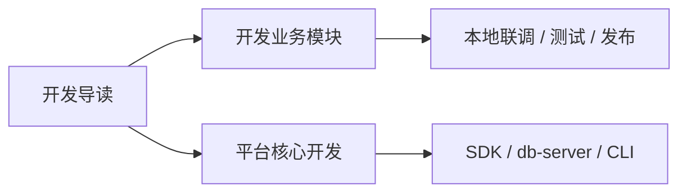

import { Tab, Tabs } from "@rspress/core/theme";

# 开发指南 · 导读

本文档面向 SFMC 业务模块开发者与平台核心贡献者，介绍项目架构划分、开发环境要求与常见开发流程。


```mermaid
flowchart LR
  A[开发导读] --> B[开发业务模块]
  B --> C[本地联调 / 测试 / 发布]
  A --> D[平台核心开发]
  D --> E[SDK / db-server / CLI]
```

## 1. 仓库划分与工程边界

在开始开发前，需要先明确 SFMC 各仓库与目录的职责边界：

| 仓库 / 目录 | 职责定位 | 说明 |
| :--- | :--- | :--- |
| **独立模块仓库** | 编写业务模块代码的地方。每个模块都是独立的 Git 仓库，拥有自己的 `package.json`、构建与测试。 | 不要在平台主仓的 `packages/` 下直接写业务模块。 |
| **npm Registry** | 模块分发渠道。模块通过 npm 发布（如 `@alice/sfmc-module-teleport` 或 `@sfmc-bds/module-<id>`）。 | 生产环境通过 CLI 从 npm 安装模块，避免直接复制文件或引用 Git 子模块。 |
| **模块索引（sfmc-modules）** | 社区模块目录。仅维护一个 `index.json`，供 `sfmc mod search` 检索和展示。 | 该仓库仅做元数据索引，不存储模块源代码。 |
| **平台运行目录（modules/packages/）** | 服务器运行时的模块安装目录。 | 本地开发时可通过 `--link` 软链接挂接到作者本地仓库进行联调。 |

## 2. 开发环境准备

| 类别 | 推荐配置 | 说明 |
| :--- | :--- | :--- |
| **操作系统** | Windows 10 / 11 或 Linux (Ubuntu 22.04+) | 建议配置好 Node.js 与 Git。 |
| **Node.js** | **`≥ 22.13.0`** (LTS) | 必须满足该版本以支持 Node 内置的 `node:sqlite`。 |
| **包管理器** | **`pnpm`** | 主仓采用 pnpm workspaces；独立模块仓库也推荐使用 pnpm。 |
| **编辑器** | [VS Code](https://code.visualstudio.com/) 或 [Cursor](https://cursor.com/) | 搭配官方扩展体验更佳。 |

### 推荐编辑器扩展

- **SFMC Module**：官方 VS Code / Cursor 扩展，支持创建新模块、挂接软链接（Link）、文件监听热重载（Watch）与一键部署。
- **ESLint**：启用 `@sfmc-bds/eslint-plugin`，在编写代码时实时检查消息格式、SDK 导入路径与权限声明。

## 3. 开发路径选择

<Tabs>
  <Tab label="路径 A：开发业务模块（玩法与功能）">

适合开发具体的服务器玩法与功能扩展：

1. [模块开发手册](./module-author.mdx) — 初始化模块、本地联调与发布流程
2. [API 速查手册 (Cheatsheet)](./cheatsheet.mdx) — 消息提示、数据库、配置与服务调用代码片段
3. [验证与调试指南](./testing.md) — 静态检查、本地联调与 BDS 运行验证
4. [ESLint 规则手册](./eslint.md) · [发布你的模块](./publish.md) — 代码规范与 npm 发布

```bash
# 1. 生成模块工程
pnpm dlx @sfmc-bds/create-module@latest
cd my-feature && pnpm install && pnpm run typecheck

# 2. 挂接到本地测试服务器（也可在 VS Code 扩展点击 "Link to SFMC Root"）
sfmc mod install my-feature --from dir:D:/WorkSpace/my-feature --link
sfmc mod enable my-feature
sfmc mod reload
```

  </Tab>
  <Tab label="路径 B：贡献平台核心（SDK 与基础服务）">

适合参与 SFMC 框架本身（SDK、CLI、db-server 等）的开发与维护：

1. 克隆主仓：`git clone https://github.com/DogeLakeDev/ScriptsForMinecraftServer.git`
2. 安装依赖并构建：`pnpm install && pnpm run build`
3. 查阅 [系统架构设计](./architecture.md) 与 [平台核心开发](./platform.md)
4. 遵循 [贡献指南](./contributing.md) 与 [代码工程约定](./conventions.md) 提交 PR

  </Tab>
</Tabs>

## 4. 文档导航

| 章节 | 说明 |
| :--- | :--- |
| **[模块开发手册](./module-author.mdx)** | 脚手架使用、目录结构、命名规范与本地联调 |
| **[API 速查手册 (Cheatsheet)](./cheatsheet.mdx)** | 常见 API 代码片段（消息、SQLite、配置、跨模块 RPC） |
| **[验证与调试策略](./testing.md)** | 静态检查、Watch 热重载与 BDS 运行验收 |
| **[Manifest 契约规范](./manifest.md)** | `manifest.json` 字段说明、权限语法与服务声明 |
| **[构建与打包管线](./build-pipeline.md)** | 行为包组装、esbuild 转译与文件注入逻辑 |
| **[ESLint 约定与静态检查](./eslint.md)** | `@sfmc-bds/eslint-plugin` 规则说明与配置 |
| **[发布你的模块](./publish.md)** | npm 发布与登记到官方索引仓库 |
| **[系统架构设计](./architecture.md)** | 进程模型、SAPI 生命周期与通信时序 |
| **[平台核心开发](./platform.md)** | SDK、db-server、CLI 等平台包架构与自检 |
| **[代码工程约定](./conventions.md)** | 命名规范、Prettier 规则与代码边界约定 |
| **[附加包更新技术专题](./pack-update.md)** | CurseForge 远程源探测与版本比较算法 |
