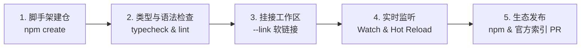

# 业务模块开发全流程手册

本手册面向 SFMC 业务模块开发者。读完本篇，你将掌握从**新建模块仓库、规范化命名、静态检查与真机热重载联调，到最终发布至 npm 与官方索引**的完整工程化闭环。

## 1. 快速脚手架：5 分钟初始化模块

推荐通过官方脚手架一键生成标准的作者独立仓库：

```bash
# 交互式初始化向导
npm create @sfmc-bds/module@latest
# 或使用 npx
npx @sfmc-bds/create-module@latest
```

向导将引导您填写并配置：
- **模块 ID（kebab-case）**
- **显示名称（Display Name）**
- **npm Scope**：社区模块建议使用个人或团队 scope（如 `@alice`）
- **可选能力选型**：是否开箱包含 SQLite 持久化支持（`db`）

:::tip 图形化创建
在 VS Code 或 Cursor 中安装官方扩展 **「SFMC Module」** 后，在命令面板（`Ctrl+Shift+P`）中执行 `SFMC: New Module`，亦可唤起相同脚手架引擎生成工程。
:::

进入新生成的工程目录并安装依赖运行测试：

```bash
cd my-feature
pnpm install && pnpm test
# 或使用 npm
npm install && npm test
```

## 2. 工程规范与命名矩阵

为确保模块在全生态中的命名唯一性与一致性，请严格遵循以下规范矩阵：

| 层次维度 | 命名规约 | 示例 | 作用与约束 |
| :--- | :--- | :--- | :--- |
| **文件夹 / 安装 ID** | 短名，小写连字符（kebab-case） | `teleport`、`economy` | 运维机安装和执行命令的唯一短名（如 `sfmc mod install teleport`）。 |
| **npm 包名（社区）** | `@<scope>/sfmc-module-<id>` | `@alice/sfmc-module-teleport` | 社区公开发布至 npm Registry 的包名。 |
| **npm 包名（官方）** | `@sfmc-bds/module-<id>` | `@sfmc-bds/module-economy` | 平台核心团队维护的官方模块。 |
| **Manifest 模块 ID** | `feature-<id>` 或 `core-<id>` | `feature-teleport` | 在 SAPI 虚拟机内部的唯一模块标识符。 |
| **配置命名空间** | 下划线命名（snake_case） | `teleport`、`my_feature` | 对应 `<SFMC_ROOT>/configs/<configKey>.json`。 |

## 3. 作者开发标准工作流（Developer Workflow）

SFMC 将模块开发划分为 5 个清晰阶段：



### ① 编写与静态检查（Type Safety & Lint）
在本地编码阶段，充分利用 TypeScript 强类型与官方 ESLint 规则保障质量：

```bash
pnpm run typecheck    # 验证 SAPI 类型约束
pnpm run lint         # 检查 Msg 消息助手、SDK 导入与权限约定
```

### ② 挂接至本地开服目录（Link）
将作者仓直接软链接到你的本地测试服务器（SFMC_ROOT）：

```bash
# 方式 A：在 VS Code 扩展点击 "SFMC: Link to SFMC Root"
# 方式 B：在服务端执行 CLI 命令
sfmc mod install my-feature --from dir:D:/WorkSpace/my-feature --link
sfmc mod enable my-feature
```

### ③ 实时监听与热重载（Watch & Reload）
在 VS Code / Cursor 中点击扩展栏的 **`SFMC: Start Watch`**。  
每次你在 `sapi/src/` 中保存代码时，`@sfmc-bds/devkit` 会在毫秒内完成转译增量部署，并自动通知 BDS 刷新行为包，游戏内无感热生效！

### ④ 发布至 npm 与官方生态
代码验证完毕后，正式发布上线：

```bash
# 发布至 npm（要求公共包）
pnpm publish --access public

# 向官方索引 sfmc-modules 的 index.json 提交 PR 登记你的模块
```

## 4. 作者仓标准文件结构

```text
my-feature/
├── package.json               # 声明依赖与 exports
├── .vscode/
│   ├── extensions.json        # 推荐扩展（SFMC Module, ESLint 等）
│   └── settings.json          # 绑定 JSON Schema
├── eslint.config.js           # 集成 @sfmc-bds/eslint-plugin
├── sapi/
│   ├── manifest.json          # 模块契约声明（v2 / v3）
│   ├── tsconfig.json          # 面向 SAPI 环境的 TypeScript 配置
│   └── src/
│       └── index.ts           # 模块业务逻辑主入口（ModuleRegistry.register）
└── package.json
```

### SDK 模块化导入路径指南

| 导入路径 | 导出功能 | 使用场景 |
| :--- | :--- | :--- |
| **`@sfmc-bds/sdk/module-loader`** | `ModuleRegistry`、`ConfigManager` | 模块根入口注册与生命周期定义。 |
| **`@sfmc-bds/sdk/sapi/runtime`** | `Command`、`Msg`、`Permission`、`MenuNavigator` | 聊天命令、规范消息展示、权限节点注册与表单菜单。 |
| **`@sfmc-bds/sdk/sapi/db`** | `db.defineTable`、`db.select`、`db.insert`、`db.tx` | SQLite 透明持久化与多模块分布式事务。 |
| **`@sfmc-bds/sdk/sapi/config`** | `config.get`、`config.set` | 读取并监听本模块私有配置文件。 |
| **`@sfmc-bds/sdk/sapi/service`** | `service.provide`、`service.call` | 跨模块暴露远程 RPC 接口或调用其他模块能力。 |

:::warning 注意：杜绝违规直连
严禁在 SAPI 模块内使用原生 `fetch` 或 `http` 直接请求 `127.0.0.1:3001`。所有数据库读写与服务通信必须通过 SDK 封装的 `db.*`、`service.*` 接口进行，SDK 会自动完成请求上下文封装与 Bearer Token 鉴权注入。
:::

## 5. Manifest v3 语义化元数据契约

在 `sapi/manifest.json` 中，除了基础的模块 ID 和依赖外，推荐声明 **v3 语义化元数据（`semantic` 块）**。它能够帮助编辑器、静态分析工具与运维面板深刻理解该模块的行为特征：

```json title="sapi/manifest.json"
{
  "$schema": "https://cdn.jsdelivr.net/gh/DogeLakeDev/ScriptsForMinecraftServer@%40sfmc-bds/sdk@0.2.0-beta.6/modules/sdk/%40sfmc-sdk/schemas/sapi-manifest.v3.schema.json",
  "schemaVersion": 3,
  "id": "feature-economy",
  "name": "核心经济系统",
  "configKey": "economy",
  "requires": [],
  "permissions": ["db:read:wallet", "db:write:wallet"],
  "services": {
    "provides": [{ "name": "economy.transfer" }],
    "requires": []
  },
  "semantic": {
    "configKeys": ["economy.initial_balance", "economy.currency_name"],
    "dependsOn": [],
    "events": {
      "emits": ["economy:balanceChanged"],
      "listens": ["world.afterEvents.playerJoin"]
    },
    "dbTables": [
      {
        "name": "wallets",
        "columns": ["player_xuid", "balance", "updated_at"]
      }
    ],
    "publicApi": [
      {
        "symbol": "transfer",
        "description": "跨玩家安全转账（支持事务回滚）",
        "params": [
          { "name": "fromPlayer", "type": "string", "required": true },
          { "name": "toPlayer", "type": "string", "required": true },
          { "name": "amount", "type": "number", "required": true }
        ],
        "returns": { "type": "boolean", "description": "转账是否成功" }
      }
    ]
  }
}
```

### 语义字段解析

- **`configKeys`**：声明该模块会读取或监听的配置键集合。
- **`events.emits` / `listens`**：声明该模块主动触发的全局事件与监听的原生/跨模块事件路径。
- **`dbTables`**：描述该模块在 SQLite 中注册的数据表与核心列。
- **`publicApi`**：对外暴露的强类型 API 接口说明，为下游调用者提供签名参考。

### 向下兼容性保障
- **零破坏性升级**：v3 对 v2 完全向下兼容。旧模块保留 `schemaVersion: 2` 即可平滑运行，系统会自动将其平滑升维为缺省 `semantic` 的 v3 格式。
- **类型宽容度**：即使在 `semantic` 中声明了可选错误类型，校验引擎仅会在控制台打印警告提示，绝对不会粗暴阻断模块的启动加载。

## 6. 下一步指引

- 📚 **核心 API 速查**：查阅 [API 速查手册 (Cheatsheet)](./cheatsheet.mdx) 获取最常用的代码片段。
- 🧪 **测试与调试策略**：查阅 [测试与调试策略](./testing.md) 掌握本地类型校验与真机 Watch 热重载的最佳实践。
- 🛡️ **代码质量规范**：查阅 [ESLint 规则说明](./eslint.md) 消除常见的安全隐患与反模式。
- 🚀 **发布至 npm**：查阅 [发布你的模块](./publish.md) 了解版本打标与上架规范。
