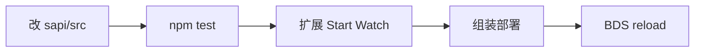

import { Tabs, Tab } from '@rspress/core/theme';

# 模块开发

从模板建仓，用 **VS Code/Cursor 扩展「SFMC Module」** 写测与 Watch；运维面仍用 `sfmc`（装模块、启停、对本机 `mod reload`）。

一模块一仓；**不要** clone `sfmc-modules` 写业务。

## 新建模块


<Tabs>
  <Tab label="扩展（推荐）">

命令面板 → `SFMC: New Module`，选空目录并填 id。

  </Tab>
  <Tab label="模板">

使用 [sfmc-module-template](https://github.com/Tanya7z/sfmc-module-template)（GitHub *Use this template*），在仓库根目录：

```bash
node scripts/rename.mjs my-feature --scope <npm用户> --name "我的功能"
npm i
npm run typecheck
npm test
```

  </Tab>
  <Tab label="new-module 脚本">

```bash
mkdir my-feature && cd my-feature
node <主仓>/tools/new-module.mjs my-feature --name "我的功能"
```

详见 [工具脚本](./tools.md)。

  </Tab>
</Tabs>

## 命名规范

| 层 | 规则 | 例 |
| ------ | ------ | ----- |
| 文件夹 / install id | 短名 kebab | `my-feature` |
| npm（社区） | `@<user>/sfmc-module-<id>` | `@alice/sfmc-module-my-feature` |
| npm（官方） | `@sfmc-bds/module-<id>` | `@sfmc-bds/module-economy` |
| `manifest.id` | `feature-<id>` 或 `core-<id>` | `feature-my-feature` |
| `configKey` | `-` → `_` | `my_feature` |

## 作者工作流



1. **先测**：`npm test`（假引擎，秒级）。详情见 [测试沙箱](./testing.md)（宿主分相、L0–L2、与 Watch 分工）。可视化编排用 **Sapience**。
2. **再联调**：扩展 `SFMC: Start Watch` / `SFMC: Reload to BDS`（设置 `sfmc.root` 为含 `configs/`、`modules/` 的工作目录；扩展会写 `${sfmc.root}/modules/module-lock.json`，与 `sfmc` CLI 同一权威源）；或运维机 `sfmc mod install --link` + `mod reload`。

:::tip 全表面 ≠ 假 BDS
沙箱能 `import` 大范围 `@minecraft/*`，未实现 API 会**硬失败**（不是静默 noop）。进服仍是终检：世界交互与版本 quirk 用 Watch / 日志。

| 入口 | 作用 |
| ------ | ------ |
| `npm test` | 模块仓假引擎单测（`createSandbox`） |
| 扩展 Start Watch | 源码变更 → `@sfmc-bds/devkit` 重建部署 |
| `sfmc mod build` / `reload` | **运维**对本机已装模块组装部署 |
| `sfmc mod install/enable` | **运维**安装与启停 |

:::warning 注意
`sfmc mod test` / `mod watch` / `mod publish` 已移除；作者发布用模板/`npm publish`，联调用扩展。

:::

### 安装源（运维）

| 来源 | 何时用 |
| ------ | -------- |
| `npm:@scope/name`（默认） | 已发布 |
| `dir:` / `local:` + `--link` | 作者仓联调到服务器工作目录 |

## 作者仓结构

```text
my-feature/
├── package.json
├── .vscode/          # ESLint / SFMC Module / 测试推荐扩展
├── eslint.config.js
├── scripts/rename.mjs
├── sapi/
│   ├── manifest.json
│   ├── tsconfig.json
│   └── src/index.ts
└── test/
```

## SDK 导入

| 路径 | 用途 |
| ------ | ------ |
| `@sfmc-bds/sdk/sapi/runtime` | Msg、命令、权限、菜单 |
| `@sfmc-bds/sdk/sapi/db` | 表、CRUD、事务 |
| `@sfmc-bds/sdk/testing` | 测试沙箱 `createSandbox` |
| `@sfmc-bds/devkit` | Watch / 脚手架（扩展依赖） |

## 接下来

| 章节 | 内容 |
| ------ | ------ |
| [测试沙箱](./testing.md) | 假引擎保真、L0/L2、与 Watch 分工 |
| [ESLint 约定](./eslint.md) | 约定检查 |
| [发布你的模块](./publish.md) | npm 发布 |

## manifest v3 语义字段

v2 manifest 只够 boot 用；v3 在 v2 之上新增可选 `semantic` 块，用来描述模块**「在做什么」**——沙箱、配置面板、场景图据此推断行为来源。

v3 是**完全可选**的能力扩展：不写 v3 字段也能 boot；旧 v2 模块一行代码不用改。

### 字段一览

| 字段 | 类型 | 用途 |
| --- | --- | --- |
| `schemaVersion` | `3` | manifest schema 版本号；旧模块保留 `2` 即可。 |
| `semantic.configKeys` | `string[]` | 模块读取的配置键：精确名（如 `"land.price"`）或前缀（如 `"economy.*"`）。 |
| `semantic.dependsOn` | `string[]` | 依赖的其他模块 id。决定启动顺序校验、UI 提示「请先启用 X」。 |
| `semantic.events.emits` | `string[]` | 模块主动 emit 的自定义事件名（建议 `module:<id>:<event>`）。 |
| `semantic.events.listens` | `string[]` | 模块监听的事件路径，含 BDS 原生（`world.afterEvents.playerJoin`）与自定义。 |
| `semantic.dbTables` | `{ name, columns? }[]` | 模块使用的 DB 表与列提示。 |
| `semantic.publicApi` | `{ symbol, description?, params?, returns? }[]` | 模块对外暴露的 API 签名，供其他模块 import 参考。 |

每个 `semantic` 子字段都允许缺失；缺省时等同于「没有声明」，沙箱按 v2 行为推断。

### 完整示例

```json
{
  "$schema": "https://cdn.jsdelivr.net/gh/DogeLakeDev/ScriptsForMinecraftServer@%40sfmc-bds/sdk@0.2.0-beta.6/modules/sdk/%40sfmc-sdk/schemas/sapi-manifest.v3.schema.json",
  "schemaVersion": 3,
  "id": "feature-economy",
  "name": "经济",
  "type": "feature",
  "configKey": "economy",
  "requires": ["feature-land"],
  "permissions": [
    "db:read:wallet",
    "db:write:wallet",
    "config:read:economy"
  ],
  "services": {
    "provides": [{ "name": "economy.balance" }],
    "requires": []
  },
  "semantic": {
    "configKeys": ["economy.*", "land.economy.*"],
    "dependsOn": ["feature-land"],
    "events": {
      "emits": ["economy:walletChanged"],
      "listens": ["world.afterEvents.playerJoin"]
    },
    "dbTables": [
      { "name": "wallet", "columns": ["playerId", "balance"] },
      { "name": "tx_log" }
    ],
    "publicApi": [
      {
        "symbol": "spend",
        "description": "扣除余额并写流水",
        "params": [
          { "name": "playerId", "type": "string", "required": true },
          { "name": "amount", "type": "number", "required": true }
        ],
        "returns": { "type": "boolean", "description": "成功与否" }
      }
    ]
  }
}
```

### 兼容性与迁移

- **v2 → v3 自动迁移**：沙箱与 `check-modules` 都内置自动 migrate（`migrateV2toV3`）。v2 manifest 加载时直接补 `schemaVersion: 3`、保留所有原有字段，`semantic` 视为空。
- **缺省 semantic 合法**：v3 manifest 可以不写 `semantic`，等价于「暂时没声明语义」——后续可逐字段补全。
- **运行时校验**：保留 v2 的硬校验（id/name/type/configKey/requires/permissions/services 必填）；`semantic` 子字段类型错时给 `errors: string[]`，但不拒绝启动（沙箱会剥掉坏字段、用 v3 顶层继续）。

### 配套工具

| 工具 | 行为 |
| --- | --- |
| `tools/check-modules.mjs` | v2 校验路径不变；v3 manifest 走新校验（`semantic` 字段类型错会报错）。 |
| `tools/catalog-sync.mjs` / `fetch-module.mjs` | 投影时把 `semantic` 块原样写入 catalog（仅读取，不主动注入）。 |

### 与缺口 1 / 3 的衔接

v3 `semantic` 不是终点，是**数据源**：

- 缺口 1（沙箱读语义镜像面板）：v3 字段准备齐后，沙箱能枚举每个模块的 `configKeys / events / dbTables / publicApi`，构建「模块语义镜像」面板，让作者不用读 manifest 也能看到自己模块触达的范围。
- 缺口 3（场景对象标来源）：场景里每个对象/事件可以标注「由哪个模块的哪个 `publicApi` / `events.emit` 产生」，数据来源就是 v3 的 `publicApi.symbol` 与 `events.emits`。

`publicApi` 当前只支持单签名；多载/重载留 TODO，等下一轮按真实模块诉求再加。

> v2 manifest 作者请保持现状不动；只有新增模块或主动升级时再写 v3。`fetch-module` 与 `catalog-sync` 不会因为写错 v3 而拒绝模块——错就报在 `check-modules`，不必动 v2 字段。
