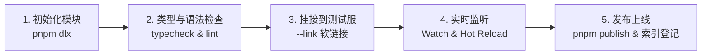

# 业务模块开发指南

本文介绍如何开发 SFMC 业务模块，涵盖脚手架初始化、目录结构、命名规范、本地联调、Manifest 配置以及发布流程。

## 1. 快速开始

使用官方脚手架初始化模块仓库：

```bash
pnpm dlx @sfmc-bds/create-module@latest
```

向导将提示配置以下内容：
- **模块 ID（kebab-case）**：如 `teleport`、`economy`
- **显示名称（Display Name）**：如 `通用经济`
- **npm Scope**：个人或团队 scope（如 `@alice`）
- **功能选型**：是否包含 SQLite 数据库支持

:::tip 编辑器支持
在 VS Code 或 Cursor 中安装扩展 **SFMC Module** 后，也可以通过命令面板（`Ctrl+Shift+P`）执行 `SFMC: New Module` 生成工程。
:::

进入模块目录并安装依赖、执行类型检查：

```bash
cd my-feature
pnpm install && pnpm run typecheck
```

## 2. 命名规范

为避免模块冲突，模块各位置的命名约定如下：

| 场景 | 命名格式 | 示例 | 说明 |
| :--- | :--- | :--- | :--- |
| **安装短名 / 文件夹** | 小写连字符（kebab-case） | `teleport`、`economy` | CLI 安装与管理时使用的短名称（如 `sfmc mod install teleport`）。 |
| **社区 npm 包名** | `@<scope>/sfmc-module-<id>` | `@alice/sfmc-module-teleport` | 发布至 npm 官方源的包名。 |
| **官方 npm 包名** | `@sfmc-bds/module-<id>` | `@sfmc-bds/module-economy` | 官方维护的核心业务模块。 |
| **Manifest 模块 ID** | `feature-<id>` 或 `core-<id>` | `feature-teleport` | SAPI 运行时中的唯一模块标识。 |
| **配置命名空间** | 下划线命名（snake_case） | `teleport`、`my_feature` | 对应 `<SFMC_ROOT>/configs/<configKey>.json`。 |

## 3. 开发工作流

开发业务模块的常规流程如下：


```mermaid
flowchart LR
  A[1. 初始化模块<br/>pnpm dlx] --> B[2. 类型与语法检查<br/>typecheck & lint]
  B --> C[3. 挂接到测试服<br/>--link 软链接]
  C --> D[4. 实时监听<br/>Watch & Hot Reload]
  D --> E[5. 发布上线<br/>pnpm publish & 索引登记]
```

### 1. 编写与静态检查
编码过程中通过 TypeScript 与 ESLint 保障代码质量：

```bash
pnpm run typecheck    # 检查 SAPI 类型与 SDK 契约
pnpm run lint         # 检查消息规范、导入路径与权限规则
```

### 2. 挂接到本地测试服务器（Link）
将本地模块软链接到测试服务器（SFMC_ROOT）进行联调：

```bash
# 方式 A：在 VS Code 扩展中点击 "SFMC: Link to SFMC Root"
# 方式 B：在服务端终端执行命令
sfmc mod install my-feature --from dir:D:/WorkSpace/my-feature --link
sfmc mod enable my-feature
```

### 3. 实时监听与热重载（Watch & Reload）
在 VS Code / Cursor 中点击扩展侧边栏的 **`SFMC: Start Watch`**。每次保存 `sapi/src/` 中的代码，扩展会自动增量编译并通知 BDS 热重载。

### 4. 发布到 npm 与社区索引
测试验证完成后，即可发布上线：

```bash
# 发布到 npm（需公开访问）
pnpm publish --access public

# 向 sfmc-modules 仓库的 index.json 提交 PR 登记模块
```

## 4. 模块目录结构

```text
my-feature/
├── package.json               # 依赖声明与 npm exports
├── .vscode/
│   ├── extensions.json        # 推荐扩展（SFMC Module, ESLint 等）
│   └── settings.json          # 编辑器配置
├── eslint.config.js           # 集成 @sfmc-bds/eslint-plugin
├── sapi/
│   ├── manifest.json          # 模块契约声明
│   ├── tsconfig.json          # 面向 SAPI 环境的 TypeScript 配置
│   └── src/
│       └── index.ts           # 模块入口（ModuleRegistry.register）
```

### SDK 常用导入路径

| 导入路径 | 导出内容 | 使用场景 |
| :--- | :--- | :--- |
| **`@sfmc-bds/sdk/module-loader`** | `ModuleRegistry`、`ConfigManager` | 模块入口注册与生命周期定义。 |
| **`@sfmc-bds/sdk/sapi/runtime`** | `Command`、`Msg`、`Permission`、`MenuNavigator` | 聊天命令、规范消息输出、权限节点与表单导航。 |
| **`@sfmc-bds/sdk/sapi/db`** | `db.defineTable`、`db.select`、`db.insert`、`db.tx` | SQLite 数据读写与跨模块事务。 |
| **`@sfmc-bds/sdk/sapi/config`** | `config.get`、`config.set` | 读取并监听模块专属配置文件。 |
| **`@sfmc-bds/sdk/sapi/service`** | `service.provide`、`service.call` | 跨模块暴露或调用 RPC 服务。 |

:::warning 注意
SAPI 模块内禁止直接使用原生 `fetch` 请求 `127.0.0.1:3001`。所有数据库操作与跨模块通信必须通过 SDK 提供的 `db.*` 和 `service.*` 进行，SDK 会自动处理请求封装与 Bearer Token 鉴权。
:::

## 5. Manifest 配置与语义元数据

在 `sapi/manifest.json` 中声明模块的基础标识、权限和依赖。推荐声明 **v3 语义元数据（`semantic` 字段）**，便于工具和控制面板识别模块行为：

:::tip 启停控制说明
模块 manifest 不再支持 `canDisable` 与 `enabledByDefault` 字段（若存在会导致校验报错）。新安装的模块默认启用，服主通过 `sfmc mod enable <id>` 与 `sfmc mod disable <id>` 管理启停，在下次 BDS 冷启动时生效；升级时会自动保留已有的启停状态。
:::

目前 v3 尚无独立公开的 JSON Schema，示例中不设置 `$schema`：

```json title="sapi/manifest.json"
{
  "schemaVersion": 3,
  "id": "feature-economy",
  "name": "核心经济系统",
  "configKey": "economy",
  "requires": [],
  "permissions": ["db:read:wallet", "db:write:wallet"],
  "services": {
    "provides": [{ "name": "economy.transfer" }],
    "requires": []
  },
  "semantic": {
    "configKeys": ["economy.initial_balance", "economy.currency_name"],
    "dependsOn": [],
    "events": {
      "emits": ["economy:balanceChanged"],
      "listens": ["world.afterEvents.playerJoin"]
    },
    "dbTables": [
      {
        "name": "wallets",
        "columns": ["player_xuid", "balance", "updated_at"]
      }
    ],
    "publicApi": [
      {
        "symbol": "transfer",
        "description": "跨玩家转账接口",
        "params": [
          { "name": "fromPlayer", "type": "string", "required": true },
          { "name": "toPlayer", "type": "string", "required": true },
          { "name": "amount", "type": "number", "required": true }
        ],
        "returns": { "type": "boolean", "description": "转账是否成功" }
      }
    ]
  }
}
```

### 语义字段说明

- **`configKeys`**：该模块读取或监听的配置键列表。
- **`events.emits` / `listens`**：该模块触发或监听的事件名。
- **`dbTables`**：该模块创建和使用的 SQLite 数据表与核心字段。
- **`publicApi`**：对外暴露的公共 API 接口描述，供下游调用者参考。

### 版本兼容说明

- **兼容 v2**：`schemaVersion: 2` 的模块仍可正常运行，系统加载时会自动填充缺省的 `semantic` 结构。
- **容错处理**：若 `semantic` 中可选字段格式不规范，系统仅在控制台输出警告，不会阻断模块加载。
- 更多字段规则与权限语法请参考 [Manifest 契约规范](./manifest.md)。

## 6. 相关文档

- [API 速查手册 (Cheatsheet)](./cheatsheet.mdx) — 常用 API 接口与代码范例
- [Manifest 契约规范](./manifest.md) — 清单字段完整定义与权限语法
- [验证与调试策略](./testing.md) — 静态检查、本地联调与 BDS 运行验收
- [ESLint 规则说明](./eslint.md) — 代码风格与边界约束
- [发布你的模块](./publish.md) — 版本打标与 npm 发布指南
