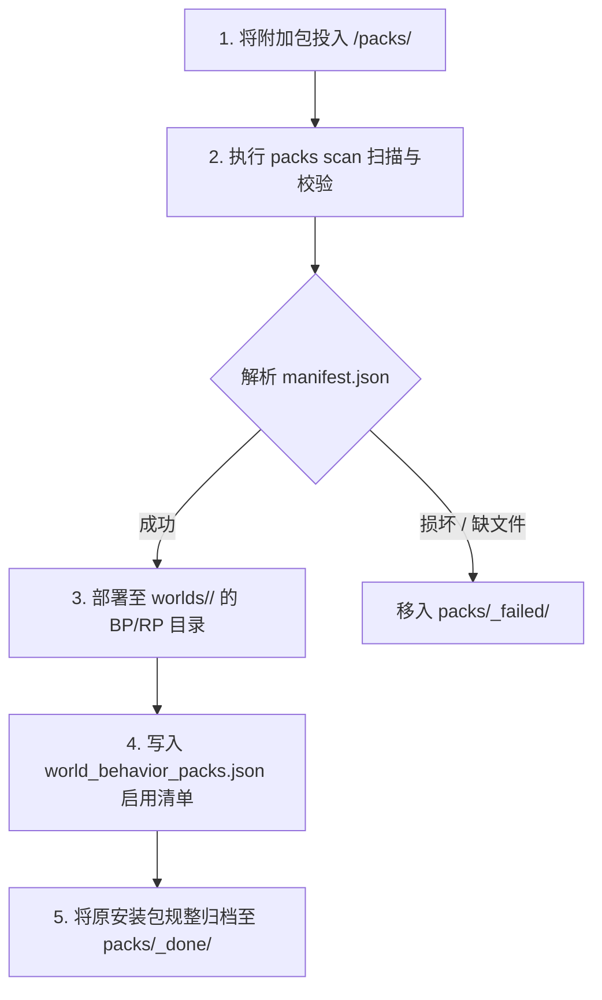

# 附加包管理（Add-ons）

在 Minecraft 基岩版生态中，服主常常需要引入社区现成的第三方**行为包（BP）**与**资源包（RP）**（如拔刀剑、载具系统、光影材质等）。

SFMC 提供了专属的 **收件箱（Inbox）流水线** 与 **CurseForge 自动更新引擎**，通过 `packs`（或别名 `addon`）命令进行自动化生命周期编排。

:::tip 概念辨析：模块 vs 附加包
- **SFMC 业务模块（`modules/`）**：采用 TypeScript 编写的平台轻量级功能包，由 SFMC 动态编译聚合为单一行为包，与 Node 伴生服务深度互通。
- **第三方附加包（`packs/`）**：现成的 `.mcpack`、`.mcaddon` 或 `.zip` 游戏扩展包，由收件箱流水线直接分发进指定游戏世界的包目录中。
:::

---

## 1. 收件箱流水线架构

服主无需手动解压或深入世界存档多层子目录。直接将下载好的扩展包放入 `<SFMC_ROOT>/packs/` 即可：

```text
<SFMC_ROOT>/packs/
├── inbox/ (即 packs/ 顶层)   # 直接将 .mcpack / .mcaddon / .zip 丢在此处
├── _done/                    # 安装部署成功后的原始归档备份
├── _failed/                  # 格式损坏、缺少 manifest 或校验失败的包
├── _trash/                   # 卸载后的安全回收站（防止误删）
├── _build/                   # SFMC 自身模块行为包的构建产物（请勿触碰）
└── pack-sources.json         # 各附加包与 CurseForge 等上游更新源的绑定关系
```



---

## 2. 常用管理指令

在 `sfmc` 控制台内输入命令：

### 扫描与安装

```bash
# 扫描 packs 目录中的待装扩展包（交互式识别冲突）
sfmc> packs scan

# 预览扫描结果，不实际写入（Dry Run 预检）
sfmc> packs scan --dry-run

# 安装特定路径下的附加包
sfmc> packs install ./downloads/cool-furniture.mcaddon

# 列出当前世界已装载的所有行为包与资源包
sfmc> packs list
sfmc> packs list --kind bp
```

### 启停、诊断与卸载

```bash
# 启用 / 禁用指定附加包（支持使用 UUID 或格式化文件夹名）
sfmc> packs enable <uuid|folder>
sfmc> packs disable <uuid|folder>

# 健康诊断：检测世界清单中是否存在悬空失效的幽灵包
sfmc> packs doctor

# 打印世界附加包落盘绝对路径
sfmc> packs path

# 安全卸载（移出世界目录并放入 _trash 回收站，自动级联清理配对 RP）
sfmc> packs uninstall <id>

# 彻底清除（直接永久物理删除，不保留在回收站）
sfmc> packs uninstall <id> --purge
```

:::warning 游戏生效机制
由于 Minecraft BDS 底层世界包清单在进程初始化时读取，**任何附加包的安装、启停或卸载操作，均需重启 BDS 服务端方可生效**。
:::

---

## 3. 智能冲突与版本覆盖策略

当安装过程中发现目标世界中已存在相同 `UUID` 或相同文件夹名的附加包时，系统实施严密的安全保护机制：

| 执行环境 | 冲突处理行为 |
| :--- | :--- |
| **交互模式（TTY 终端）** | 在控制台高亮对比新旧包的版本号与哈希，提示服主确认是否覆盖。 |
| **非交互模式（开服前自动扫描）** | 为防止生产事故，**默认跳过并打印警告日志**，绝不进行静默覆盖；如确认要无条件更新，可追加 `--force` 参数。 |
| **高版本自然升级** | 当检测到待装包的 UUID 与旧包完全一致且 `version` 明确更高时，安装引擎会自动平滑覆写原目录，保留配置连续性。 |

---

## 4. CurseForge 自动化更新与源绑定

SFMC 内置了面向基岩版附加包的 CurseForge 驱动。只要配置了 API Key，即可实现扩展包的云端更新检索与一键升级：

```bash
# 在 CurseForge 基岩版资源库中搜索项目
sfmc> packs search "Slash Blade"

# 将世界中已安装的附加包与 CurseForge 项目 slug 强绑定
sfmc> packs bind <uuid|folder> slash-blade-addon

# 查看所有已绑定的远端更新源
sfmc> packs sources

# 检查是否存在可用更新
sfmc> packs check

# 一键将所有可用更新下载并应用到世界
sfmc> packs update --all
```

### 关联配置文件

- **全局策略 (`configs/pack-update.json`)**：配置 CurseForge API Key、开服时是否静默检查以及名称匹配模糊阈值。
- **本地映射 (`packs/pack-sources.json`)**：维护每个本地包与远端工程的绑定关系，可随时通过 `packs unbind <id>` 解除关联。

### 强制客户端材质刷新（RP Bump）

在修改或升级资源包（RP）后，基岩版客户端经常因为本地贴图缓存而无法即时看到最新材质。

执行以下指令，可自动将指定资源包的 `patch` 版本号自增 1：

```bash
sfmc> packs bump <rp-folder-name>
```

客户端在下次连接服务器时，检测到 RP 版本号变更，将自动重新下载并应用全新材质缓存。
