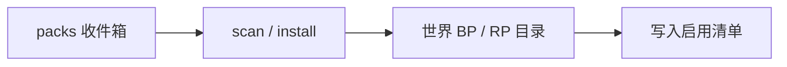

# 附加包

管理装进当前世界的第三方**行为包 / 资源包**（`.zip` / `.mcpack` / `.mcaddon` 等）。别名：`addon` ≡ `packs`。

```bash
sfmc> packs scan
sfmc> packs list
```

## 收件箱

路径：`<SFMC_ROOT>/packs/`

| 内容                | 说明                                 |
| ------------------- | ------------------------------------ |
| 待装文件 / 目录     | 归档或含 `manifest.json` 的文件夹    |
| `_done/`            | 安装成功后的源归档                   |
| `_failed/`          | 识别或安装失败                       |
| `_trash/`           | 卸载回收站（默认）                   |
| `_build/`           | 模块行为包构建产物（勿当附加包安装） |
| `pack-sources.json` | CurseForge 等更新源绑定              |

`start bds` 前会扫描收件箱；日常**更建议手动 `packs scan`**，便于处理冲突与更新源。



## 常用命令

| 命令                                      | 作用                   |
| ----------------------------------------- | ---------------------- |
| `packs list [--kind bp\|rp\|all]`         | 列出已装包             |
| `packs install [path\|--inbox] [--force]` | 安装指定路径或扫收件箱 |
| `packs scan [--force] [--dry-run]`        | 扫收件箱               |
| `packs enable \| disable <id>`            | id 为 uuid 或文件夹名  |
| `packs uninstall [id...] [--purge]`       | 卸出世界；默认进回收站 |
| `packs doctor`                            | 诊断清单与目录问题     |
| `packs path`                              | 打印相关路径           |
| `packs bump <id>`                         | 仅 RP：patch 版本 +1   |

完整子命令见 [命令列表](./commands.md)。

## 安装与冲突

安装成功后会写入 `world_behavior_packs.json` / `world_resource_packs.json`（默认启用）。改完后需重启 BDS 才生效。

目标已存在同 uuid 或同格式化文件夹名时：

| 环境                       | 行为                                   |
| -------------------------- | -------------------------------------- |
| 交互（TTY）                | 提示对比后确认是否覆盖                 |
| 非交互（如 `beforeStart`） | 不静默覆盖，跳过并告警；可用 `--force` |

同 uuid 且新版本更高时，安装侧可静默覆盖到原文件夹名。

## CurseForge 更新

可为已装 BP 绑定 CurseForge 项目，在启动或手动命令时检查 / 应用更新。

```bash
sfmc> packs search "Slash Blade"
sfmc> packs bind <uuid|folder> slash-blade-addon
sfmc> packs check
sfmc> packs update --all
sfmc> packs sources
```

| 配置                       | 作用                                              |
| -------------------------- | ------------------------------------------------- |
| `configs/pack-update.json` | 总开关、API Key、启动时是否检查                   |
| `packs/pack-sources.json`  | 每包绑定；可设 `enabled: false` 或 `packs unbind` |

API Key 可用环境变量 `CURSEFORGE_API_KEY` 覆盖。

:::tip 提示
实现细节（探测评分、RP 抬版策略、Provider）见 [CurseForge 附加包更新（技术路线）](../dev/pack-update.md)。

:::

## 卸载

`packs uninstall` 会：disable、移出世界目录（或 `--purge` 直接删除）、清理绑定与收件箱指纹；卸 BP 时默认连带配对 RP（`--no-paired` 跳过）。

删除后 `packs/_done` 里的源归档仍然会保留。
