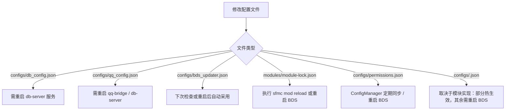

# 平台与模块配置

SFMC 采用**约定优于配置（Convention over Configuration）**的设计理念，兼具开箱即用的自动化能力与生产级可定制性。

---

## 1. 核心机制与设计原则

- **冷启动自愈（Zero-Config Bootstrap）**：首次启动任何服务（`sfmc`、`db-server`、`qq-bridge`）时，系统会自动探测并生成缺失的标准配置文件，填入安全的默认参数。
- **静态强校验（JSON Schema）**：每个自动生成的 JSON 文件首行均预注入 `$schema` 契约指针。在 VS Code 或 Cursor 中编辑时，可享受即时的字段悬停解释、代码补全与语法检查。
- **无感环境覆盖（Environment Overrides）**：生产环境（如 Docker、CI/CD 或云服务器守护进程）下，可通过环境变量覆盖敏感凭证与关键路径，无需侵入文件。

```text
<SFMC_ROOT>/
├── configs/
│   ├── db_config.json          # 数据库守护服务与 loopback 通信
│   ├── qq_config.json          # QQ 互通桥接（官方 Bot / LLBot）
│   ├── bds_updater.json        # BDS 版本检查、自动备份与崩溃重启
│   ├── pack-update.json        # 附加包自动更新与 CurseForge 接入
│   ├── permissions.json        # 全局玩家权限阶梯配置
│   ├── log-filter.json         # 统一日志降噪与过滤规则
│   └── <configKey>.json        # 各业务模块的独立私有配置
└── modules/
    ├── catalog.json            # 已安装模块镜像清单
    └── module-lock.json        # 模块启停状态锁文件
```

---

## 2. 平台核心配置详解

### `db_config.json`：数据守护服务

管理 `db-server` 的 HTTP 监听端口、SQLite 存储位置与跨进程调用凭据。这是 SAPI 脚本、CLI 与 QQ 桥接共同依赖的中枢。

```json title="configs/db_config.json"
{
  "$schema": "../modules/sdk/@sfmc-sdk/schemas/db_config.schema.json",
  "db_port": 3001,
  "http_auth": "",
  "dbDir": "./data/sfmc_data.db",
  "modulesDir": "modules"
}
```

| 字段 | 类型 | 默认值 | 作用说明 |
| :--- | :--- | :--- | :--- |
| `db_port` | `number` | `3001` | db-server 监听端口（仅监听 Loopback `127.0.0.1`）。可通过环境变量 `DB_PORT` 覆盖。 |
| `http_auth` | `string` | `""` | Bearer 鉴权令牌。留空时不启用 HTTP 鉴权；生产环境建议配置长字符串防越权。可通过环境变量 `HTTP_AUTH` 覆盖。 |
| `dbDir` | `string` | `./data/sfmc_data.db` | SQLite 数据库文件绝对路径或相对 `SFMC_ROOT` 的路径。 |
| `modulesDir` | `string` | `"modules"` | 模块仓库主目录，存放 `catalog.json`、`module-lock.json` 与已安装模块源码。 |

:::tip 安全提示
`db-server` 仅在本地回环接口（`127.0.0.1`）提供服务，**严禁将该端口映射或穿透到公网**。如需远程管理，应配置强随机 `http_auth` 并在反向代理层实施 mTLS 或 IP 白名单。
:::

---

### `qq_config.json`：多端互通网关

配置 Minecraft 服务器与 QQ 群消息互通。支持 **QQ 官方机器人**（推荐，基于开放平台 WebSocket Gateway）与 **LLBot**（基于 OneBot 11 协议）双后端架构。

```json title="configs/qq_config.json"
{
  "$schema": "../modules/sdk/@sfmc-sdk/schemas/qq_config.schema.json",
  "qq_backend": "official",
  "qq_app_id": "102030405",
  "qq_app_secret": "your_app_secret_here",
  "qq_group_openid": "YOUR_GROUP_OPENID",
  "qq_sandbox": false,
  "mctoqq_prefix": "[MC] ",
  "qq_admin_openids": [],
  "qq_events": {
    "player_join": true,
    "player_leave": true,
    "player_death": true,
    "server_start": true,
    "server_stop": true
  }
}
```

#### 关键参数解析

- **后端选择 (`qq_backend`)**：
  - `"official"`：使用腾讯 QQ 开放平台官方 API。免除本地 QQ 客户端挂机封号风险，支持主动推群与群面板指令交互。
  - `"llbot"`：使用 LLBot (OneBot 11)。需配合 `qq_ws_port`（默认 3002）与 `llbot_host`/`llbot_port`（默认 3004）。
- **官方凭据 (`qq_app_id` / `qq_app_secret`)**：开放平台开发者凭证，**请勿提交到公开 Git 仓库**。
- **群标识 (`qq_group_openid`)**：官方机器人对应的群唯一 OpenID（注意：**并非传统群号**）。首次拉入机器人后在群内 `@机器人`，可在 `qq-bridge` 日志中查看自动捕获并打印的 OpenID。
- **事件推群开关 (`qq_events`)**：细粒度控制进服、退服、玩家阵亡、服务器起停等系统广播是否转发至 QQ 群。

> 完整机器人联调步骤与权限申请指引，请参阅 [QQ 互通配置手册](./qq-bridge.md)。

---

### `bds_updater.json`：BDS 核心与进程守护

管理 Bedrock Dedicated Server 的自动版本检测、热补丁下载、升级前安全备份与进程崩溃自启。

```json title="configs/bds_updater.json"
{
  "$schema": "../modules/sdk/@sfmc-sdk/schemas/bds_updater.schema.json",
  "bds_path": "./BedrockDedicatedServer",
  "backup_dir": "./backups",
  "channel": "release",
  "auto_check": true,
  "crash_restart": true,
  "crash_restart_delay": 5,
  "preserve": [
    "server.properties",
    "whitelist.json",
    "permissions.json",
    "worlds"
  ],
  "qq_notify": true
}
```

| 字段 | 类型 | 说明 |
| :--- | :--- | :--- |
| `bds_path` | `string` | BDS 核心可执行程序所在目录。 |
| `backup_dir` | `string` | 升级或回滚时的全量备份落盘路径（必须位于 `bds_path` 目录之外）。 |
| `channel` | `string` | 更新通道：`"release"`（正式稳定版）或 `"preview"`（预览测试版）。 |
| `auto_check` | `boolean` | 服务启动时是否静默请求 Mojang 官方源检测最新版本。 |
| `crash_restart` | `boolean` | 当 `bedrock_server` 异常崩溃退出时，是否自动尝试拉起恢复。 |
| `crash_restart_delay` | `number` | 崩溃重启前的缓冲等待时间（秒），避免因端口未释放引发频繁颠簸。 |
| `preserve` | `string[]` | 覆盖更新时**绝对予以保留并自动复原**的文件/目录白名单（避免存档或基础配置被冲洗）。 |
| `qq_notify` | `boolean` | 更新启动、完成或崩溃告警时，是否通过 QQ 群同步广播进度。 |

---

### `pack-update.json`：附加包自动升级

为安装在世界中的第三方行为包/资源包提供 CurseForge 等上游提供商的版本探测与自动更新服务。

```json title="configs/pack-update.json"
{
  "$schema": "../modules/sdk/@sfmc-sdk/schemas/pack_update.schema.json",
  "enabled": true,
  "checkOnBdsStart": true,
  "applyOnBdsStart": false,
  "match": {
    "nameMinScore": 0.85,
    "stripFolderTags": true
  },
  "providers": {
    "curseforge": {
      "apiKey": ""
    }
  }
}
```

- **安全防御**：`applyOnBdsStart` 默认设为 `false`。建议服主在启动时仅检查（`checkOnBdsStart: true`），确认版本更新日志后再手动执行 `packs update`，防止未知上游更新破坏世界一致性。
- **API Key 注入**：`providers.curseforge.apiKey` 可留空，直接在宿主环境注入 `CURSEFORGE_API_KEY` 环境变量。

---

### `permissions.json`：全服权限阶梯矩阵

定义游戏内玩家与后台操作者的权限级别。SFMC 采用声明式、自顶向下的四级权限控制阶梯：

```json title="configs/permissions.json"
[
  {
    "player_name": "Steve",
    "level": 3
  },
  {
    "player_name": "Alex",
    "level": 2
  }
]
```

| 级别数值 | 角色标识 | 权限范围 | 典型适用命令 |
| :---: | :--- | :--- | :--- |
| `0` | **Any**（游客） | 所有进服玩家均持有的基础权限 | `!help`、`!ping`、`!menu`、`!tps` |
| `1` | **Member**（正式成员） | 通过白名单认证或入服审核后的正常玩家 | `!afk`、`!pay`、`!sethome`、`!shop` |
| `2` | **Admin / OP**（巡查与管理） | 具备游戏管理与秩序维护能力的运维人员 | `!kick`、`!mute`、`!land admin` |
| `3` | **Root / SuperAdmin**（超管） | 平台级最高权限，通常对应服主自身 | `!sfmc reload`、`!permission set` |

---

### `log-filter.json`：统一日志降噪

BDS 控制台或高频实体脚本常常会打印过量无效信息。通过 `log-filter.json`，可声明式拦截无意义刷屏：

```json title="configs/log-filter.json"
{
  "$schema": "../modules/sdk/@sfmc-sdk/schemas/log_filter.schema.json",
  "enabled": true,
  "mode": "drop",
  "applyTo": "display",
  "rules": [
    {
      "enabled": true,
      "sources": ["bds"],
      "levels": ["info"],
      "contains": "Player disconnected: "
    }
  ]
}
```

- `mode`: `"drop"`（命中规则丢弃）或 `"keep"`（白名单模式，仅保留命中项）。
- `applyTo`: `"display"`（仅在控制台终端/REPL 中隐藏，落盘文件仍保留便于复盘）或 `"all"`（连同磁盘日志一同过滤）。

---

## 3. 模块状态与私有配置

### 模块运行时状态文件

位于 `<SFMC_ROOT>/modules/` 目录下，记录当前工作区的模块拓扑状态：

| 文件 | 角色与职责 | 维护者 |
| :--- | :--- | :--- |
| `modules/catalog.json` | **本地模块清单**。记录所有已解压安装模块的名称、版本、依赖关系与代码入口路径。作为只读静态索引。 | `sfmc mod install` / `uninstall` 自动维护 |
| `modules/module-lock.json` | **启停状态锁**。记录每个模块的显式激活状态（`"enabled": true | false`）。**这是 BDS 装载闸门判断是否打包该模块的唯一真理源**。 | `sfmc mod enable` / `disable` 或 Admin GUI 维护 |

:::important 锁文件原则
切勿手动破坏 `module-lock.json` 的 JSON 格式。启停模块请统一使用命令 `sfmc mod enable <id>` 或 `sfmc mod disable <id>`，确保状态同步与行为包热重载平滑执行。
:::

### 模块私有配置（`<configKey>.json`）

当某个模块需要对外暴露参数时（如挂机判定时间、传送冷却、经济初始金额），规范要求其配置独立存放于 `configs/<configKey>.json`（通常为小写下划线命名，如 `configs/economy.json`）。

模块内部可通过 SDK 的 `@sfmc-bds/sdk/sapi/config` 模块完成透明读写与持久化，服主可根据各模块文档直接编辑对应的 JSON 文件。

---

## 4. 配置修改与生效边界

不同配置在架构中所处的层次不同，其生效机制亦存在明确边界：



1. **热重载（无需重启 BDS）**：
   - 启停模块：运行 `sfmc mod enable/disable <id>` 后紧接着执行 `sfmc mod reload`。
   - 规则与权限：支持热同步的模块会实时从 `db-server` 获取变更。
2. **需要重启服务进程**：
   - 修改 `db_config.json`（如端口、token）：必须重启 `db-server`。
   - 修改 `qq_config.json`：必须重启 `qq-bridge` 与 `db-server`（更新出站凭据）。
3. **需要重启 BDS 游戏服务端**：
   - 涉及 `server.properties`、BDS 核心二进制更新、全新附加包导入、以及在 SAPI 启动初始化（`startup` 阶段）固化参数的底层模块。
