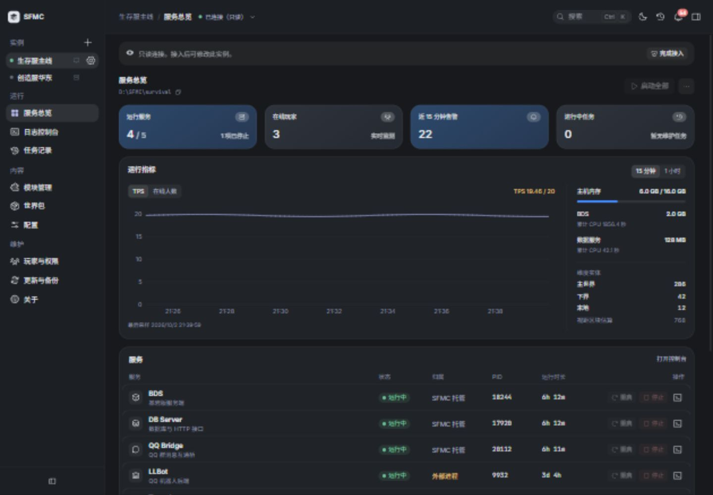
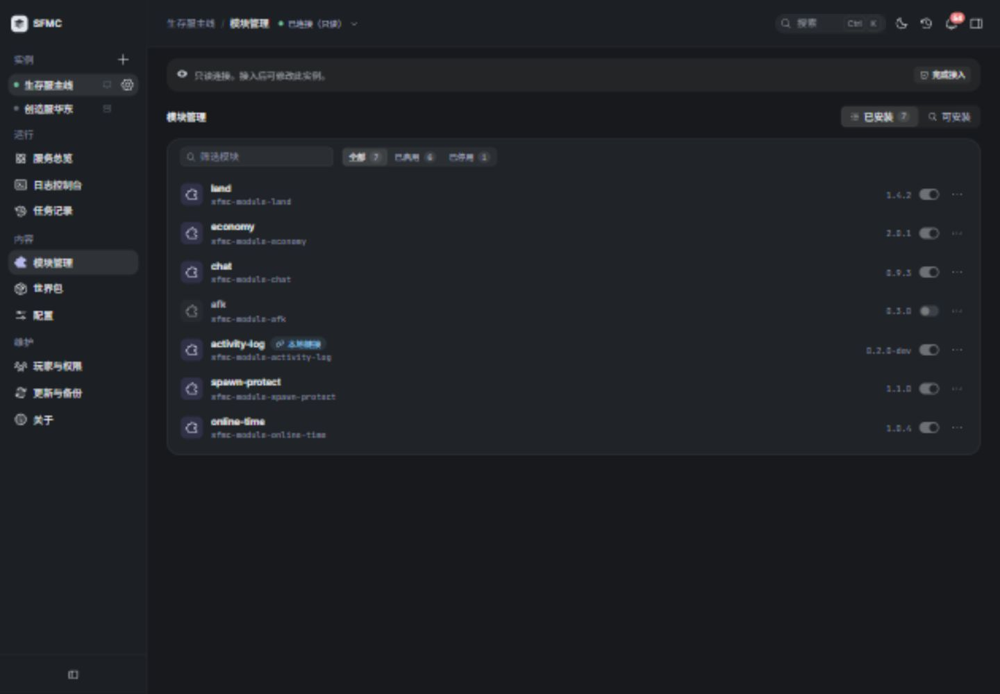
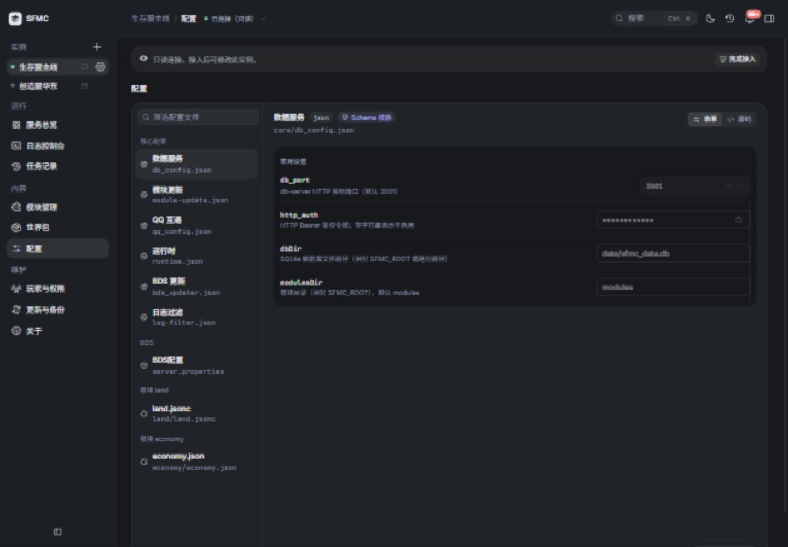

# SFMC 桌面版

SFMC Desktop 是 Windows x64 桌面客户端，可以管理本机 SFMC 部署，也可以通过 SSH 连接 Linux 或 Windows 服务器。服务启停、控制台、模块、资源包、配置、玩家与维护任务都集中在同一个工作区。

当前提供 **0.1.2 正式版**，内置平台 `0.2.11`。客户端通过发行页手动下载安装更新。

## 下载与启动

从 [桌面版发行页](https://github.com/DogeLakeDev/ScriptsForMinecraftServer/releases/tag/desktop-v0.1.2) 下载：

- `SFMC-Desktop-0.1.2-x64.exe`：安装向导，可以选择安装目录。
- `SFMC-Desktop-0.1.2-x64.zip`：完整解压到一个目录，再运行 `SFMC Desktop.exe`。保留全部文件。
- `SHA256SUMS.txt`：下载校验值；`release-manifest.json`：源代码提交与内置运行时版本。
- `artifact-attestation.sigstore.json`：GitHub Artifact Attestations 构建证明。

客户端已经包含 Node.js、pnpm 和平台代码，本机无需额外安装这些工具。首次初始化、BDS 下载及联网更新仍需要网络。

发行页同时公示 SHA256。下载后核对文件摘要：

```powershell
Get-FileHash -LiteralPath '.\SFMC-Desktop-0.1.2-x64.exe' -Algorithm SHA256
```

安装 [GitHub CLI](https://cli.github.com/) 后，可核对构建证明、源码仓库、工作流和标签：

```powershell
gh attestation verify '.\SFMC-Desktop-0.1.2-x64.exe' --repo DogeLakeDev/ScriptsForMinecraftServer --signer-workflow DogeLakeDev/ScriptsForMinecraftServer/.github/workflows/desktop-release.yml --source-ref refs/tags/desktop-v0.1.2 --deny-self-hosted-runners
```

验证 ZIP 时替换文件名即可；添加 `--bundle '.\artifact-attestation.sigstore.json'` 可以验证下载的证明文件。需要固定到具体提交时，再加入 `--source-digest` 和 `release-manifest.json` 中的 `sourceCommit`。构建证明用于核对文件来源与摘要，不是 Windows 发布者证书。

## 添加本机实例

1. 在欢迎页选择 **本机**，填写便于辨认的实例名称。
2. 选择 **SFMC 部署根目录**，例如 `D:\WorkPlace\SFMC`。不要选择源码仓库、`BDS` 子目录或世界目录。
3. 保存后点击 **接入实例**。查看接入计划，再选择 **仅查看** 或完成接入。

已有部署保留自己的活动平台版本，客户端不会仅因为连接就替换它。旧平台可能只能查看，或者缺少新指标与管理接口。首次验收建议使用独立测试目录（例如 `D:\WorkPlace\SFMC-Desktop-Test`），按引导确认 Minecraft EULA 并初始化；向导会下载 BDS 并尝试启动服务。

## 添加 SSH 实例

在欢迎页选择 **远程服务器**，填写下列信息：

| 字段 | 填写方式 |
| --- | --- |
| 主机、端口 | SSH 的实际地址和端口 |
| 用户名 | 远程登录用户 |
| 操作系统 | 远程服务器的 Windows 或 Linux |
| 部署目录 | 远程 SFMC 的绝对根路径，例如 `/srv/sfmc` 或 `E:\SFMC` |
| 身份验证 | 选择私钥文件，或输入密码；加密私钥另填口令 |

客户端不会自动解析 `~/.ssh/config` 中的别名。若平时使用 `ssh dogelake`，先在终端执行 `ssh -G dogelake`，把该连接的 HostName、Port、User 和 IdentityFile 对应值填入窗口。私钥文件位于运行桌面客户端的电脑上。

首次连接需要核实主机指纹，与可信终端或服务器管理者提供的指纹比较后确认。远程服务器需要已有 SSH 服务与相应目录权限。客户端通过 SSH 管理，不需要额外向公网开放管理端口。

## 工作区

以下截图来自开发预览，**实例、日志和指标均为演示数据**，用于展示布局。



**概览** 查看服务状态、TPS、在线人数与主机/服务资源。停止状态、零在线人数和缺少采样都可能是正常情况；指标是否新鲜需要结合采样状态判断。



**模块** 查看来源、版本和启用状态。修改后根据任务提示重启 BDS，才会应用需要重新打包的变更。平台 0.2.9 停用模块声明中的 `canDisable` 与 `enabledByDefault`，旧模块需移除这些字段；已有启停状态仍由 module-lock 保存。



**配置** 编辑服务和模块配置，保存后根据提示重载或重启相关服务。**控制台** 查看不同服务日志、发送 BDS 命令；**任务** 查看操作进度、失败原因与备份编号。

## 内置 UI Studio（下个桌面版本）

左侧栏的 **开发工具 → UI Studio** 打开声明式界面的可视化编辑器，也可用 `Ctrl+9` 或命令面板搜索「UI Studio」。无需添加或连接实例，也无需执行 `sfmc ui studio`；编辑器随桌面客户端打包，可离线使用。控件、图标、字体与桌面端统一，外观跟随桌面顶栏的浅色 / 深色 / 跟随系统设置。

支持新建工程、导入文件夹或 ZIP、拖放组件、编辑属性、预览和导出 ZIP。切换桌面页面或实例后返回，当前工程、选中项与撤销记录仍保留。工程自动保存在当前电脑的客户端数据中，跨电脑使用时先导出 ZIP。

浏览器中的 Studio 工程与桌面客户端分别保存；已有浏览器工程请先导出 ZIP，再导入内置编辑器。导出的工程需按模块开发流程放回模块中，编辑器不会自动修改或部署服务器文件。

## 建议的首次验收

1. 先在独立测试目录完成接入；已有正式部署优先选择 **仅查看**。
2. 在概览先启动数据服务，再启动 BDS。确认日志没有初始化错误，指标有新采样。
3. 查看模块与配置，尝试一项可撤销的修改，并确认任务完成。
4. 关闭客户端后重新打开，确认能连接原守护进程。关闭窗口不会停止服务器；需要停止时在概览明确停止 BDS 和数据服务。

本版本通过发行页手动更新。后续版本从发行页下载，退出客户端后安装到原客户端目录，或完整替换 ZIP 内容；部署根目录和服务器数据独立于客户端安装目录。

## 当前边界

- 本机 Windows 与 SSH Windows 的数据服务/BDS、实际指标和断线重连已经验收；其他环境仍需自行验证。
- 接入时不会自动切换旧活动平台。需要新版接口时，按接入计划核对兼容性并升级。
- 游戏内表单点击与独立模块的全部业务流程仍需要 Minecraft 客户端验收。
