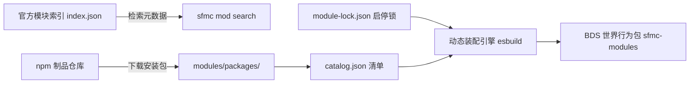

import { Steps } from "@rspress/core/theme";

# 模块与行为包管理

在 SFMC 架构中，所有游戏业务逻辑（如经济系统、领地保护、挂机检测、传送菜单等）均以独立的**功能模块（Module）**形式存在。

本页面向服主与运维人员，详细阐释如何在服务器中**搜索、安装、启停模块**，以及系统如何将多个独立模块动态编排组装为原生 BDS 行为包。

:::tip 开发者指引
如果您希望自行开发、测试并发布新的功能模块，请直接查阅 [模块开发指南](../dev/module-author.mdx)。
:::

---

## 1. 模块生态体系与架构

SFMC 模块具备高度工程化的解耦设计：

- **代码分发面（npm）**：模块源码以标准 npm 包形式发布（如官方包 `@sfmc-bds/module-economy` 或社区包 `@author/sfmc-module-myfeature`），杜绝传统“靠群文件传 zip”的版本混乱问题。
- **发现索引（Index）**：[`sfmc-modules`](https://github.com/Tanya7z/sfmc-modules) 官方仓库仅作为轻量索引目录，用于驱动 CLI 的搜索与元数据拉取。
- **本地组装面（Assemble）**：服主勾选启用的所有模块，会在开服前由打包引擎自动编译聚合为单一合法的原生行为包 `sfmc-modules`，直接注入当前世界。



---

## 2. 常用管理命令

在 `sfmc` 控制台或宿主 Shell 中，可直接通过 `mod`（或全称 `module`）子命令进行全生命周期管理：

### 检索与安装

```bash
# 检索官方模块库中的可用模块
sfmc> mod search

# 查看已下载模块的详细信息
sfmc> mod info economy

# 一键下载并安装指定模块（支持同时安装多个）
sfmc> mod install afk economy teleport
```

安装源说明（`--from`）：
- 默认为 npm 源：`@sfmc-bds/module-<id>` 或 `@scope/sfmc-module-<id>`。
- 支持本地目录调试（挂接作者仓）：`sfmc mod install <id> --from dir:<绝对路径> --link`。

### 启停与卸载

```bash
# 列出本地所有模块及其当前启停状态
sfmc> mod list

# 启用指定模块
sfmc> mod enable afk

# 禁用指定模块
sfmc> mod disable afk

# 卸载模块并清理本地源码
sfmc> mod uninstall afk
```

:::important 启停状态与锁文件机制
`mod enable` 与 `mod disable` 会将状态持久化写入 `<SFMC_ROOT>/modules/module-lock.json`。
- **离线安全**：即使 `db-server` 处于离线状态，启停修改依然能安全落盘；待下次启动数据库时会自动同步内存态。
- **游戏生效**：在 BDS 运行期间修改了模块启停状态，**必须执行 `mod reload` 或重启 BDS** 才能在游戏中生效。
:::

---

## 3. 行为包动态装配机制

传统开服方式中，安装多个 Script API 脚本包极易引发依赖冲突与 `manifest.json` 权限混乱。SFMC 采用**全自动装配管线**解决这一痛点：

```bash
# 仅执行编译组装，不部署到世界
sfmc> mod build

# 组装并部署，随后向运行中的 BDS 发出热重载请求（日常调试推荐）
sfmc> mod reload

# 仅组装并部署文件，不触发游戏内重载（之后需在控制台手动 reload）
sfmc> mod reload --build-only
```

### 部署路径一览

| 阶段 / 产物 | 落盘路径 | 作用说明 |
| :--- | :--- | :--- |
| **中间产物** | `<SFMC_ROOT>/packs/_build/sfmc-modules/` | 经过打包工具（esbuild）混淆编译后的暂存目录。 |
| **世界行为包 (BP)** | `<BDS>/worlds/<level>/behavior_packs/sfmc-modules/` | 实际注入当前游戏世界的最终行为包产物。 |
| **世界资源包 (RP)** | `<BDS>/worlds/<level>/resource_packs/sfmc-modules-rp/` | 若启用的模块包含材质、UI 或音频资源，将自动生成配套 RP。 |
| **部署清单** | BP 根目录下 `sfmc-deploy-catalog.json` | 记录本次构建所包含的模块版本哈希，供装载闸门快速比对。 |

### 装配流水线四步走

<Steps>
### 收集模块契约
扫描 `modules/packages/*/sapi` 下的所有子模块，读取其 `manifest.json` 声明的依赖项与所需权限。

### 过滤启停白名单
严格依照 `modules/module-lock.json` 中标记为 `"enabled": true` 的项进行过滤。未启用的模块绝对不会被打入行为包。

### 统一转译与聚合打包
以 `installHostBootstrap()` 宿主脚本为入口，通过现代化打包引擎将各模块的生命周期、事件侦听器与指令注册代码编译整合为一个高内聚的 `scripts/main.js`。

### 部署到世界并更新清单
将生成产物同步至当前世界的 `behavior_packs` 目录，并原子化更新 `world_behavior_packs.json` 启用声明。
</Steps>

:::note 空包保护
即使服主关闭了所有功能模块，装配引擎仍会生成一个合法的空行为包骨架，确保服务端不会因资源丢失而报错。
:::

---

## 4. 本地开发与联调（--link）

模块开发者无需每次都将未测试的代码发布到 npm。在本地开发时，运维机可通过软链接（Symlink）直连作者的源码仓库：

```bash
# 通过 dir: 源与 --link 参数挂接本地模块仓
sfmc> mod install my-feature --from dir:D:/WorkSpace/my-feature --link

# 启用并编译
sfmc> mod enable my-feature
sfmc> mod reload
```

配合 VS Code / Cursor 专属扩展 **「SFMC Module」** 的 Watch 功能，在作者仓中每次按下保存，代码即可毫秒级热同步并通知 BDS 重新装载！

---

## 5. 官方推荐模块目录

以下列表在构建文档站时自动拉取自官方 `sfmc-modules` 索引库：

<ModuleCatalog />

> 想要调用官方模块暴露的跨模块接口？请查阅 [模块服务调用目录](../api/modules/index.md)。
