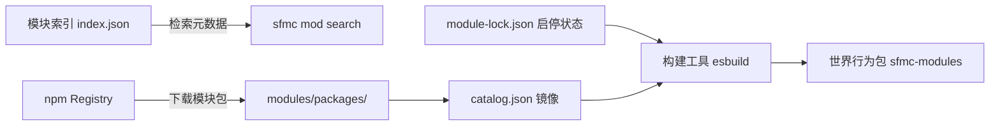

import { Steps } from "@rspress/core/theme";

# 模块与行为包管理

在 SFMC 中，服务器的功能与玩法（如经济、领地、挂机检测、菜单等）均以独立的**功能模块（Module）**形式提供。

本文介绍如何在服务器中**搜索、安装、启停模块**，以及系统如何将多个独立模块自动装配为原生 BDS 行为包。

:::tip 模块开发者指引
如果希望自行开发与发布模块，请查阅 [模块开发指南](../dev/module-author.mdx)。
:::

## 1. 模块体系结构

SFMC 模块采用模块化设计与集中打包：

- **npm 分发**：模块以标准 npm 包发布（官方模块如 `@sfmc-bds/module-economy`，社区模块如 `@author/sfmc-module-myfeature`），具备明确的语义化版本。
- **社区索引**：[`sfmc-modules`](https://github.com/Tanya7z/sfmc-modules) 仓库维护可用模块目录，供 CLI 检索与下载。
- **动态组装**：已启用的所有模块会在开服前由打包工具自动编译并整合为单个行为包 `sfmc-modules`，直接注入当前世界。


```mermaid
flowchart LR
  Index[模块索引 index.json] -->|检索元数据| CLI[sfmc mod search]
  npm[npm Registry] -->|下载模块包| Local[modules/packages/]
  Local --> Catalog[catalog.json 镜像]
  Lock[module-lock.json 启停状态] --> Assembler[构建工具 esbuild]
  Catalog --> Assembler
  Assembler --> BP[世界行为包 sfmc-modules]
```

## 2. 常用管理命令

在 `sfmc` 控制台或终端中，可通过 `mod` 子命令进行模块管理：

### 检索与安装

```bash
# 搜索可用模块
sfmc> mod search

# 查看模块详情
sfmc> mod info economy

# 安装指定模块（支持批量安装）
sfmc> mod install afk economy teleport
```

安装源说明（`--from`）：
- 默认从 npm 源安装：`@sfmc-bds/module-<id>` 或 `@scope/sfmc-module-<id>`。
- 支持本地目录软链接（便于本地调试）：`sfmc mod install <id> --from dir:<绝对路径> --link`。

### 启停与卸载

```bash
# 列出本地所有模块及其当前状态
sfmc> mod list

# 启用指定模块
sfmc> mod enable afk

# 禁用指定模块
sfmc> mod disable afk

# 卸载模块
sfmc> mod uninstall afk
```

#### `mod list` 输出说明

执行 `mod list` 会扫描 `<SFMC_ROOT>/modules/packages/` 下的所有模块，输出格式示例如下：

```text
已安装模块
  D:\WorkPlace\SFMC\modules\packages
    id                          state   files   size      fingerprint
  ● activity-log               on      11      90.5 KB   93b28894…8a7a0fdb
  ● afk                        on      12      78.6 KB   ed988a9e…0c01e0d9
  ● qq-link(feature-qq-link)   on      16      103.5 KB  3ba99a80…43bd9d92
  ○ clean                      off     13      93.7 KB   b44e4c0e…d58e7409

  tip: mod enable|disable <logicalId>
```

**状态符号说明**：

| 符号 | 颜色 | 状态含义 | 说明 |
| :--- | :--- | :--- | :--- |
| **`●`** | 绿色 | **已启用** | 收录于官方索引，且在 `module-lock.json` 中处于启用状态（`on`）。 |
| **`○`** | 灰色 | **已禁用** | 收录于官方索引，但在 `module-lock.json` 中处于禁用状态（`off`）。 |
| **`?`** | 黄色 | **未知来源** | 模块已安装在本地，但未在官方索引库中收录。 |
| **`○`** | 黄色 | **配置损坏** | 本地 `sapi/manifest.json` 缺失或格式损坏。 |

**字段含义**：
- **`id`**：模块安装目录名。当目录名与模块内部 `manifest.json` 的逻辑 ID 不一致时，显示为 `目录名(逻辑ID)`。执行 `mod enable` / `mod disable` 时支持使用任一名称。
- **`state`**：当前启停状态（`on` 表示参与行为包编译，`off` 表示排除）。
- **`files` / `size`**：模块源码文件数与总体积（已排除 `node_modules`、`.git` 等目录）。
- **`fingerprint`**：模块当前代码的 SHA-256 指纹截断，用于判断是否需要重新打包。

:::important 启停状态与生效时机
`mod enable` 与 `mod disable` 会将状态持久化写入 `<SFMC_ROOT>/modules/module-lock.json`。  
在 BDS 运行期间修改了模块状态后，**必须执行 `mod reload` 或重启 BDS** 才能在游戏中生效。
:::

## 3. 行为包装配机制

当安装了多个模块时，SFMC 会在开服前自动合并模块代码并注入权限：

```bash
# 仅执行编译与组装，不写入世界目录
sfmc> mod build

# 组装并部署至世界，并向运行中的 BDS 请求热重载
sfmc> mod reload

# 仅组装并部署文件，不发送 reload 指令
sfmc> mod reload --build-only
```

### 产物路径一览

| 产物类型 | 输出路径 | 说明 |
| :--- | :--- | :--- |
| **中间产物** | `<SFMC_ROOT>/packs/_build/sfmc-modules/` | esbuild 编译后的暂存文件。 |
| **世界行为包 (BP)** | `<BDS>/worlds/<level>/behavior_packs/sfmc-modules/` | 实际注入当前世界的行为包产物。 |
| **世界资源包 (RP)** | `<BDS>/worlds/<level>/resource_packs/sfmc-modules-rp/` | 若启用的模块携带贴图、UI 或音效资源，自动生成配套 RP。 |
| **部署清单** | BP 根目录下 `sfmc-deploy-catalog.json` | 记录本次构建所包含的模块版本哈希。 |

### 装配流程

<Steps>
### 收集模块清单
扫描 `modules/packages/*/sapi` 下的所有模块，读取其 `manifest.json` 声明的依赖与权限。

### 过滤启停状态
依据 `modules/module-lock.json` 中标记为 `"enabled": true` 的模块进行筛选，禁用模块不参与编译。

### 编译整合
以 `installHostBootstrap()` 宿主脚本为入口，使用 esbuild 将各模块代码编译合并为 `scripts/main.js`。

### 部署至世界
将生成产物同步至世界的 `behavior_packs` 目录，并更新 `world_behavior_packs.json` 声明。
</Steps>

:::note 空包容底
若服主禁用了所有模块，装配系统仍会生成一个合法的空行为包骨架，确保服务端不会因资源包缺失报错。
:::

## 4. 本地开发挂接（--link）

模块开发者在本地开发时，可通过软链接（Symlink）挂接作者本地仓库进行调试：

```bash
# 通过 dir: 源与 --link 参数挂接本地模块
sfmc> mod install my-feature --from dir:D:/WorkSpace/my-feature --link

# 启用并重载
sfmc> mod enable my-feature
sfmc> mod reload
```

配合 VS Code / Cursor 官方扩展 **SFMC Module** 的 Watch 功能，保存代码时扩展会自动增量编译并通知 BDS 热重载。

## 5. 模块索引目录

以下模块列表在构建文档站时自动拉取自官方 `sfmc-modules` 索引库：

<ModuleCatalog />

> 跨模块调用接口请查阅 [模块服务调用目录](../api/modules/index.md)。
