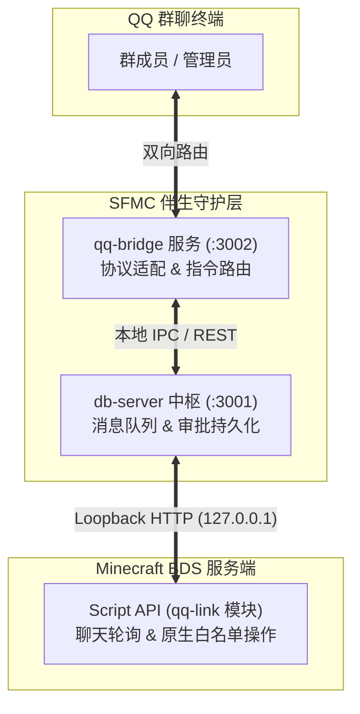
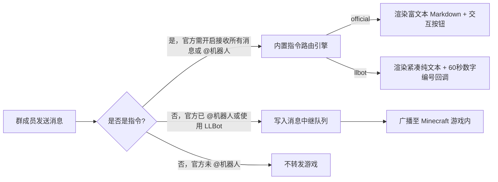
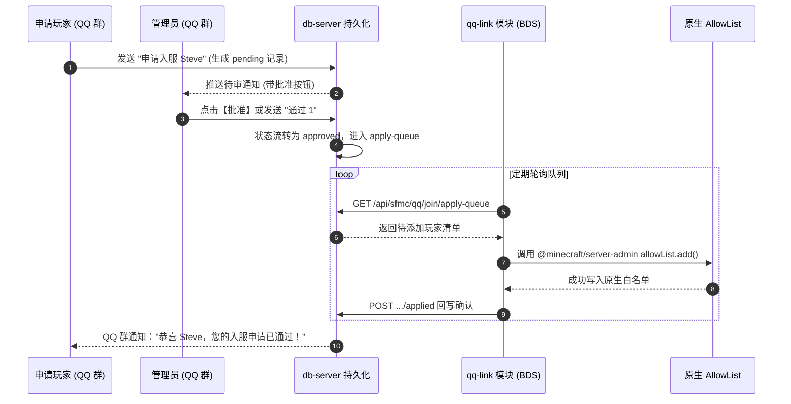

import { Tab, Tabs, Steps } from "@rspress/core/theme";

# QQ 互通与机器人集成

SFMC 内置了工业级的多端互通网关服务（`qq-bridge`），能够无缝桥接 Minecraft 服务器与 QQ 群聊生态，提供**群服双向聊天互通、全服状态监控、游戏内身份绑定、入服白名单审批与游戏事件批量播报**等核心能力。

## 1. 架构拓扑与双后端模型

`qq-bridge` 作为独立的伴生守护进程运行，支持两种完全不同的通信协议架构：



### 两种后端模式对比

| 对比维度       | 腾讯官方开放平台（`official`，默认推荐）               | LLBot / OneBot 11（`llbot`）                            |
| :------------- | :----------------------------------------------------- | :------------------------------------------------------ |
| **接入方式**   | 官方机器人开发凭证（AppID / Secret / OpenID）          | 基于本地 QQ 客户端框架（如 LiteLoaderQQNT + OneBot 11） |
| **封号风险**   | **零风险**。走腾讯官方 OpenAPI 与标准审核通道。        | 存在传统“小号挂机”被风控或冻结的潜在风险。              |
| **交互能力**   | 支持原生 Markdown 格式排版、富文本按钮与指令交互面板。 | 纯文本消息与数字编号快捷交互。                          |
| **入站方式**   | 开放平台 WebSocket Gateway 或 HTTPS Webhook。         | LLBot 反向 WebSocket（监听本地 `3002` 端口）。          |
| **出站方式**   | `db-server` 直调 OpenAPI 发送主动推群消息。            | `db-server` 请求 LLBot HTTP 服务（默认 `3004` 端口）。  |
| **群频度限制** | 严格遵循官方限制（约 20 条/分钟、1000 条/群/天）。     | 视本地挂机账号本身的风控规则而定。                      |

## 2. 配置文件全景详解 (`configs/qq_config.json`)

首次开服拉起服务时，系统会自动在 `configs/qq_config.json` 中填充默认配置与 `$schema` 校验指针：

```json title="configs/qq_config.json"
{
  "$schema": "../modules/sdk/@sfmc-sdk/schemas/qq_config.schema.json",
  "qq_enabled": true,
  "qq_backend": "official",
  "official": {
    "transport": "webhook",
    "app_id": "102030405",
    "app_secret": "your_app_secret_here",
    "group_openid": "YOUR_GROUP_OPENID",
    "sandbox": false,
    "sync_menu_panel": true,
    "admin_openids": ["OPENID_OF_ADMIN_1"],
    "webhook": { "port": 3005, "path": "/qqbot/webhook" }
  },
  "llbot": {
    "enabled": false,
    "host": "127.0.0.1",
    "port": 3004,
    "ws_port": 3002,
    "group_id": "0"
  },
  "qq_events": {
    "enabled": true,
    "window_sec": 60,
    "join": true,
    "leave": true,
    "death": true,
    "crash": true,
    "start": true,
    "stop": true
  }
}
```

### 核心参数对照表

| 配置项                        | 适用后端 |      类型       |      默认值      | 作用说明                                                                      |
| :---------------------------- | :------: | :-------------: | :--------------: | :---------------------------------------------------------------------------- |
| `qq_backend`                  |   全局   |    `string`     |   `"official"`   | 后端选择：`"official"` 或 `"llbot"`。                                         |
| `official.admin_openids`       | official |   `string[]`    |       `[]`       | 具备入服审批、踢人、远程开关白名单权限的管理员 OpenID 列表。                  |
| `qq_events`                   |   全局   |    `object`     |       见上       | 进退服、阵亡与服务器崩溃重启等系统事件的聚合广播控制。                        |
| `official.transport`          | official |    `string`     |  `"websocket"`   | `webhook` 时由云端接收事件并自动同步配置。                                    |
| `official.app_id` / `app_secret` | official |  `string`     |       `""`       | 腾讯 QQ 开放平台分配的机器人凭据（**切勿泄露或提交至公开 Git**）。            |
| `official.group_openid`       | official |    `string`     |       `""`       | 机器人所在目标群的唯一 OpenID（注意：**并非传统群号**）。                     |
| `official.sandbox`            | official |    `boolean`    |     `false`      | 是否启用官方沙箱测试环境（正式开服请保持 `false`）。                          |
| `official.sync_menu_panel`    | official |    `boolean`    |      `true`      | 服务启动时是否同步群指令面板与单聊菜单。                                      |
| `llbot.ws_port`               |  llbot   |    `number`     |      `3002`      | `qq-bridge` 监听的 WebSocket 端口，供 LLBot 配置反向连接。                    |
| `llbot.group_id`              |  llbot   |    `string`     |       `"0"`      | LLBot 模式下的目标 QQ 群号；设为 `"0"` 表示不转发。                           |
| `llbot.host` / `llbot.port`   |  llbot   | `string/number` | `127.0.0.1:3004` | LLBot 的 HTTP API 地址，供主动推群使用。                                      |

### Webhook 模式与配置同步

在游戏机 `qq_config.json` 的 `official.transport` 填 `"webhook"`，保持 `qq_enabled: true`。游戏机 CLI 将跳过本地 QQ 桥；登录后启动的 `SFMC QQ Config Sync` 计划任务每 30 秒检查一次配置，将官方凭据、目标群、管理员、频道和公开服务器信息经 SSH 同步到阿里云。阿里云的回调监听、隧道端口与群面板 ID 保留在云端，不会被整份覆盖。同步失败时恢复上一版云端配置。回调地址仍需在 QQ 开放平台设置为 `https://img.ovo7.cc/qqbot/webhook`。

改回 `"websocket"` 时，同步任务会停止云端桥；重启游戏机上的 SFMC CLI 后，本地 QQ 桥使用 WebSocket Gateway。QQ 开放平台的消息接收方式也需要对应切换。同步任务依赖游戏机用户登录，详见 `packages/qq-bridge/README.md` 的部署说明。

## 3. 接入配置指引

<Tabs>
  <Tab label="方案 A：接入官方机器人（official，推荐）">

### 第一步：开发者平台准备与凭证获取

1. 前往 [QQ 开放平台](https://q.qq.com/) 注册并创建机器人应用。
2. 在应用凭据页面获取 `AppID` 与 `AppSecret`，填入 `configs/qq_config.json`。
3. 在管理端 **事件订阅** 中，勾选并开启 **`GROUP_AT_MESSAGE_CREATE`（公域/私域群聊 @ 机器人事件）**。
4. 将机器人邀请加入你的 Minecraft 玩家群，并提醒群主开启 **「允许机器人主动在群聊内发言」** 开关。

### 第二步：捕获并回填目标群 `official.group_openid`

<Steps>
### 启动中枢服务
`official.transport` 为 `websocket` 时，在游戏机终端启动数据库与本地 QQ 桥接进程：
```bash
sfmc> /start db
sfmc> /start qq
```

`official.transport` 为 `webhook` 时，游戏机只启动 `db-server`；阿里云的 `sfmc-qq-bridge.service` 接收回调。游戏机的配置同步任务会把官方机器人所需字段同步到阿里云。

### 在群内触发一次探测

在 QQ 群中直接发送任意内容并 **@机器人**（例如 `@机器人 ping`）。

### 复制日志中的群 OpenID

由于初次尚未配置群标识，`qq-bridge` 会在控制台高亮输出捕捉到的群信息：

```text
[qq-bridge] [INFO] 收到群 @ 消息，当前群 group_openid 为: 4A7B8C9D0E...
```

### 回填并重启服务

将该字符串填入 `configs/qq_config.json` 中 `official` 对象的 `group_openid`。WebSocket 模式重启本地服务；Webhook 模式等待同步任务应用到阿里云，并重启游戏机的 db-server：

```bash
sfmc> /restart db
```

WebSocket 模式另执行 `sfmc> /restart qq`。

</Steps>

:::tip 接口白名单提示（错误码 11253）
官方机器人调用获取群基本资料（`GET /v2/groups/.../info`）时，若控制台出现 `11253` 错误，说明该机器人的开放平台账号尚未申请群资料接口权限。该限制**不影响**正常的群消息转发、审批流与状态查询。
:::

  </Tab>
  <Tab label="方案 B：接入 LLBot / OneBot 11（llbot）">

1. 编辑 `configs/qq_config.json`：
   - 将 `"qq_backend"` 修改为 `"llbot"`。
   - 在 `llbot` 对象里填写目标群号 `"group_id": "123456789"`。
2. 打开 LLBot / OneBot 11 客户端设置：
   - **反向 WebSocket 配置**：新增反向 WS 目标为 `ws://127.0.0.1:3002`。
   - **HTTP API 配置**：开启 HTTP 服务，监听端口保持默认的 `3004`（`127.0.0.1:3004`）。
3. 启动服务：
   ```bash
   sfmc> /start -all
   ```
4. 在群内发送 `/help`，机器人应立即返回纯文本数字指令菜单。

  </Tab>
</Tabs>

## 4. 群内交互指令体系（无需进入游戏）

`qq-bridge` 会在消息入库前进行实时拦截与指令模式匹配。同一套指令在两端呈现出极致契合其平台特性的交互形式：



### 玩家服务首页

发送「菜单」打开「服务器 / 我的账号 / 入服 / 帮助」，权限核验成功时额外显示「管理」。子菜单均可返回首页。官方端用按钮或命令，LLBot 用文字或本人 60 秒内有效的编号；无效编号不会清空菜单。解绑、踢人、关闭白名单功能或关闭审批均需本人再次确认，支持「取消」。

保留本服习惯命令：`查服` 查看服务器状态，`版本` 优先显示当前 BDS 实际版本，`ip` 显示公开连接地址和端口。实际版本来自新版 CLI 捕获的 BDS 启动日志，并由状态服务核验 PID 与启动时刻；需要更新 CLI 后重启 BDS，无法核验时明确提示未知。

公开地址通过 `qq_config.json` 的 `public_server` 配置：

```json
{ "public_server": { "address": "play.example.com", "port": 19132, "version": "" } }
```

其中 `version` 仅作为实际版本不可用时的备用入服说明，回复会明确标注。地址未配置时提示联系管理员，不推断内网地址。Webhook 模式修改后由同步任务更新云端；WebSocket 模式修改后重启本地 QQ 服务。

### 玩家常用命令

| 指令触发词                | 功能与返回内容                                                                        |
| :------------------------ | :------------------------------------------------------------------------------------ |
| `菜单` / `help` / `/help` | 展示常用交互面板。官方端呈现为精美 Markdown 按钮卡片；LLBot 呈现为序号索引。          |
| `ping` / `/ping`          | 探测网关连通性与服务心跳延迟。                                                        |
| `查服` / `status` / `状态`         | 查询服务器运行摘要：运行状态、在线人数、世界日、难度与更新时间；运维详情移至管理员自检。 |
| `online` / `在线`         | 列出在线玩家名称，长名单自动连续分段。                                                |
| `绑定` / `bind`           | 向系统申请一个 6 位短验证码，用于在游戏内完成身份认证。                               |
| `我的绑定` / `whoami`     | 查询当前 QQ 账号已绑定的 Minecraft 正版/离线角色名称。                                |
| `解绑` / `unbind`         | 解除当前账号与游戏角色的映射绑定。                                                    |
| `申请入服 <游戏名>`       | 提交白名单入服申请（直接进入管理员审批工作流）。                                      |
| `频道` / `channel`        | 诊断当前双向互通频道的连接状态与健康度。                                              |

### 管理员高级管理指令（仅限 `official.admin_openids` 成员）

输入 `管理` 或 `admin` 可唤出专属管理子面板：

- **`待审`**：列出当前待审批的入服申请队列。
- **`通过 <申请ID>` / `拒绝 <申请ID>`**：审批入服请求（官方端可在卡片上直接点击【批准】/【拒绝】回调按钮）。
- **`踢人 <玩家名>`**：向 BDS 下发管理员驱逐指令（玩家必须在线）。
- **`配置`**：远程切换入服白名单与审核开关（支持指令：`配置 白名单 开|关`、`配置 审批 开|关`）。

## 5. 游戏聊天双向互通（Chat Bridge）

要开启游戏与 QQ 群的无缝实时互通，需依赖官方游戏侧模块 **`@sfmc-bds/module-qq-link`**（简称 `qq-link`）。

### 数据流动与安全防环

1. **QQ $\to$ 游戏**：
   - 官方端中，**仅转发群成员 @机器人 后的聊天内容**，避免普通灌水刷屏污染游戏。
   - 聊天模块轮询内置的 `qq` 频道并向订阅玩家展示消息。该频道默认向全体玩家订阅，且所有玩家都不能在其中发言。
2. **游戏 $\to$ QQ**：
   - 玩家在游戏内的普通发言（自动过滤以 `!` 或 `！` 开头的指令消息）会被打包发送至 `POST /api/sfmc/messages`。
   - `db-server` 读取来源频道的「转发到 QQ」开关，开启时使用该频道前缀推入 QQ 群。新频道默认开启，可在频道设置中关闭。
3. **防循环与去重机制（Anti-Looping）**：
   - 严格拦截并丢弃机器人自身发送的消息。
   - 底层设有 **5 秒滑动窗口消息 ID 去重缓存**，彻底杜绝多端回环与重复轰炸。

## 6. 入服白名单与自动化审批工作流

SFMC 颠覆了传统“手动改 `whitelist.json` 然后在控制台重载”的繁琐流程，开创了完全闭环的异步审批流：



:::important 为什么不直接物理篡改 allowlist.json？
若外部 Node 服务直接强制覆盖写入 BDS 正在读写的 `allowlist.json` 文件，极易导致文件锁冲突与存档数据损坏。  
SFMC 通过官方 `@minecraft/server-admin` 原生安全接口注入白名单，即使 BDS 停机维护，所有审批也能在数据库中安全积压，**待 BDS 再次开机时全自动批量应用生效**。
:::

## 7. 智能事件节流与聚合广播（Event Throttle）

为了遵守腾讯 QQ 开放平台的主动推群频率配额（约 20 条/分钟、1000 条/群/天），SFMC 内置了**窗口时间聚合引擎（Window Aggregator）**：

```text
       时间轴 (Timeline) ──────────────────────────────────────────►
  玩家 Steve 进服 ──┐
  玩家 Alex 进服  ──┼──► [60 秒聚合窗口] ──► 批量推送单条广播：
  玩家 Bob 阵亡   ──┘                         "[MC事件] 上线: Steve, Alex \n 死亡: Bob (坠落)"
```

### 聚合规则配置

管理员在 QQ 中打开「管理 → 事件推送」，可分别切换总开关、启动、停服、异常退出、玩家上线、下线与死亡通知，也可设置 5–600 秒的聚合间隔。官方机器人开启「接收所有消息」后，可直接发送「事件推送」；否则先 @机器人。LLBot 可直接发送。设置会写入 `configs/qq_config.json` 并立即生效。

官方机器人使用主动群消息发送服务器事件和游戏聊天。群内需在机器人设置中允许主动发送；若 db-server 日志出现 `40034105`，表示 QQ 拒绝这类消息，菜单开关无法代替群内授权。玩家上下线与死亡事件会按设置的时间窗口合并发送。

- **聚合广播（缓冲 `window_sec: 60` 秒合并为一条）**：
  - `join`: 玩家登录上线
  - `leave`: 玩家退出服务器
  - `death`: 玩家意外阵亡（包含死因解析）
- **高优先级直通广播（不等待窗口，立刻告警）**：
  - `start`: BDS 进程启动
  - `stop`: BDS 正常停止
  - `crash`: BDS 非正常意外崩溃退出（附带退出代码，自动重启前先行告警）

:::note 降噪哲学
为了保障群聊日常交流体验，成就达成通知、每一条高频阵亡以及日常聊天镜像**绝不混入事件通道**，确保推送内容高价值、无噪音。
:::

## 8. 常见排障清单

- **机器人收不到群消息？**：
  - 检查管理端是否已开启群消息事件权限。@ 消息对应 `GROUP_AT_MESSAGE_CREATE`；无需 @ 的指令需要开启「接收所有消息」，对应 `GROUP_MESSAGE_CREATE`。
  - 「允许主动发送」控制机器人向群主动推送，与接收群内普通消息是不同设置。
- **发送消息报 `401 Unauthorized`？**：
  - 检查 `configs/db_config.json` 是否配置了 `http_auth`，若有配置，需确保环境变量中携带了对应密钥。
- **无法获取群 OpenID？**：
  - 先配好 AppID 与 Secret，启动 `qq` 服务；在群里 @ 机器人一次，直接观察控制台打印的抓取日志即可。

