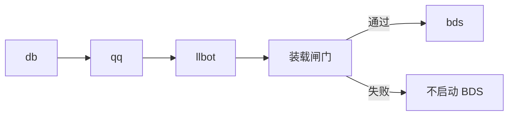

import { Steps } from "@rspress/core/theme";

# 服务管理

## 启动顺序

在使用`/start -all`时：

## 常用命令

| 命令                             | 作用                      |
| -------------------------------- | ------------------------- |
| `start db\|qq\|llbot\|bds\|-all` | 启动                      |
| `stop …` / `restart …`           | 停止 / 重启               |
| `status`                         | 查看运行状态              |
| `logs <svc> [-n N] [-f]`         | 查看日志；快捷键 `Ctrl+L` |
| `init`                           | 重新进入初始化向导        |
| `update [--check-only]`          | 检查或安装 BDS 更新       |

## 装载闸门

此阶段会校验模块目录与服务器附加包的情况。

<Steps>
### 扫描 `<SFMC_ROOT>/packs/` 并处理附加包（见 [附加包](./addons.md)）
### 比对模块行为包内的 `sfmc-deploy-catalog.json` 与本机启停 / 指纹
### 不一致则编译并部署模块行为包，必要时写入 `server-net` 权限
### 打印装载摘要；失败则不启动 BDS
</Steps>

