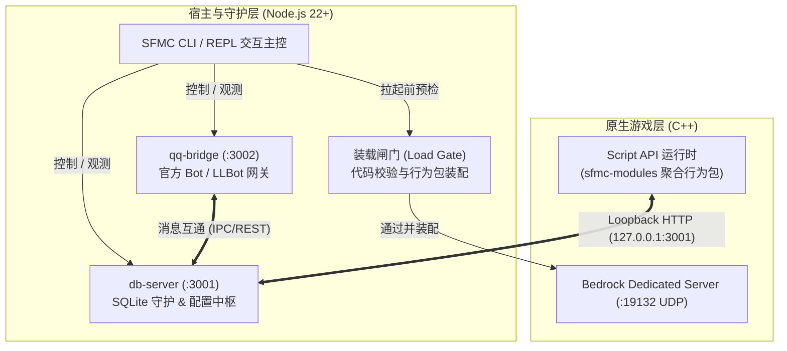
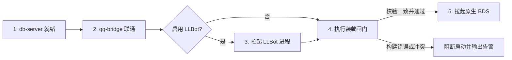

import { Steps } from "@rspress/core/theme";

# 服务编排与管理

SFMC 采用**解耦的多进程伴生架构**。原生 Bedrock Dedicated Server（BDS）专注于高性能游戏世界模拟，而数据持久化、多端通信与附加包版本管控等重量级操作则由伴生的 Node.js 守护进程承担。

---

## 1. 伴生架构与进程全景

整个平台由以下四个核心子系统分工协作构成：



| 组件名称 | 运行时 | 监听端口 / 协议 | 核心职责 |
| :--- | :--- | :--- | :--- |
| **db-server** | Node.js | `3001` (TCP, Loopback) | 依托 `node:sqlite` 原生驱动，为 SAPI 模块提供透明数据库读写、跨模块 RPC 转发及平台全局配置（`configs/all`）下发。 |
| **qq-bridge** | Node.js | `3002` (TCP) / 外联 OpenAPI | 负责与腾讯 QQ 开放平台 WebSocket 网关或本地 LLBot (OneBot 11) 通信，实现群服消息双向路由与入服白名单联动。 |
| **装载闸门** | Node.js | 阶段性执行，无端口 | 在拉起 BDS 前执行代码哈希校验、附加包更新源探测、多模块行为包动态编译与 `server-net` 权限校验。 |
| **BDS (SAPI)** | Native C++ | `19132` (UDP, 游戏通信) | Minecraft 官方 Bedrock 服务端核心，内置 Script API 虚拟机，运行由 SFMC 动态编译的业务模块合集。 |

---

## 2. 启动时序与装载闸门（Load Gate）

### 严格的启动依赖拓扑

在使用 `/start -all` 命令时，SFMC 会严格按照依赖依赖图顺序逐级拉起各进程：



> **为什么 SAPI 不能早于 db-server 启动？**  
> Minecraft BDS 在触发 `system.beforeEvents.startup` 钩子时，SFMC SDK 的 `ConfigManager` 必须立刻向 `127.0.0.1:3001` 请求初始配置快照（包含模块 Token、系统配置与权限）。若 db-server 未提前就绪，模块将因无法获取合法身份而拒绝加载。

### 装载闸门的工作流程

装载闸门是保障服务器数据安全与代码一致性的核心屏障：

<Steps>
### 扫描与归档收件箱附加包
自动扫描 `<SFMC_ROOT>/packs/` 目录中的第三方 `.mcpack`、`.mcaddon` 与压缩归档。核对世界目录中已有的 UUID 与版本，自动安装或增量更新，详情见 [附加包管理](./addons.md)。

### 指纹比对与一致性核验
读取目标世界行为包内的部署清单 `sfmc-deploy-catalog.json`，与当前本地的 `modules/module-lock.json`（启停状态）及各模块源码的 SHA 指纹进行快速哈希比对。

### 按需全量编译与权限注入
若检测到模块增删、启停状态改变或 TypeScript 源码变更，系统会自动调用轻量打包器将所有 `enabled` 模块重编整合为 `sfmc-modules` 行为包，并强制写入 BDS 所必需的 `server-net` 原生通信权限。

### 打印装载摘要与阻断熔断
在控制台清晰打印本次加载的模块名称、版本号与耗时。若任何环节发生语法编译错误或依赖死锁，**装载闸门将坚决终止 BDS 启动**，避免损坏世界存档。
</Steps>

---

## 3. 运维控制命令速查

在 `sfmc` 交互式终端（REPL）中，可通过斜杠 `/` 或直接输入命令进行全方位编排：

### 服务起停与状态

```bash
# 一键启动所有关联服务（推荐开服使用）
sfmc> /start -all

# 单独启动或重启特定服务
sfmc> /start db
sfmc> /restart bds

# 查看当前各进程的 PID、运行时间与资源状态
sfmc> /status

# 平滑停止所有进程（安全存盘退出）
sfmc> /stop -all
```

### 日志流监控与标准输入

- **日志查看**：执行 `logs <svc> [-n 行数] [-f]` 实时跟踪指定服务日志（如 `logs bds -f`）。
- **多源切换**：在 REPL 交互面板中，随时按下键盘 `TAB` 键或使用快捷键 `Ctrl + L`，可在 BDS 控制台、数据库中枢和 QQ 桥接的实时日志流间无缝切换。
- **向原生 BDS 发送命令**：使用 `send` 指令向子进程标准输入（stdin）注入指令：
  ```bash
  sfmc> send bds say §a[系统公告] 服务器将在 10 分钟后例行重启维护
  sfmc> send bds op Steve
  ```

---

## 4. 生产环境常驻与守护实践（Linux / Windows）

在长期运行的生产服务器上，推荐采用系统级服务管理器进行保活守护。

### 方案 A：Linux `systemd` 服务守护（推荐）

创建 `/etc/systemd/system/sfmc.service`：

```ini title="/etc/systemd/system/sfmc.service"
[Unit]
Description=ScriptsForMinecraftServer (SFMC) Core Daemon
After=network.target

[Service]
Type=simple
User=minecraft
WorkingDirectory=/home/minecraft/sfmc-server
# 明确指定 Node.js 运行时与 SFMC_ROOT
Environment="SFMC_ROOT=/home/minecraft/sfmc-server"
Environment="PATH=/usr/local/bin:/usr/bin"
ExecStart=/usr/local/bin/sfmc /start -all
ExecStop=/usr/local/bin/sfmc /stop -all
Restart=on-failure
RestartSec=10s
LimitNOFILE=65535

[Install]
WantedBy=multi-user.target
```

启用并启动守护服务：

```bash
sudo systemctl daemon-reload
sudo systemctl enable --now sfmc
# 查看运行日志
sudo journalctl -u sfmc -f
```

### 方案 B：PM2 进程管理方案

如果服务器已配置 PM2 环境，可创建 `ecosystem.config.cjs` 实施细粒度守护：

```javascript title="ecosystem.config.cjs"
module.exports = {
  apps: [
    {
      name: "sfmc-db",
      script: "packages/db-server/dist/index.js",
      env: {
        SFMC_ROOT: __dirname,
        NODE_ENV: "production",
      },
      restart_delay: 3000,
    },
  ],
};
```

---

## 5. 网络拓扑与安全加固规范

为了防止越权访问与恶意网络扫描，生产环境必须严格遵循以下端口隔离策略：

```text
       Internet
          │
     [ UDP: 19132 ]  ──► 仅放行游戏流量至 BDS
          │
  ─────────────────── 防火墙边界 (Firewall Barrier) ───────────────────
          │
     [ 127.0.0.1 ]   ──► 仅允许本机回环（Loopback）
          ├── TCP: 3001 (db-server HTTP)
          ├── TCP: 3002 (qq-bridge WS)
          └── TCP: 3004 (LLBot HTTP API)
```

| 端口号 | 协议 | 建议暴露范围 | 安全要求与防范建议 |
| :--- | :---: | :--- | :--- |
| **`19132`** | UDP | **公网开放** | Minecraft Bedrock 官方游戏客户端连接端口。 |
| **`3001`** | TCP | **仅本机 (127.0.0.1)** | `db-server` 核心持久化接口。**严禁暴露至公网**。建议在 `db_config.json` 中配置强密钥 `http_auth`。 |
| **`3002`** | TCP | **仅本机 / 内网** | QQ 桥接 WebSocket 端口，供 LLBot 连接。 |
| **`3004`** | TCP | **仅本机 (127.0.0.1)** | LLBot OneBot 11 HTTP 监听端口。 |

在 Linux 云服务器上，可通过 `ufw` 快速巩固安全边界：

```bash
# 仅放行 Minecraft 游戏端口与 SSH
sudo ufw allow 22/tcp
sudo ufw allow 19132/udp
# 显式拒绝外网对 3001 / 3002 的嗅探
sudo ufw deny 3001/tcp
sudo ufw deny 3002/tcp
sudo ufw enable
```
