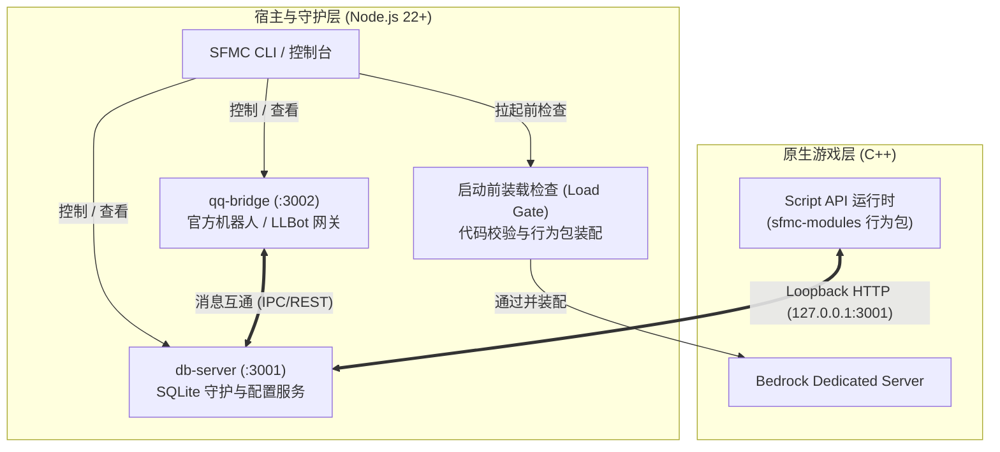
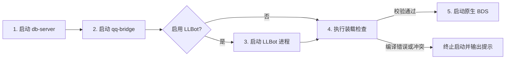

import { Steps } from "@rspress/core/theme";

# 服务编排与管理

SFMC 采用多进程伴生架构：Bedrock Dedicated Server（BDS）负责运行游戏逻辑，数据持久化、QQ 互通与行为包装配则由伴随的 Node.js 守护进程承担。

## 1. 进程架构与组件职责

平台由以下核心子系统协同构成：


```mermaid
flowchart TD
  subgraph HostProcess ["宿主与守护层 (Node.js 22+)"]
    CLI["SFMC CLI / 控制台"]
    DB["db-server (:3001)<br/>SQLite 守护与配置服务"]
    QQ["qq-bridge (:3002)<br/>官方机器人 / LLBot 网关"]
    GATE["启动前装载检查 (Load Gate)<br/>代码校验与行为包装配"]
  end

  subgraph NativeBDS ["原生游戏层 (C++)"]
    BDS["Bedrock Dedicated Server"]
    SAPI["Script API 运行时<br/>(sfmc-modules 行为包)"]
  end

  CLI -->|控制 / 查看| DB
  CLI -->|控制 / 查看| QQ
  CLI -->|拉起前检查| GATE
  GATE -->|通过并装配| BDS

  SAPI <== Loopback HTTP (127.0.0.1:3001) ==> DB
  QQ <== 消息互通 (IPC/REST) ==> DB
```

| 组件名称 | 运行时 | 默认端口 / 协议 | 核心职责 |
| :--- | :--- | :--- | :--- |
| **db-server** | Node.js | `3001` (TCP, Loopback) | 基于 `node:sqlite` 为 SAPI 模块提供数据库读写、跨模块 RPC 转发及平台配置（`configs/all`）下发。 |
| **qq-bridge** | Node.js | `3002` (TCP) / 外部 OpenAPI | 连接腾讯 QQ 开放平台或本地 LLBot (OneBot 11)，处理群聊与游戏消息路由。 |
| **装载检查** | Node.js | 无网络端口（启动阶段运行） | 在启动 BDS 前比对代码指纹、处理待装附加包，并在有变更时自动编译生成行为包。 |

## 2. 启动时序与装载检查（Load Gate）

### 启动时序

执行 `/start -all` 命令时，系统按以下顺序依次启动各进程：


```mermaid
flowchart LR
  db[1. 启动 db-server] --> qq[2. 启动 qq-bridge]
  qq --> llbot{启用 LLBot?}
  llbot -->|是| bot[3. 启动 LLBot 进程]
  llbot -->|否| gate[4. 执行装载检查]
  bot --> gate
  gate -->|校验通过| bds[5. 启动原生 BDS]
  gate -->|编译错误或冲突| stop[终止启动并输出提示]
```

:::tip 为什么 db-server 必须优先启动？
Minecraft BDS 触发 `system.beforeEvents.startup` 钩子时，SFMC SDK 的 `ConfigManager` 会立刻向 `127.0.0.1:3001` 请求初始配置快照（包含模块 Token、系统配置与权限表）。若 db-server 未提前就绪，模块因无法获取 Token 将无法正常初始化。
:::

### 装载检查流程

启动 BDS 前，系统会自动执行前置检查与构建：

<Steps>
### 扫描与安装待装附加包
检查 `<SFMC_ROOT>/packs/` 目录中的第三方 `.mcpack`、`.mcaddon` 与压缩包。若有新文件，自动解压部署至世界目录，详见 [附加包管理](./addons.md)。

### 代码指纹比对
读取世界行为包内的部署清单 `sfmc-deploy-catalog.json`，与当前本地模块源码的 SHA 指纹进行比对。

### 增量编译与行为包装配
若检测到模块增删、启停状态改变或源码发生变动，自动调用打包工具编译所有已启用模块，生成世界行为包产物。

### 放行或阻断
若编译或依赖校验失败，**系统将终止 BDS 启动**并输出错误提示，避免加载损坏的行为包导致世界异常。
</Steps>

## 3. 运维控制命令

在 `sfmc` 控制台中可执行以下管理命令：

### 服务启停与状态

```bash
# 启动所有服务
sfmc> /start -all

# 单独启动或重启特定服务
sfmc> /start db
sfmc> /restart bds

# 查看当前各进程的 PID、运行时间与资源状态
sfmc> /status

# 安全停止所有进程
sfmc> /stop -all
```

### 日志查看与指令转发

- **查看日志**：执行 `logs <svc> [-n 行数] [-f]` 跟踪指定服务日志（如 `logs bds -f`）。
- **切换日志流**：在控制台中按 `TAB` 键或使用 `Ctrl + L`，可在各服务日志间切换。
- **向 BDS 发送指令**：使用 `send` 命令向 BDS 控制台输入指令：
  ```bash
  sfmc> send bds say §a[系统公告] 服务器将在 10 分钟后例行重启
  sfmc> send bds op Steve
  ```

## 4. 生产环境常驻运行

在长期运行的生产服务器上，推荐使用系统服务管理器进行保活守护。

### 方案 A：Linux `systemd` 服务守护（推荐）

创建配置文件 `/etc/systemd/system/sfmc.service`：

```ini title="/etc/systemd/system/sfmc.service"
[Unit]
Description=ScriptsForMinecraftServer (SFMC) Core Daemon
After=network.target

[Service]
Type=simple
User=minecraft
WorkingDirectory=/home/minecraft/sfmc-server
Environment="SFMC_ROOT=/home/minecraft/sfmc-server"
Environment="PATH=/usr/local/bin:/usr/bin"
ExecStart=/usr/local/bin/sfmc /start -all
ExecStop=/usr/local/bin/sfmc /stop -all
Restart=on-failure
RestartSec=10s
LimitNOFILE=65535

[Install]
WantedBy=multi-user.target
```

加载并启动服务：

```bash
sudo systemctl daemon-reload
sudo systemctl enable --now sfmc

# 查看运行日志
sudo journalctl -u sfmc -f
```

### 方案 B：PM2 进程管理

如果已有 PM2 环境，可创建 `ecosystem.config.cjs` 进行守护：

```javascript title="ecosystem.config.cjs"
module.exports = {
  apps: [
    {
      name: "sfmc-db",
      script: "packages/db-server/dist/index.js",
      env: {
        SFMC_ROOT: __dirname,
        NODE_ENV: "production",
      },
      restart_delay: 3000,
    },
  ],
};
```

## 5. 端口与网络安全规范

生产环境中请确保内部通信端口不暴露至公网：

```text
       公网流量 (Internet)
               │
          [ UDP: 19132 ]  ──► 仅放行游戏连接至 BDS
               │
   ──────────── 防火墙边界 ────────────
               │
          [ 127.0.0.1 ]   ──► 本地回环接口
               ├── TCP: 3001 (db-server HTTP 接口)
               ├── TCP: 3002 (qq-bridge WebSocket 端口)
               └── TCP: 3004 (LLBot HTTP API)
```

| 端口号 | 协议 | 暴露范围 | 说明 |
| :--- | :---: | :--- | :--- |
| **`19132`** | UDP | **公网开放** | Minecraft 基岩版官方客户端连接端口。 |
| **`3001`** | TCP | **仅本机 (127.0.0.1)** | `db-server` 数据库接口。**严禁暴露至公网**。建议在 `db_config.json` 中配置密钥。 |
| **`3002`** | TCP | **仅本机 / 内网** | QQ 桥接 WebSocket 端口，供 LLBot 连接。 |
| **`3004`** | TCP | **仅本机 (127.0.0.1)** | LLBot OneBot 11 HTTP 监听端口。 |

在 Linux 云服务器上，可通过 `ufw` 限制端口访问：

```bash
# 仅放行 SSH 与游戏端口
sudo ufw allow 22/tcp
sudo ufw allow 19132/udp

# 拒绝外网对内部服务端口的访问
sudo ufw deny 3001/tcp
sudo ufw deny 3002/tcp
sudo ufw enable
```
